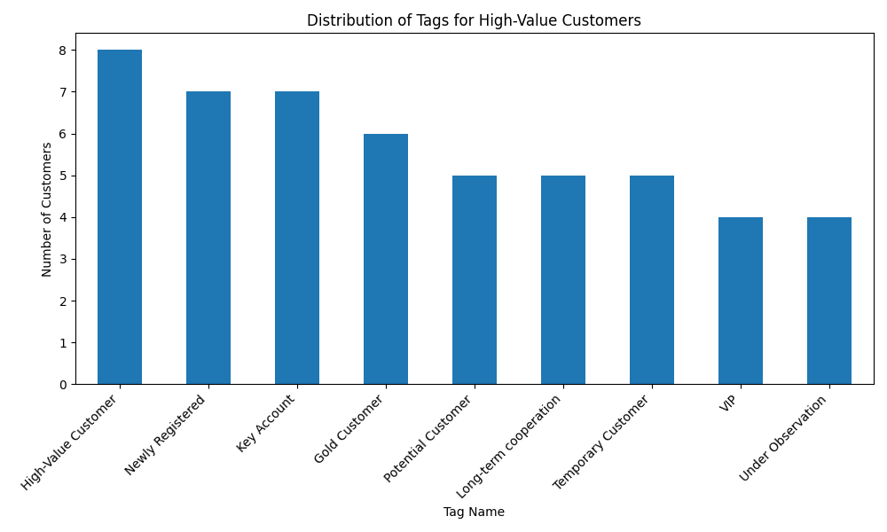
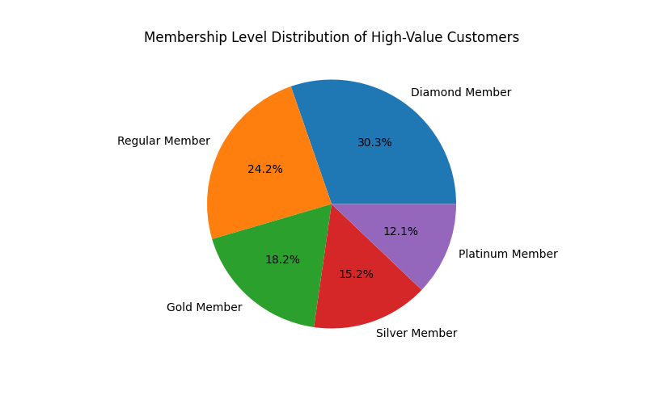
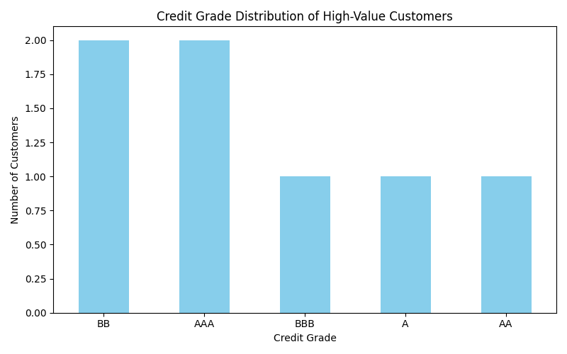

# Unlocking the Profile of High-Value Customers

## Executive Summary

An analysis of customers with cumulative transaction amounts exceeding 5,000 reveals a clear and actionable profile of our most valuable segment. These customers are not just high spenders; they are deeply engaged, loyal, and financially sound individuals.

**Key Findings:**
*   **They are our "VIPs":** The most common tags are `High-Value Customer` (8 customers), `Key Account` (7 customers), and `Gold Customer` (6 customers), confirming their recognized importance.
*   **Top-Tier Members:** A staggering **28.6% of these customers are "Diamond Members"**, the highest tier in our membership system. This indicates that our loyalty program is effectively retaining high spenders.
*   **Financially Reliable:** The credit ratings of these customers are predominantly excellent (`AAA`, `AA`) or good (`A`, `BBB`, `BB`), suggesting they are low-risk and have strong financial standing.

**Recommendations:**
1.  **Hyper-Personalize Engagement:** Launch targeted marketing campaigns for "Diamond" and "Platinum" members, offering exclusive benefits to reinforce their loyalty.
2.  **Nurture Potential VIPs:** Customers tagged as "Potential Customer" but who are already high-spenders should be prioritized for account management outreach to accelerate their transition to "Key Account" status.
3.  **Optimize Credit-Based Offers:** Leverage the strong credit profiles of this segment to offer premium services or tailored credit-based products, driving further revenue.

---

### In-Depth Analysis of High-Value Customers

Our analysis began by identifying a cohort of customers whose cumulative transaction amount in "Paid" status exceeded 5,000. This group represents the top echelon of our customer base. The subsequent analysis focuses on three key dimensions: their assigned tags, membership status, and credit ratings.

#### Insight 1: Customer Tags Reveal a Pattern of High Value and Engagement

The tags associated with these customers confirm they are already recognized internally as being crucial to the business. The distribution is heavily skewed towards labels indicating high value and loyalty.

*   **Observation:** As seen in the chart above, the most frequent tags are `High-Value Customer` (8 instances), `Key Account` (7 instances), and `Gold Customer` (6 instances).
*   **Why It Matters:** This shows that our internal tagging system is correctly identifying high spenders. The presence of tags like `Newly Registered` (7 instances) and `Potential Customer` (5 instances) among this group is particularly insightful. It means some customers become high-spenders very quickly after joining.
*   **Recommendation:** The sales and marketing teams should create a fast-track nurturing program for customers tagged as `Newly Registered` who exhibit high early spending. This can accelerate their journey to becoming loyal "Key Accounts."

#### Insight 2: High-Value Customers Dominate Top Membership Tiers

Our high spenders are deeply integrated into our membership program, with a significant concentration in the highest tiers.

*   **Observation:** "Diamond Member" is the largest single group, comprising **28.6%** of these high-value customers. When combined, the top three tiers (Diamond, Platinum, and Gold) account for a remarkable portion of this segment. In contrast, only a minority are "Regular" or "Silver" members.
*   **Why It Matters:** This strong correlation proves the success of our loyalty program in retaining our most profitable customers. The benefits offered to Diamond and Platinum members are clearly valued by those who spend the most.
*   **Recommendation:** We should double down on what works. Introduce even more exclusive perks for Diamond members to prevent churn and encourage lower-tier high spenders to climb the membership ladder.

#### Insight 3: Strong Credit Ratings Signal Financial Health and Low Risk

The credit profiles of our high-value customers are overwhelmingly positive, indicating they are financially stable and reliable.

*   **Observation:** The credit grades are concentrated in the upper tiers, with grades like `AAA`, `AA`, `A`, `BBB`, and `BB`. There is a notable absence of lower-tier credit grades.
*   **Why It Matters:** This reduces the financial risk associated with this customer segment. Their high creditworthiness means they are more likely to make timely payments and are good candidates for premium financial products or services that involve credit.
*   **Recommendation:** The business should consider developing exclusive, credit-based offers for this segment, such as premium financing options or co-branded credit cards. This could open up new revenue streams while providing additional value to our best customers.
