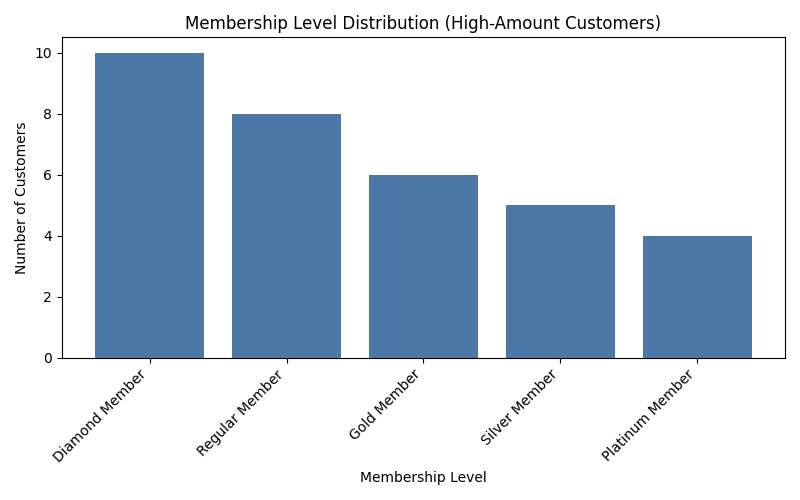
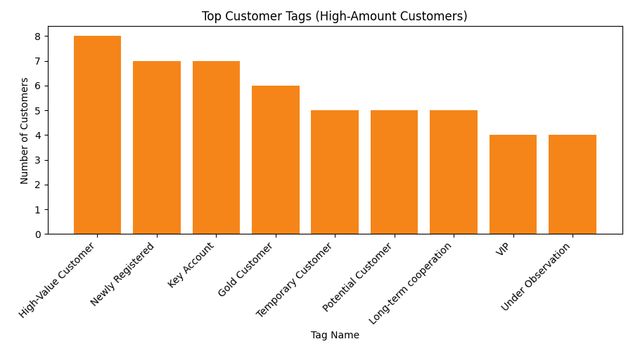

Executive Summary
- High-amount cohort definition: Customers with cumulative Paid transaction amount ≥ 5000 CNY (based on transaction_history_table: Transaction Amount and Transaction Payment Status='Paid').
- Cohort size is 71 out of 150 Paid customers (47.3%), contributing 481,739.59 CNY out of 685,050.18 CNY Paid revenue (70.3%). Average spend per high-amount customer is 6,785.06 CNY; min 5,014.63; max 8,924.35.
- Membership engagement is partial: 33 of 71 cohort customers have membership records (46.5%), with a 60.6% auto-renewal rate among those.
- Credit ratings coverage is low: only 7 of 71 (9.9%) have credit rating records; average score 762, average credit limit 524,285.7 CNY; 85.7% show any overdue count (>0).
- Top tags among the cohort signal value and relationship depth: “High-Value Customer” (8; 11.3%), “Newly Registered” (7; 9.9%), “Key Account” (7; 9.9%), “Gold Customer” (6; 8.5%), suggesting a mix of VIP/enterprise and newly onboarded customers.

Cohort Definition and Revenue Concentration
- Observation: Using SQL CTE cohort from transaction_history_table (Paid only), we counted 71 customers meeting the ≥5000 CNY threshold; their total Paid is 481,739.59 CNY, with an average 6,785.06 CNY.
- Root Cause: Spend is concentrated among fewer customers, indicating either enterprise/strategic accounts or high-value consumer segments with frequent or larger orders.
- Business Impact: 70.3% of Paid revenue is driven by 47.3% of Paid customers. Prioritizing retention and expansion for this cohort should materially affect topline.

Membership System Insights
- Observation: Among the 71 cohort customers, 33 have membership records (membership_table). Level distribution is Diamond 10, Regular 8, Gold 6, Silver 5, Platinum 4; auto-renewal shows Yes=20, No=13; average Current Points 2,836.97 and Lifetime Points 12,287.88.
- Root Cause: The presence of higher-tier members (e.g., Diamond) suggests that loyalty benefits correlate with higher spend. However, partial membership coverage (46.5%) indicates missed opportunities to enroll and engage profitable customers.
- Business Impact / Recommendation:
  - Expand membership enrollment within the high-amount cohort to raise coverage above 70% (target +23–25 pp). Expect improved retention given current auto-renewal of 60.6%.
  - Design upgrade journeys for Regular/Gold members toward Platinum/Diamond via tailored perks and spend-based milestones (e.g., accelerated points, exclusive access).
  - Leverage points: with average Lifetime Points at 12.3k, consider redemption nudges and tier-retention campaigns to reduce churn risk (especially “De-registered”=13 and “Frozen”=8 statuses).

Visualization: Membership Level Distribution

- Key Takeaway: Among 33 cohort customers with membership records, Diamond=10, Regular=8, Gold=6, Silver=5, Platinum=4. Diamond members represent 30.3% of membership-engaged high spenders, underscoring the value of top-tier loyalty.
- Why It Matters: Concentration in Diamond suggests tier benefits align with high spend; formalizing upgrade paths and exclusive benefits can convert Regular/Gold into higher tiers, potentially increasing average revenue per customer.

Customer Tags Insights
- Observation: Top tags from customer_tag_table among high-amount customers: High-Value Customer (8; 11.3%), Newly Registered (7; 9.9%), Key Account (7; 9.9%), Gold Customer (6; 8.5%), Temporary/Potential/Long-term cooperation (each 5; 7.0%), VIP (4; 5.6%), Under Observation (4; 5.6%).
- Root Cause: Tags reflect both relationship depth (“Key Account,” “Long-term cooperation,” “VIP”) and onboarding status (“Newly Registered”), suggesting a pipeline of new high-potential customers alongside established strategic accounts.
- Business Impact / Recommendation:
  - Use tag-aware playbooks: for Key Accounts/VIPs, run cross-sell bundles and strategic reviews; for Newly Registered/Potential, run onboarding accelerators (guided use, welcome offers) to cement habits and lift spend.
  - Align sales and customer success motions to tag signals (e.g., elevated service SLAs for High-Value and Key Account).

Visualization: Top Customer Tags among High-Amount Customers

- Key Takeaway: The most frequent tag is “High-Value Customer” (8; 11.3%), followed by “Newly Registered” and “Key Account” (each 7; 9.9%), then “Gold Customer” (6; 8.5%). This balance between high-value incumbents and new entrants offers dual levers: retention and onboarding growth.
- Why It Matters: Tag-driven segmentation enables targeted lifecycle programs—preserve existing high-value relationships while maturing new registrants into long-term, high-spend customers.

Credit Ratings and Risk Signals
- Observation: Only 7 of 71 cohort customers have credit rating records (via latest rating per account from customer_credit_rating_table joined to customer_account_table). Grades observed: AAA=2, BB=2, BBB=1, A=1, AA=1; average score 762; average credit limit 524,285.7 CNY; overdue rate (any overdue count >0) is 85.7%.
- Root Cause: Low coverage suggests ratings are captured for a subset (likely enterprise or financed accounts). The high overdue incidence within the rated subset indicates potential credit risk concentration.
- Business Impact / Recommendation:
  - Expand credit assessment coverage for high-amount customers to move beyond 10% coverage (target ≥50%). This enables proactive risk controls and tailored credit limits.
  - For accounts with overdue signals, implement risk mitigation (payment reminders, restructuring offers, collateral requirements) while preserving customer value.

Additional Cohort Metrics
- Overall Paid customers: 150; overall Paid revenue: 685,050.18 CNY. High-amount cohort contributes 481,739.59 CNY (70.3%), highlighting the strategic importance of targeted engagement.
- Membership statuses in cohort include Normal=12, De-registered=13, Frozen=8—monitor churn risk and reactivation opportunities.

Methodology and Data Fields
- SQL:
  - Cohort: SUM(Transaction Amount) WHERE Transaction Payment Status='Paid' GROUP BY Customer ID; HAVING SUM≥5000.
  - Revenue stats: AVG/MIN/MAX/SUM(total_paid) on the cohort; overall Paid totals from transaction_history_table.
  - Membership: distributions from membership_table by Membership Level, Privilege Level, Member Status, Automatic Renewal; points averages.
  - Credit ratings: join customer_account_table to latest records per Account ID from customer_credit_rating_table using MAX(Rating Date).
  - Tags: top tag names and DISTINCT customer counts from customer_tag_table for cohort customers.
- Python plotting: Two bar charts saved to membership_distribution.png and top_tags.png using matplotlib; code executed in analyze_high_spenders.py.

Actionable Recommendations
1) Membership coverage expansion: Enroll non-member high spenders (currently 38 of 71 without records) with tailored incentives; aim >70% coverage. Expected impact: higher retention and ARPU via auto-renewal and tier progression.
2) Tier upgrade journeys: Convert Regular/Gold to Platinum/Diamond with milestone-based rewards and exclusive benefits; track lift in average spend per customer.
3) Tag-driven lifecycle programs: 
   - Key Account/VIP/High-Value: quarterly business reviews, cross-sell bundles, dedicated support.
   - Newly Registered/Potential: onboarding campaigns, guided product usage, first-90-days offers.
4) Credit risk management: Expand rating coverage; for rated customers with overdue signals (85.7%), institute reminders, flexible terms, and credit limit reviews to reduce bad debt while protecting revenue.
5) Churn control: Address De-registered and Frozen members with reactivation offers and service recovery; monitor outcomes with membership status transitions.

Why this matters: Concentrated revenue among a relatively small cohort means targeted retention and upsell strategies will have outsized impact. The mix of high-value and newly registered tags highlights both protection and growth plays. Strengthening credit assessment and membership engagement closes risk and loyalty gaps, translating into durable revenue and margin improvements.
