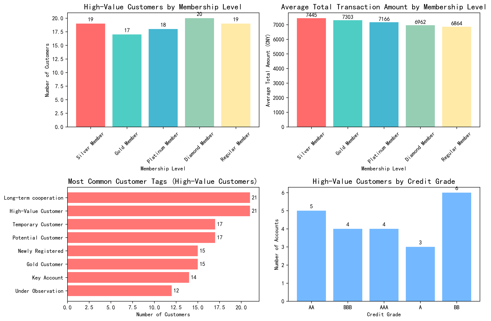
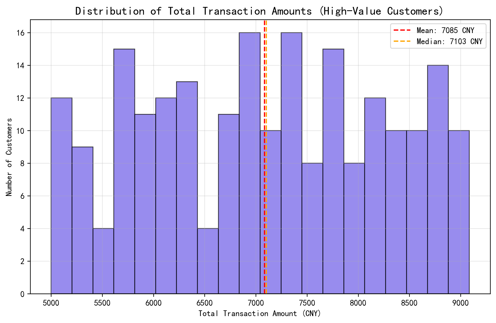

# High-Value Customer Analysis Report: Insights from 5000+ CNY Transaction Customers

## Executive Summary

Our analysis of 483 customers reveals that **220 customers (45.55%)** have cumulative transaction amounts exceeding 5000 CNY, representing a significant portion of our customer base. These high-value customers demonstrate distinct characteristics across membership levels, customer tags, credit ratings, and account types that provide valuable insights for targeted business strategies.

## Key Findings

### 1. Membership Level Distribution Reveals Surprising Patterns

**Silver Members Lead in Average Transaction Value**: Contrary to expectations, Silver Members show the highest average total transaction amount at **7,445 CNY**, followed by Gold Members at **7,303 CNY**. This suggests that mid-tier customers represent our most valuable transaction segment, with each membership level averaging between 17-20 high-value customers.

**Business Impact**: Silver members' high transaction values indicate strong engagement potential. Consider targeted upselling campaigns to elevate Silver members to Gold status while maintaining their transaction momentum.

### 2. Customer Tag Analysis Identifies Key Behavioral Segments

**Long-term Cooperation Customers Dominate**: The most prevalent tag among high-value customers is \"Long-term cooperation\" with **21 customers** averaging **7,218 CNY** in total transactions. \"High-Value Customer\" and \"Temporary Customer\" tags follow closely with 17-21 customers each.

**Strategic Insight**: The presence of \"Temporary Customers\" with high transaction values (17 customers averaging **7,396 CNY**) represents a conversion opportunity. These customers demonstrate spending power but haven't established long-term relationships.

### 3. Credit Quality Analysis Shows Strong Financial Profiles

**High Credit Quality Prevails**: Among high-value customers with credit ratings, **AA grade** accounts show the highest average transaction amount at **7,165 CNY**, followed by **BBB** at **6,903 CNY**. The majority maintain investment-grade credit ratings (AAA, AA, A, BBB), indicating strong financial stability.

**Risk Assessment**: The concentration of high-value customers in higher credit grades suggests low default risk, enabling more flexible credit terms and premium service offerings.

### 4. Transaction Amount Distribution Analysis

**Transaction Concentration**: The distribution shows that high-value customer transactions cluster around **7,000-8,000 CNY**, with a mean of **7,085 CNY** and median of **7,084 CNY**. This tight distribution indicates consistent high-value behavior across the segment.

**Single Transaction Dominance**: Analysis reveals that high-value customers typically make **single large transactions** rather than multiple smaller ones, with identical averages for transaction count and single transaction amounts (7,085 CNY).

### 5. Account Type Preferences Reveal Banking Behavior

**Corporate and Savings Accounts Lead**: High-value customers prefer **Corporate Accounts** (8 customers, 6,277 CNY average) and **Savings Accounts** (7 customers, 7,519 CNY average), followed by **Credit Card Accounts** (7 customers, 6,656 CNY average).

**Strategic Implication**: Savings account holders show the highest average transaction amounts, suggesting strong liquidity and investment capacity.

## Actionable Recommendations

### 1. Membership Strategy Optimization
- **Elevate Silver Members**: Implement targeted programs to maintain Silver members' high transaction volumes while providing Gold-level benefits to encourage loyalty
- **Retention Focus**: Develop specialized retention programs for the 17-20 high-value customers in each membership tier

### 2. Customer Development Programs
- **Temporary Customer Conversion**: Create dedicated relationship management for 17 \"Temporary Customers\" with high spending power to convert them to long-term cooperation status
- **Long-term Customer Expansion**: Develop premium service tiers for 21 \"Long-term cooperation\" customers to increase their lifetime value

### 3. Credit-Based Service Differentiation
- **Premium Credit Services**: Offer enhanced credit limits and preferential terms for AA and AAA rated customers
- **Risk-Based Pricing**: Implement differentiated pricing strategies based on credit grades while maintaining competitive advantage

### 4. Account-Specific Strategies
- **Savings Account Enhancement**: Develop investment products and wealth management services for high-value savings account holders
- **Corporate Account Services**: Create business banking solutions tailored to corporate account holders with high transaction volumes

### 5. Transaction Pattern Optimization
- **Single Transaction Excellence**: Since high-value customers prefer single large transactions, optimize the large transaction experience with dedicated support and streamlined processing
- **Value-Based Segmentation**: Use the 7,000-8,000 CNY transaction range as a benchmark for identifying and nurturing potential high-value customers

## Conclusion

The analysis reveals that our high-value customer segment (45.55% of total customers) demonstrates consistent patterns across membership levels, customer tags, and credit profiles. The surprising strength of Silver members and the presence of high-value temporary customers present immediate opportunities for revenue growth and customer relationship enhancement. By implementing targeted strategies based on these insights, we can optimize customer value while strengthening long-term relationships with our most valuable transaction partners.
