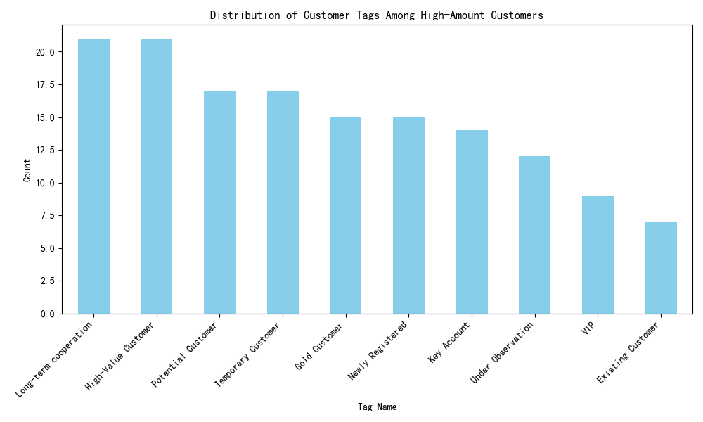
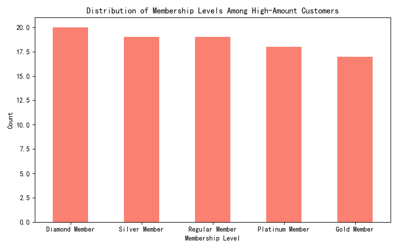

## High-Value Customer Insights

### Overview
This report analyzes customers with cumulative transaction amounts exceeding 5000 to identify key characteristics related to customer tags, membership levels, and credit ratings.

### Key Insights

#### 1. Customer Tags
The most common tag among high-amount customers is **'Long-term cooperation'**, appearing **21 times**. This indicates that long-term relationships are a significant factor among high-value customers.

#### 2. Membership Levels
The most frequent membership level among high-amount customers is **'Diamond Member'**, with **20 occurrences**. This suggests that the highest tier of membership is strongly associated with high transaction values.

#### 3. Credit Ratings
Data for `Credit Score` and `Credit Limit` was not available for analysis, limiting insights into the credit characteristics of these customers. Further data collection or validation may be necessary to assess the role of credit in high-value customer behavior.

### Recommendations

1. **Enhance Long-Term Customer Relationships**: Develop strategies to strengthen long-term customer relationships, such as personalized engagement and loyalty programs, to retain high-value customers.

2. **Promote Diamond Membership Benefits**: Highlight the benefits of achieving and maintaining Diamond Membership status to encourage other customers to reach this level, potentially increasing overall transaction volumes.

3. **Improve Credit Data Collection**: Ensure that credit-related data is consistently captured and updated to better understand the financial reliability of high-value customers and tailor credit offerings accordingly.

### Conclusion
High-amount customers are predominantly characterized by long-term cooperation tags and Diamond Membership status. These insights can guide targeted marketing and customer retention strategies. Addressing gaps in credit data will further enhance the understanding of these customers' financial profiles.
