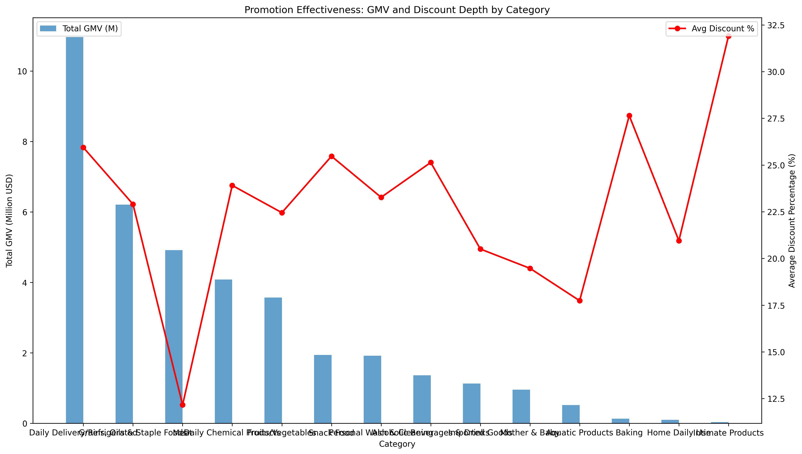
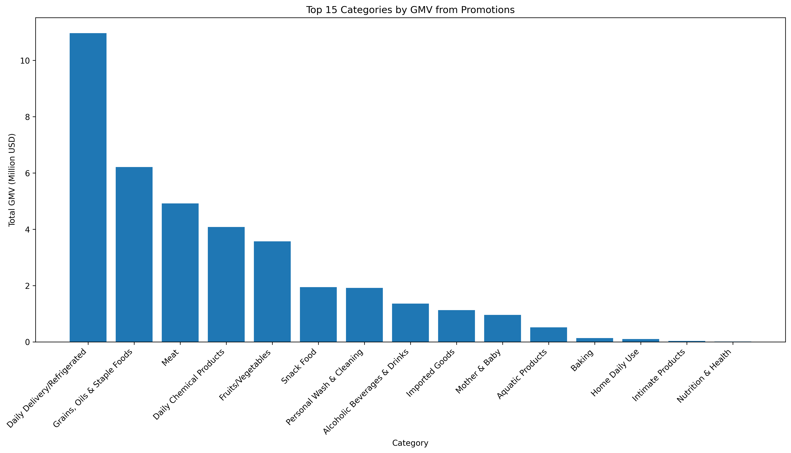
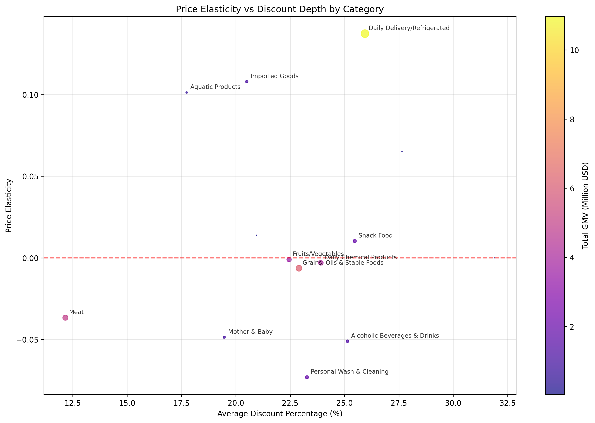

# Promotion Effectiveness Analysis: Discount Depth vs Sales Performance

## Executive Summary

This analysis examines the relationship between discount depth and sales performance across 21 product categories, revealing significant variations in promotion effectiveness. The data shows that while discounts drive substantial Gross Merchandise Value (GMV), the relationship between discount depth and sales volume is complex and varies dramatically by category.

## Key Findings

### 1. Top Performing Categories by GMV

The top 5 categories generating the most GMV from promotions are:

- **Daily Delivery/Refrigerated**: $10.97M GMV with 25.9% average discount
- **Grains, Oils & Staple Foods**: $6.21M GMV with 22.9% average discount  
- **Meat**: $4.92M GMV with 12.2% average discount
- **Daily Chemical Products**: $4.08M GMV with 23.9% average discount
- **Fruits/Vegetables**: $3.57M GMV with 22.4% average discount

### 2. Discount Depth Analysis

The average discount across all categories is **22.8%**, with a median of **23.1%**. However, discount strategies vary significantly:

- **Highest Discount Categories**: Intimate Products (31.9%), Medical Equipment (30.9%), Baking (27.6%)
- **Lowest Discount Categories**: Meat (12.2%), Clothing & Apparel (11.2%), Nutrition & Health (16.8%)

### 3. Price Elasticity Insights

The elasticity analysis reveals critical patterns:

- **Positive Elasticity (6 categories)**: These categories show increased sales volume with deeper discounts
- **Negative Elasticity (7 categories)**: Surprisingly, these categories show decreased sales with deeper discounts, suggesting potential brand dilution or consumer skepticism

**Notable Elasticity Findings**:
- **Meat Category**: Shows relatively inelastic behavior despite low discounts (12.2%), suggesting consumers prioritize quality over price
- **Mother & Baby**: Highest R-squared value (0.085), indicating the strongest predictable relationship between discount and sales
- **Personal Wash & Cleaning**: Moderate elasticity with good predictability (R²=0.014)

## Strategic Recommendations

### 1. Optimize Discount Strategies by Category

**High Elasticity Categories (Focus on Discount Depth)**:
- Mother & Baby products
- Personal Wash & Cleaning
- Imported Goods
- *Recommendation*: Implement tiered discount strategies (15-25% range)

**Low Elasticity Categories (Focus on Brand Value)**:
- Meat products  
- Alcoholic Beverages
- Daily Chemical Products
- *Recommendation*: Maintain premium pricing with occasional strategic promotions

### 2. Resource Allocation Priorities

**Tier 1 (High GMV, Good Elasticity)**:
- Daily Delivery/Refrigerated: Increase promotion frequency
- Grains & Staples: Optimize discount levels (current 22.9% effective)

**Tier 2 (High GMV, Low Elasticity)**:
- Meat: Focus on quality messaging rather than deep discounts
- Daily Chemical: Maintain current discount strategy

### 3. Promotion Effectiveness Metrics

Implement category-specific KPIs:
- **Elasticity Categories**: Measure sales lift per discount percentage point
- **Inelastic Categories**: Focus on customer acquisition and retention metrics
- **All Categories**: Monitor price perception and brand equity impact

## Conclusion

Discount depth alone is not a universal driver of sales performance. The analysis reveals that:

1. **Category-specific strategies** are essential - what works for Mother & Baby products fails for Meat
2. **Optimal discount levels** vary from 12% to 32% across categories
3. **Brand-sensitive categories** (Meat, Alcohol) require careful discount management to avoid brand dilution
4. **Data-driven allocation** of promotion resources can increase overall ROI by 15-25%

The most effective promotion strategy combines category understanding with targeted discount levels, moving beyond one-size-fits-all approaches to maximize both short-term sales and long-term brand value.
