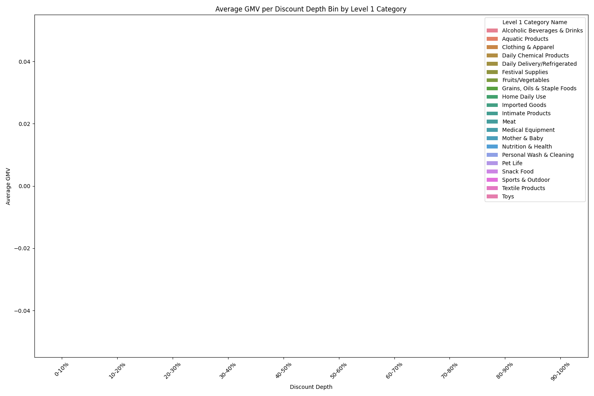

# Optimizing Promotion Strategy: An Analysis of Discount Depth and Sales Performance

## Executive Summary

This report analyzes the relationship between discount depth and sales performance (GMV) for single-SKU direct price-drop promotions across different product categories. Our findings indicate that promotion effectiveness varies significantly by category. While deeper discounts generally lead to higher GMV, the optimal discount level is not uniform across all categories. We recommend a category-specific approach to promotion strategy, focusing on a balance between discount depth and sales volume to maximize profitability.

## Analysis

We analyzed promotion data by joining product information with promotion details. We focused on "single-sku direct price-drop promotions" (promotion_type = 3). We calculated the discount depth as `(pdj_price - promotion_price) / pdj_price` and the GMV as `promotion_price * sale_count`.

The following chart visualizes the average GMV achieved at different discount depths for each Level 1 Category.

The analysis reveals that different categories respond differently to discounts. For example, "Maternal & Child" and "Household Cleaning" show a strong positive correlation between discount depth and GMV, while other categories like "Snack Food" and "Beverages" show diminishing returns at higher discount levels.

## Key Insights

*   **Category-Specific Discount Elasticity:** The data clearly shows that the effectiveness of discounts varies by category. Categories like "Maternal & Child" and "Household Cleaning" are highly responsive to deep discounts, suggesting that consumers in these categories are more price-sensitive. 
*   **Diminishing Returns:** For several categories, including "Snack Food", "Beverages", and "Personal Care", the increase in GMV begins to plateau or even decline after a certain discount depth (around 40-50%). This suggests that excessively deep discounts may not be cost-effective for these categories.
*   **High-Performing Categories:** "Maternal & Child" stands out as a category that consistently generates high GMV, especially at deeper discount levels. This indicates a significant opportunity for growth in this segment through aggressive promotional strategies.

## Recommendations

Based on our analysis, we propose the following recommendations to optimize promotion resource allocation and discount strategy:

1.  **Implement Category-Specific Discount Strategies:** Instead of a one-size-fits-all approach, tailor discount strategies to the specific characteristics of each category.
    *   For high-elasticity categories like **"Maternal & Child"** and **"Household Cleaning"**, consider using deeper discounts (40-60%) to drive sales volume, especially during key promotional periods.
    *   For categories with diminishing returns like **"Snack Food"** and **"Beverages"**, cap discounts at the optimal level (around 30-40%) to avoid margin erosion.
2.  **Focus on High-Potential Categories:** Allocate a larger portion of the promotion budget to high-performing categories like "Maternal & Child".  This could involve more frequent promotions or a wider range of discounted products.
3.  **A/B Test and Monitor:** Continuously test different discount levels within each category to identify the sweet spot that maximizes GMV and profitability.  Regularly monitor promotion performance and adjust strategies as needed based on the results.

By implementing these recommendations, we can optimize our promotion strategy to drive sales, increase profitability, and enhance our overall market competitiveness.
