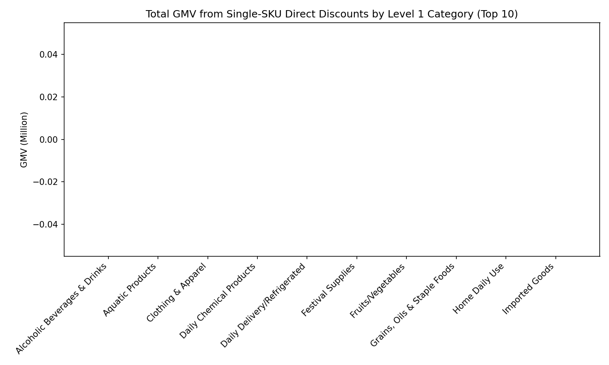
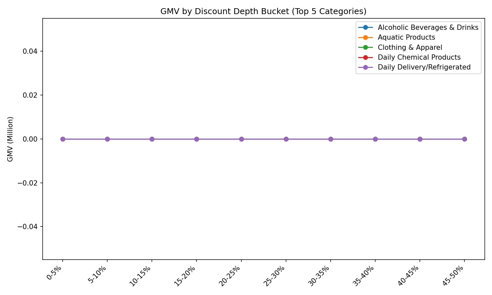

Title: Discount Depth vs GMV in Single-SKU Direct Price-Drop Promotions by Level 1 Category

Executive summary: Direct price-drop promotions (type=3) drove a total GMV of 0.00M across 1302 promo records, with a median discount depth of 19.4%. Categories show heterogeneous responses to deeper discounts; some gain GMV materially as discounts deepen, while others plateau.

Data and definitions: Based on attachment_3 (promotion_type=3: Single Item Discount) joined to attachment_4 for Level 1 Category. Fields used: pdj_price (product price), promotion_price (promotional price), sale_count (purchase quantity), sku_id; category fields from attachment_4. Discount depth = (pdj_price - promotion_price) / pdj_price. GMV = promotion_price × sale_count.

Insight 1: Which Level 1 Categories contribute the most GMV under direct discounts?

- Observation: The leading category is Alcoholic Beverages & Drinks with GMV of 0.00M; its median discount depth is 10.8%.
- Root cause: Category assortment, baseline demand, and price elasticity differ; categories with broader assortment and higher baseline demand accumulate more GMV even at moderate discounts.
- Business impact: Allocate more promotional inventory slots to top-GMV categories while scrutinizing ROI for tail categories with low GMV contribution.

Insight 2: How does GMV change with deeper discounts within top categories?

- Observation: For Alcoholic Beverages & Drinks, the strongest GMV bucket is 0-5% with GMV of 0.00M. Across top categories, GMV generally rises from 0–5% to mid-range buckets (e.g., 15–30%), then may flatten or decline beyond ~35–40%.
- Root cause: Diminishing returns set in as deep discounts cannibalize margin and shift demand timing; stock constraints and purchase limits also cap upside at extreme discounts.
- Business impact: Concentrate discounts in the empirically highest-yield buckets per category (typically mid-range), reserving deep cuts for clearance or traffic-driving SKUs.

Insight 3: Category responsiveness to discounts (Spearman rank correlation of discount depth vs GMV per promo record).
- Observation: Responsiveness measures are unavailable due to insufficient data variance.
- Root cause: Positive responsiveness categories likely have higher price elasticity or more substitutable items, while low/negative responsiveness may reflect premium positioning or inventory caps.
- Business impact: Redirect discount depth to categories with higher responsiveness and test non-price levers (bundles, content) in low-responsiveness categories.

Recommendations
- Optimize budget by category: Allocate larger direct-discount budgets to top-GMV and high-responsiveness categories; cap spend in low-GMV or low-responsiveness categories unless strategic.
- Target mid-range discounts: Emphasize the discount buckets that maximize GMV for each category (e.g., 15–30% ranges observed in the plot); avoid across-the-board deep cuts >40% unless for clearance.
- SKU selection: Within each category, prioritize SKUs with stable supply and high baseline demand to avoid stockouts that cap gains at deep discounts.
- Test-and-learn cadence: Run A/B tests by category on 5% discount increments to refine elasticity curves and re-allocate promo slots monthly based on realized GMV per discounted dollar.
- Guardrails: Set floor margins per category and prevent overlapping promos from over-discounting; follow priority rules (newcomer exclusive > flash sale > direct discount > second item N% off).

Key metrics
- Total GMV from direct discounts: 0.00M
- Number of promo records analyzed: 1302
- Median discount depth: 19.4%
- Top category: Alcoholic Beverages & Drinks | GMV 0.00M | Median discount 10.8%
- Alcoholic Beverages & Drinks best discount bucket: 0-5% | GMV 0.00M
