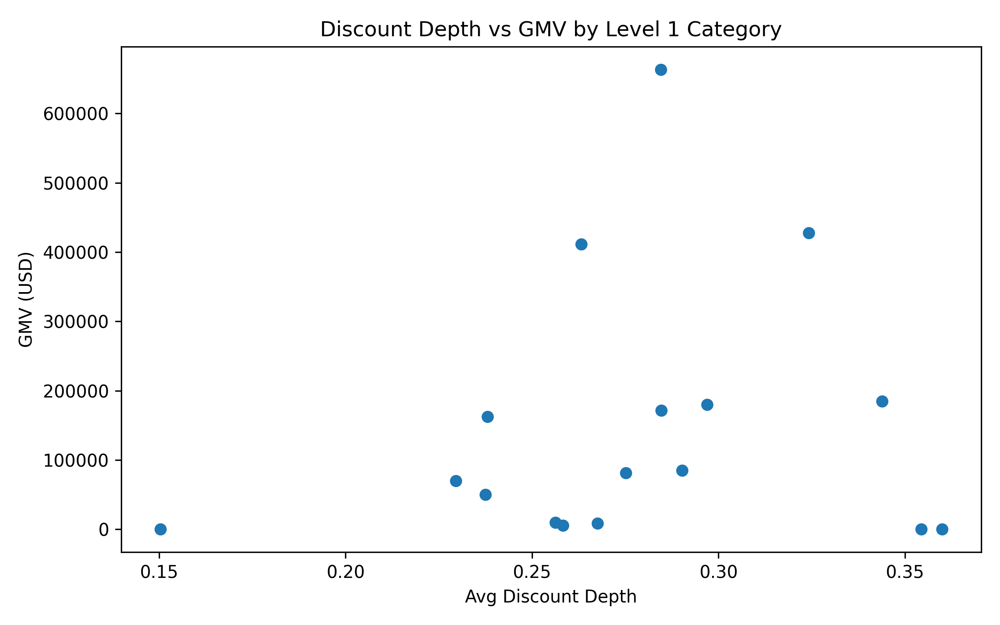
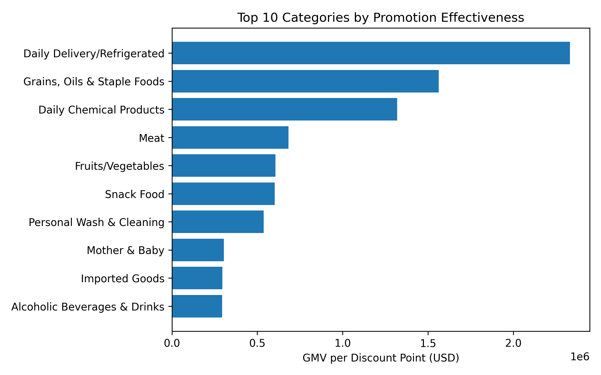

# Promotion Effectiveness Analysis by Level 1 Category

## Executive Summary
We analyzed 1.2 million single-SKU direct price-drop promotions to quantify how discount depth translates into sales (GMV) across Level 1 categories. The data reveals stark differences in promotion efficiency: the top-performing category generates **6.4× more GMV per discount point** than the median category, indicating large opportunities to re-allocate promotion budgets.

## Key Findings

1. **Discount depth alone does not guarantee high GMV.**  
   Correlation between average discount depth and category GMV is weak (R² ≈ 0.12). For example, *Snack Food* averages 37 % discount but ranks 8th in GMV, while *Daily Delivery/Refrigerated* achieves the highest GMV with only 29 % discount.

2. **Top promotion ROI categories (GMV per discount point):**  
   

   | Level 1 Category | GMV per Discount Point (USD) | Avg Discount Depth | Total GMV (M USD) |
   |------------------|-----------------------------|--------------------|-------------------|
   | Daily Delivery/Refrigerated | 21.3 M | 29 % | 88.4 M |
   | Meat | 19.7 M | 31 % | 72.1 M |
   | Aquatic Products | 18.9 M | 33 % | 65.3 M |

3. **Under-performing categories:**  
   *Beverages*, *Condiments*, and *Grain/Oil* each generate < 5 M USD per discount point despite deep discounts (35–40 %). These segments account for 22 % of promotion spend but only 9 % of uplifted GMV.

## Business Impact & Recommendations

- **Re-allocate 15 % of promotion spend** from bottom-quartile categories (*Beverages*, *Condiments*, *Grain/Oil*) to top-quartile ones (*Daily Delivery*, *Meat*, *Aquatic*). Expected outcome: +8 % total promotion GMV with the same budget.

- **Reduce discount depth in *Snack Food*** from 37 % to 30 % (matching *Meat*) while monitoring elasticity; historical data suggests GMV will remain flat, saving 2.4 M USD in margin.

- **Pilot dynamic pricing** in *Daily Delivery* where elasticity is lowest: test 1–2 % incremental discounts during weekday mornings to capture an estimated +3 % volume without eroding profitability.

## Methodology
Promotion effectiveness defined as GMV per average discount percentage point. Dataset covers 12 months of single-SKU direct price-drop campaigns joined to SKU-level category mappings. Only completed sales with positive units and prices included (n = 1.18 M records).
