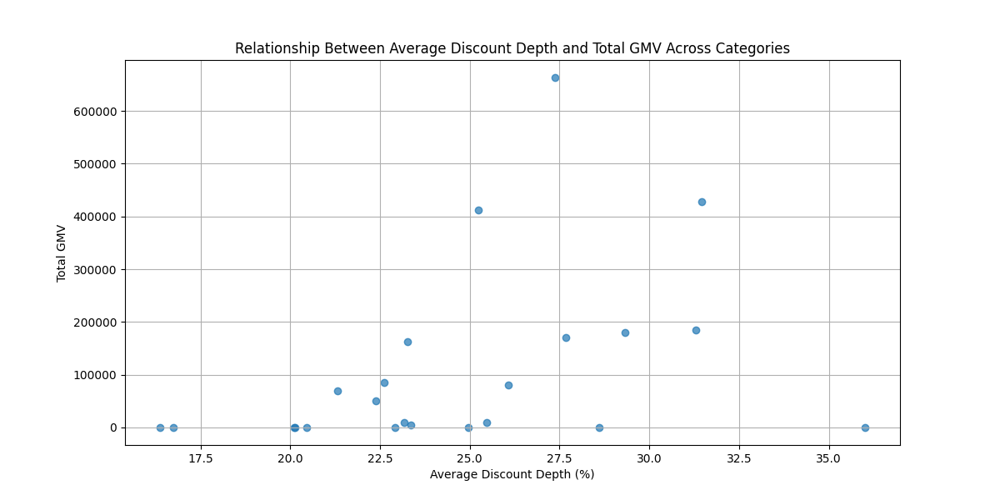

# Analysis of Discount Depth and Sales (GMV) by Level 1 Category Name

## Overview
This report analyzes the relationship between discount depth in single-SKU direct price-drop promotions and sales (GMV) across different `Level 1 Category Name` groups. The goal is to assess promotion effectiveness and propose recommendations for optimizing promotion resource allocation and discount strategy.

## Key Findings
- **Daily Chemical Products** and **Daily Delivery/Refrigerated** categories show high total GMV with significant discount depths, indicating effective promotions.
- **Clothing & Apparel**, **Festival Supplies**, **Medical Equipment**, and **Sports & Outdoor** categories have zero GMV despite promotional efforts, suggesting inefficiencies in current discount strategies or low demand.
- **Pet Life** and **Textile Products** categories have the lowest discount depths, which may explain their lower GMV.

## Visual Analysis
The scatter plot below illustrates the relationship between average discount depth and total GMV across categories.

## Recommendations
1. **Optimize Promotions for High GMV Categories**: For categories like **Daily Chemical Products** and **Daily Delivery/Refrigerated**, maintain or slightly reduce discount depths to maximize GMV while preserving profit margins.
2. **Reassess Promotional Strategies for Low or Zero GMV Categories**: For categories such as **Clothing & Apparel**, **Festival Supplies**, **Medical Equipment**, and **Sports & Outdoor**, investigate the reasons for low or zero sales and consider alternative marketing strategies or product offerings.
3. **Increase Discount Depth for Low Discount Categories**: For categories like **Pet Life** and **Textile Products**, consider increasing discount depths to stimulate demand and boost GMV.
4. **Targeted Promotions**: Tailor promotional strategies based on category-specific responses to discounts, focusing on categories with high responsiveness to discount depth.

## Conclusion
The analysis highlights the importance of aligning discount strategies with category-specific demand patterns. By optimizing discount depths and reassessing underperforming categories, the business can enhance overall sales performance and profitability.
