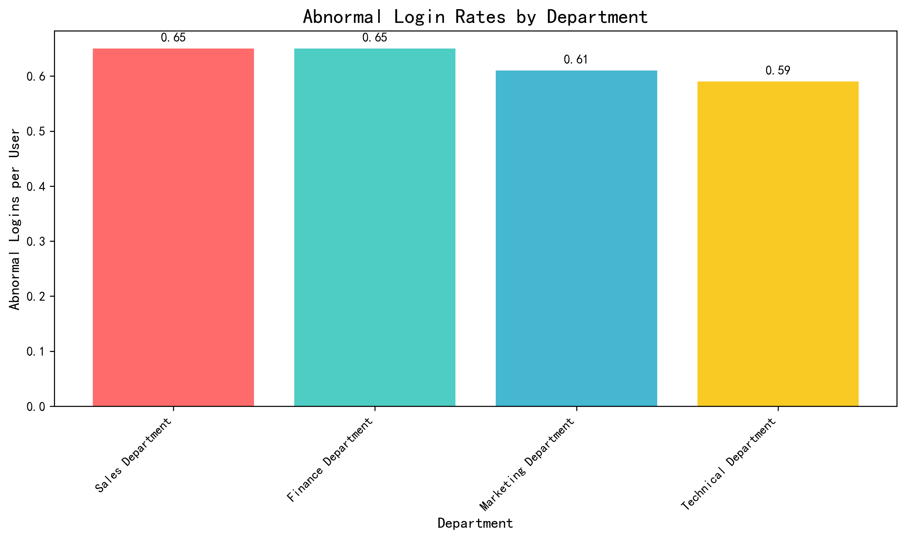
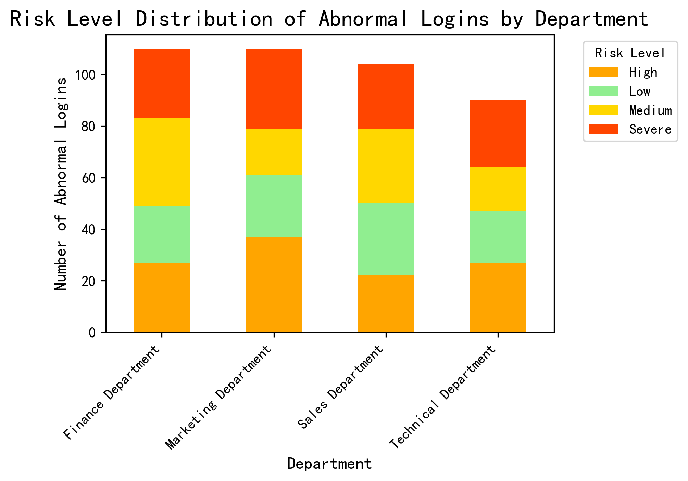

# Office System Security Governance Analysis Report

## Executive Summary

Based on the analysis of 415 abnormal login incidents across four departments, the Sales and Finance Departments show the highest security vulnerability rates, with 0.65 abnormal logins per user each. Marketing Department follows at 0.61, while Technical Department demonstrates the strongest security posture at 0.59 abnormal logins per user.

*Figure 1: Sales and Finance Departments lead with the highest abnormal login rates per user (0.65), indicating these departments require immediate security awareness intervention.*

## Key Findings

### 1. Department Security Vulnerability Ranking
- **Sales Department**: 0.65 abnormal logins per user (104 total incidents)
- **Finance Department**: 0.65 abnormal logins per user (110 total incidents) 
- **Marketing Department**: 0.61 abnormal logins per user (110 total incidents)
- **Technical Department**: 0.59 abnormal logins per user (90 total incidents)

### 2. Risk Level Distribution Analysis

*Figure 2: Marketing Department shows the highest number of Severe risk incidents (31), while Sales Department has the most balanced risk profile across all levels.*

- **Marketing Department**: Highest severe risk incidents (31) and high risk incidents (37)
- **Finance Department**: Leads in medium risk incidents (34) with significant severe (27) and high (27) risk cases
- **Technical Department**: Shows relatively lower severe risk incidents (26) compared to other departments

### 3. Anomaly Type Patterns by Department
- **Finance Department**: Device anomalies (31.8%) and multiple IP logins (29.1%) are most prevalent
- **Marketing Department**: Remote login issues (27.3%) and device anomalies (26.4%) dominate
- **Sales Department**: Device anomalies (27.9%) and frequent login attempts (26.0%) are primary concerns
- **Technical Department**: Multiple IP logins (33.3%) and frequent login attempts (30.0%) are most common

### 4. Incident Response Effectiveness
- **Sales Department**: Shows the best incident response with 58.7% of abnormal logins confirmed
- **Marketing Department**: 48.2% confirmation rate, indicating moderate response effectiveness
- **Technical Department**: 47.8% confirmation rate with 52.2% still pending
- **Finance Department**: Worst response rate with only 38.2% confirmed and 61.8% pending

## Critical Security Concerns

### Priority 1: Finance Department
- **Highest combined risk**: 27 severe + 27 high risk incidents
- **Poorest incident response**: 61.8% of incidents remain unconfirmed
- **Primary issues**: Device anomalies (35 incidents) and multiple IP logins (32 incidents)

### Priority 2: Sales Department  
- **Highest per-user vulnerability rate**: 0.65 abnormal logins per user
- **Device anomaly prevalence**: 29 incidents requiring immediate attention
- **Strong response rate**: 58.7% confirmation shows good awareness but high incident volume

### Priority 3: Marketing Department
- **Most severe risk incidents**: 31 severe cases indicating critical security gaps
- **Remote login vulnerabilities**: 30 incidents suggesting external access issues
- **Moderate response effectiveness**: 48.2% confirmation rate

## Actionable Recommendations

### Immediate Actions (Next 30 Days)
1. **Finance Department Security Bootcamp**: Mandatory training focusing on device security and IP address management
2. **Sales Department Device Security Audit**: Comprehensive review of all devices used for system access
3. **Marketing Department Remote Access Policy Review**: Strengthen remote login protocols and authentication requirements

### Medium-term Initiatives (Next 90 Days)
1. **Department-specific Security Training Programs** based on anomaly patterns:
   - Finance: Device security and multi-factor authentication
   - Sales: Login frequency monitoring and access pattern recognition
   - Marketing: Remote access security and VPN best practices
   - Technical: IP address management and session monitoring

2. **Incident Response Improvement**: Target 80% confirmation rate across all departments
3. **Quarterly Security Awareness Assessments** to measure progress

### Long-term Strategy (6-12 Months)
1. **Automated Security Monitoring System** with department-specific alert thresholds
2. **Regular Security Drills** simulating different anomaly scenarios
3. **Department Security Scorecard** implementation for continuous monitoring

## Conclusion

The analysis reveals significant security awareness gaps, particularly in Sales and Finance Departments. The high volume of device anomalies and multiple IP logins suggests inadequate security protocols and potentially compromised credentials. Immediate intervention is required, starting with targeted training programs and enhanced monitoring for high-risk departments.

Technical Department, while showing the best overall performance, still requires ongoing vigilance given the prevalence of multiple IP login incidents. A comprehensive, department-specific approach to security awareness training will significantly reduce abnormal login incidents and strengthen overall organizational security posture.

*Data Source: Analysis of 415 abnormal login incidents from dacomp-en-035.sqlite database, covering user behavior across four departments.*
