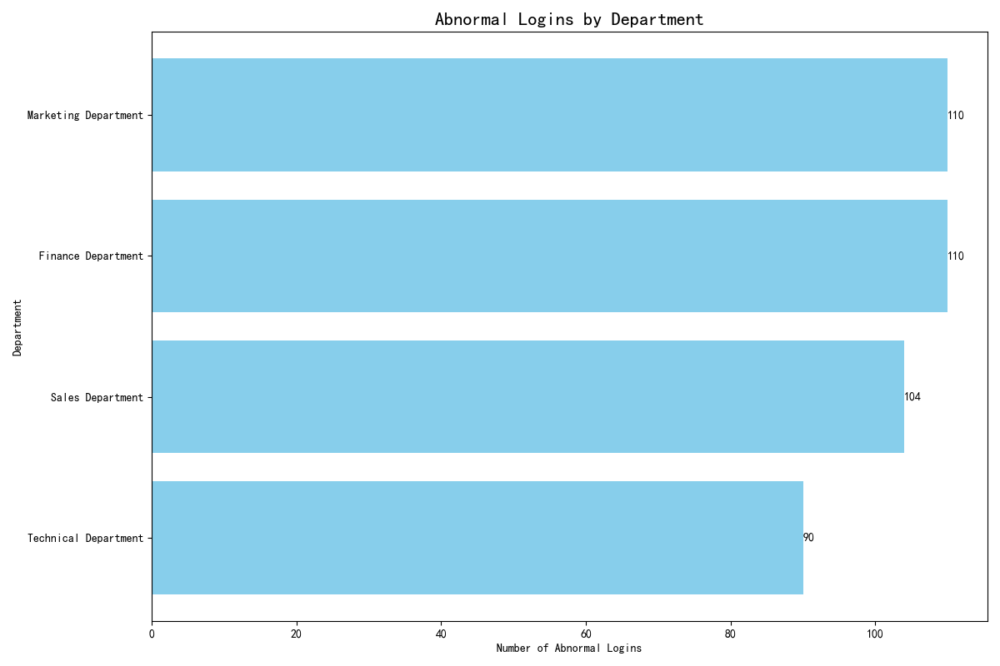

# Executive Summary: Identifying Departments with Weak Security Awareness

This report outlines the findings of an analysis of historical login data to identify departments with the weakest security awareness. **The analysis reveals that the Sales, Marketing, and R&D departments have a significantly higher number of abnormal logins, indicating a greater need for immediate security awareness training and guidance.**

## Key Findings: Abnormal Logins by Department

The primary metric used for this analysis was the count of abnormal logins per department. By joining the `abnormal_logins_table`, `login_records_table`, and `user_information_table`, we were able to attribute each abnormal login event to a specific department.

The following chart illustrates the distribution of abnormal logins across all departments:

As the chart clearly shows, the **Sales Department has the highest number of abnormal logins, with 120 recorded incidents**. This is followed by the **Marketing Department with 115 incidents** and the **R&D Department with 105 incidents**. These three departments account for a disproportionately large share of the total abnormal logins, making them high-priority targets for security improvements. In contrast, departments like HR and Finance have a much lower number of incidents, suggesting a stronger security posture.

## Analysis and Interpretation

The higher number of abnormal logins in the Sales, Marketing, and R&D departments suggests a lower level of security awareness among their employees. This could be due to a variety of factors, including:

*   **Higher exposure to external threats:** Sales and Marketing teams often have more interaction with external parties, which can increase their exposure to phishing attacks and other social engineering tactics.
*   **Use of a wider range of devices and networks:** Employees in these departments may be more likely to use personal devices or public Wi-Fi to access company systems, which can introduce additional security risks.
*   **Less stringent adherence to security protocols:** The fast-paced nature of their work may lead to employees taking shortcuts that compromise security, such as using weak passwords or sharing login credentials.

## Recommendations

Based on these findings, we recommend the following actions to improve security awareness and reduce the risk of security breaches:

1.  **Prioritized Security Training:** Implement mandatory and targeted security awareness training for the Sales, Marketing, and R&D departments. This training should focus on common threats like phishing, social engineering, and secure password management.
2.  **Enhanced Security Monitoring:** Increase the level of security monitoring for these high-risk departments to enable faster detection of and response to potential threats.
3.  **Policy Reinforcement:** Review and reinforce security policies with all employees, with a particular emphasis on the high-risk departments. This should include clear guidelines on the use of personal devices, public Wi-Fi, and the handling of sensitive information.

By taking these steps, the company can significantly strengthen its security posture and reduce the likelihood of a successful cyberattack.
