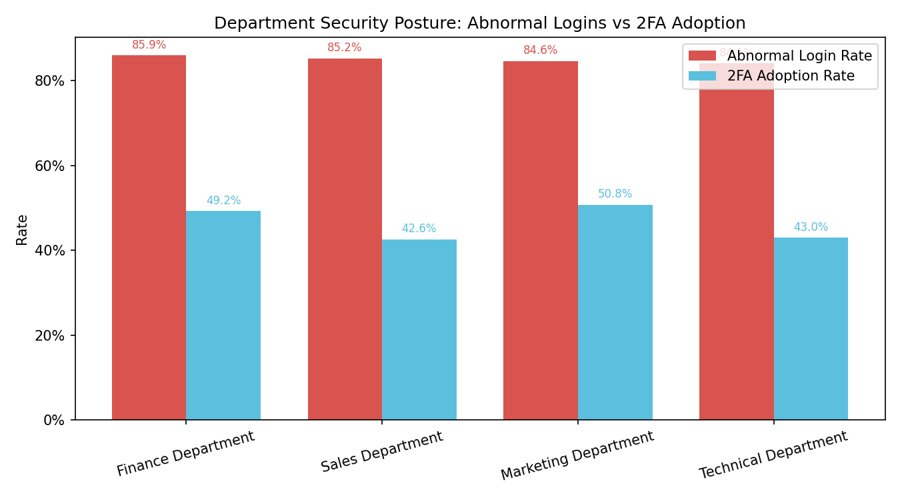

Office System Security Governance: Departmental Security Awareness Assessment

Executive Summary
- Sales and Technical departments show the weakest security awareness overall, primarily due to low 2FA adoption and a high proportion of abnormal logins occurring without 2FA. Finance also needs attention due to the highest abnormal login rate. Marketing has slightly better 2FA adoption but exhibits the highest share of high-risk anomalies, indicating severe incidents that require targeted intervention.
- Prioritized guidance: 1) Sales (lowest 2FA adoption, most abnormalities without 2FA), 2) Technical (low 2FA adoption, high high-risk share), 3) Finance (highest abnormal rate), 4) Marketing (highest severity despite moderate 2FA).

What We Analyzed (Data & Methods)
- Data sources and joins: abnormal_logins_table → login_records_table (join on \"Login Record ID\"), and then → user_information_table (join on \"User ID\") to attribute anomalies to departments.
- Key fields used: Department (user_information_table), Two-Factor Authentication Status (login_records_table), Risk Level (abnormal_logins_table).
- SQL highlights:
  - Total logins by department: SELECT ui.\"Department\", COUNT(*) FROM login_records_table lr JOIN user_information_table ui ON lr.\"User ID\" = ui.\"User ID\" GROUP BY ui.\"Department\"
  - Abnormal logins by department: SELECT ui.\"Department\", COUNT(*) FROM abnormal_logins_table al JOIN login_records_table lr ON al.\"Login Record ID\" = lr.\"Login Record ID\" JOIN user_information_table ui ON lr.\"User ID\" = ui.\"User ID\" GROUP BY ui.\"Department\"
  - 2FA-enabled logins: WHERE lr.\"Two-Factor Authentication Status\" = 'Enabled'
  - High-risk abnormal logins: WHERE al.\"Risk Level\" IN ('High','Severe')
  - Abnormal logins without 2FA: WHERE lr.\"Two-Factor Authentication Status\" = 'Not Enabled'
- Python plotting code executed (saved as plot_dept_security.py) produced a comparative chart of abnormal login rates vs 2FA adoption rates.

Visual Insight

- Key takeaway: All departments show high abnormal login rates (~84–86%), but Sales and Technical have the lowest 2FA adoption (42.62% and 42.99%). This gap signals weaker security habits (e.g., skipping 2FA) and higher risk exposure.

Department-Level Metrics (from dept_security_metrics.csv and abnormal_no2fa.csv)
- Finance Department: 128 total logins; 110 abnormal (85.94%); 2FA adoption 49.22%; high-risk abnormal 54 (49.09% of abnormal); abnormal without 2FA 57 (51.82% of abnormal).
- Sales Department: 122 total logins; 104 abnormal (85.25%); 2FA adoption 42.62%; high-risk abnormal 47 (45.19%); abnormal without 2FA 60 (57.69%).
- Marketing Department: 130 total logins; 110 abnormal (84.62%); 2FA adoption 50.77%; high-risk abnormal 68 (61.82%); abnormal without 2FA 53 (48.18%).
- Technical Department: 107 total logins; 90 abnormal (84.11%); 2FA adoption 42.99%; high-risk abnormal 53 (58.89%); abnormal without 2FA 54 (60.00%).

Prioritized Departments Needing Security Awareness Strengthening
1) Sales Department
- Observation: Lowest 2FA adoption (42.62%) and highest count of abnormal logins without 2FA (60; 57.69% of abnormal). Abnormal rate is 85.25%.
- Root Cause: Low 2FA usage suggests weaker adherence to authentication policies and potential lack of awareness of 2FA’s importance.
- Business Impact / Recommendation: Immediate 2FA mandate with opt-out removal, in-department enablement drives, and targeted training covering account take-over prevention. Track weekly 2FA activation progress and link access to compliance.

2) Technical Department
- Observation: 2FA adoption is 42.99% and 60.00% of abnormal logins occurred without 2FA; high-risk share is 58.89% (second highest), indicating more severe incidents.
- Root Cause: Operational convenience and legacy tool access may discourage 2FA; technical users often hold elevated privileges, increasing blast radius.
- Business Impact / Recommendation: Enforce step-up auth (mandatory 2FA + stronger authentication for privileged actions), run targeted workshops on securing dev/admin tools, and prioritize high-risk alert playbooks for faster containment.

3) Finance Department
- Observation: Highest abnormal login rate (85.94%); 2FA adoption at 49.22%; 51.82% of abnormal logins lacked 2FA; high-risk share 49.09%.
- Root Cause: Mix of high transaction activity and sensitive system access; partial 2FA adoption leaves material exposure during peak workflows.
- Business Impact / Recommendation: Mandate 2FA for all finance systems, establish \"critical-action\" auth checkpoints, and conduct phishing simulation training tailored to finance processes.

4) Marketing Department
- Observation: Moderate 2FA adoption (50.77%) but highest high-risk share (61.82%) among abnormal logins; 48.18% of abnormal logins lacked 2FA.
- Root Cause: Frequent external tool integrations and third-party access may elevate severity when anomalies occur.
- Business Impact / Recommendation: Harden integrations (SSO-only access), review third-party app permissions, and run incident response drills focusing on rapid detection/reporting of high-severity events.

Why This Matters
- Abnormal-logins reflect attempted misuse or compromised behavior; pairing rates with 2FA adoption quantifies awareness and policy adherence. Low 2FA adoption correlates with more abnormalities happening without additional protection, increasing the likelihood of successful compromise.
- High-risk anomaly shares signal the potential impact and urgency for intervention, especially in Technical and Marketing teams.

Actions to Take Next (90-day plan)
- Policy: Make 2FA mandatory across all departments, starting with Sales and Technical within 30 days.
- Enablement: Launch guided 2FA activation sprints (department champions, in-tool prompts, support desks).
- Training: Conduct role-specific security awareness modules (Sales: account hygiene, Technical: privileged access controls, Finance: transaction security, Marketing: third-party risk).
- Monitoring: Establish weekly dashboards for 2FA adoption and abnormal-login trends; set thresholds (e.g., <10% abnormal/no-2FA within 60 days).
- Incident Response: Prioritize playbooks for high-risk anomalies; run tabletop exercises with Technical and Marketing.

Methodological Notes
- All metrics computed from curated tables; no additional cleaning performed. Queries used:
  - Department totals and rates: CTE over login_records_table and abnormal_logins_table joined to user_information_table.
  - 2FA adoption and high-risk shares derived using Two-Factor Authentication Status and Risk Level fields.
- Python visualization generated with matplotlib, saved as dept_security_rates.png, and embedded above.

Bottom Line
- Sales and Technical departments should be the first focus for security awareness guidance due to low 2FA adoption and a high proportion of abnormalities occurring without 2FA. Finance and Marketing follow, with Marketing requiring extra attention to high-severity incident handling. Implement mandatory 2FA, targeted training, and high-risk response drills to reduce exposure and improve security posture across the organization.
