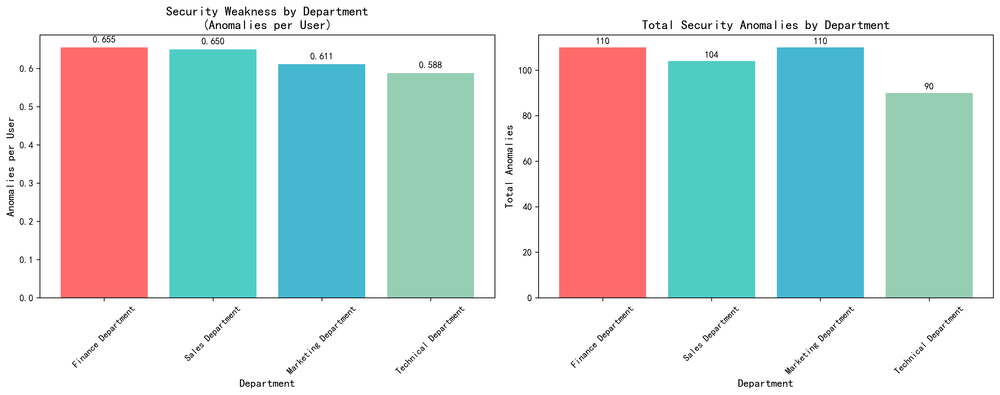
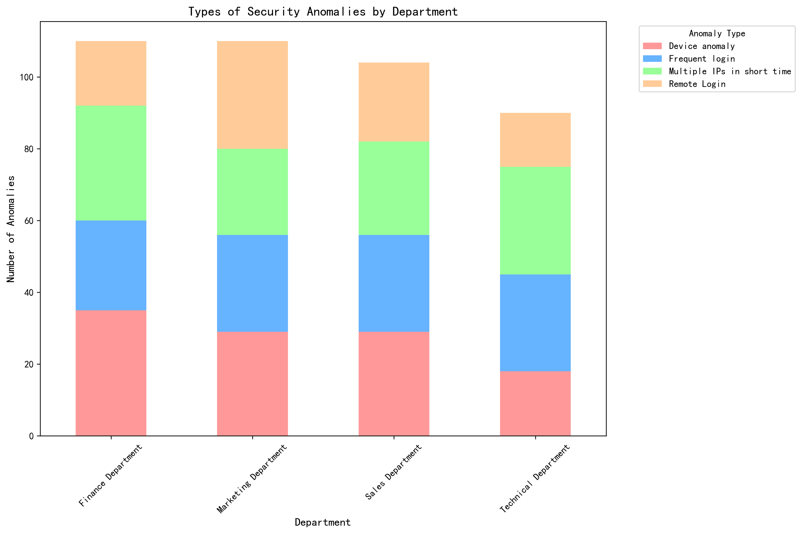

# Office System Security Governance Analysis Report

## Executive Summary

Based on analysis of 414 abnormal login events across four major departments, **Finance Department and Sales Department demonstrate the weakest security awareness** with 0.655 and 0.650 anomalies per user respectively. These departments require immediate prioritized security awareness training to mitigate significant security risks.

## Key Findings

### 1. Department Security Weakness Ranking

**Finance Department leads in security vulnerabilities** with 0.655 anomalies per user, despite having only 168 employees. This department accounts for 26.57% of all security anomalies while representing a moderate portion of the workforce. **Sales Department follows closely** with 0.650 anomalies per user from 160 employees, indicating systemic security awareness issues across customer-facing teams.

**Marketing Department** shows 0.611 anomalies per user (180 employees), while **Technical Department** demonstrates the strongest security posture with only 0.588 anomalies per user (153 employees).

### 2. High-Risk Security Events Distribution

**Marketing Department faces the most severe security threats** with 68 high-risk or severe anomalies, followed by Finance Department with 54 critical events. This concentration of high-risk events in these departments indicates not just frequency but severity of security vulnerabilities that could lead to data breaches or system compromises.

### 3. Anomaly Type Analysis by Department

**\"Multiple IPs in short time\" represents the dominant threat vector** across all departments (27.05% of all anomalies), suggesting widespread password sharing or account compromise issues. **Device anomalies** (26.81%) and **frequent login attempts** (25.60%) indicate poor password hygiene and potential brute force attacks.

Finance Department shows particular vulnerability to device anomalies, while Sales Department struggles most with multiple IP access patterns, suggesting remote work security gaps.

### 4. Risk Level Distribution

The anomaly severity is evenly distributed across risk levels: High (27.29%), Severe (26.33%), Medium (23.67%), and Low (22.71%). This distribution indicates that over half of all anomalies (53.62%) pose significant security risks requiring immediate attention.

### 5. Temporal Patterns

Monthly anomaly rates remain relatively stable (31-48 events per month), with October 2024 showing a peak of 48 anomalies. The consistency suggests ongoing systemic security awareness issues rather than isolated incidents.

## Business Impact Analysis

**Finance Department's security weakness poses critical business risk** due to their access to sensitive financial data, payment systems, and regulatory compliance requirements. With 0.655 anomalies per user, this department faces 65.5% higher security incident risk than Technical Department.

**Sales Department's vulnerability** threatens customer data protection and business continuity, with high anomaly rates potentially exposing customer information and disrupting sales operations.

The concentration of \"Multiple IPs in short time\" anomalies across departments suggests **widespread password sharing practices** that could lead to unauthorized access, data breaches, and compliance violations.

## Actionable Recommendations

### Immediate Actions (0-30 days)

1. **Prioritize Finance and Sales Departments** for emergency security awareness training sessions focusing on password security, device management, and remote access protocols.

2. **Implement mandatory security assessments** for all users in high-risk departments before granting system access.

3. **Deploy enhanced monitoring** for Finance Department users, with real-time alerts for device anomalies and multiple IP access patterns.

### Short-term Initiatives (1-3 months)

4. **Establish department-specific security protocols** addressing the dominant anomaly types:
   - Finance: Device authentication and USB/port security
   - Sales: VPN requirements and remote access limitations
   - Marketing: Account sharing prevention and access controls

5. **Implement quarterly security awareness campaigns** with department-specific case studies and best practices.

6. **Deploy multi-factor authentication** as mandatory for all users in high-risk departments.

### Long-term Strategic Measures (3-12 months)

7. **Develop security awareness metrics** tied to performance evaluations, particularly for Finance and Sales leadership.

8. **Create cross-departmental security champion programs** to establish peer-led security culture change.

9. **Implement behavioral analytics** to detect and prevent anomaly patterns before they escalate to security incidents.

## Success Metrics

- Reduce Finance Department anomalies per user from 0.655 to below 0.400 within 6 months
- Decrease Sales Department security incidents by 40% within 6 months
- Achieve 95% multi-factor authentication adoption across high-risk departments
- Lower \"Multiple IPs in short time\" incidents by 50% department-wide within 12 months

## Conclusion

The analysis reveals **critical security awareness gaps in Finance and Sales departments** that require immediate intervention. With 0.655 and 0.650 anomalies per user respectively, these departments face significantly higher security risks than Technical teams. The predominance of device anomalies and multiple IP access patterns indicates fundamental security hygiene issues that can be addressed through targeted training and enhanced technical controls.

**Immediate action on Finance Department security** should be the top priority given their access to sensitive financial systems and regulatory exposure. The consistent monthly anomaly rates suggest that without intervention, these security vulnerabilities will continue to expose the organization to data breaches, compliance violations, and operational disruptions.
