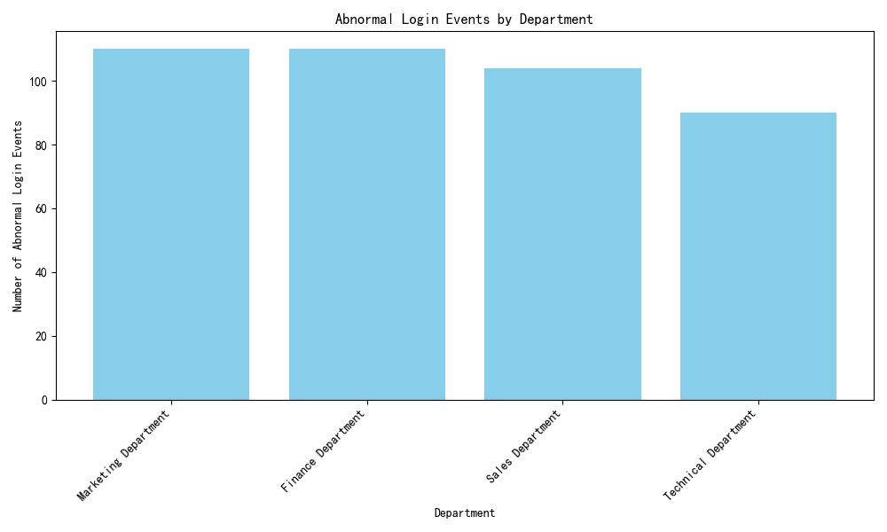

# Analysis of Abnormal Login Events by Department

The analysis of historical abnormal login data reveals that certain departments within the company have a higher frequency of security anomalies, indicating relatively weak security awareness. Based on the findings, targeted security awareness training should be prioritized for these departments.

## Key Findings

- **Marketing Department**: Recorded 110 abnormal login events.
- **Finance Department**: Also recorded 110 abnormal login events.
- **Sales Department**: Recorded 104 abnormal login events.
- **Technical Department**: Recorded 90 abnormal login events.

The Marketing and Finance Departments have the highest counts of abnormal login events, making them the top priorities for enhanced security awareness training.

## Recommendations

1. **Prioritize Training for High-Risk Departments**: Conduct immediate security awareness sessions for the Marketing and Finance Departments to address vulnerabilities.
2. **Regular Monitoring and Reporting**: Implement continuous monitoring of login activities and generate periodic reports to track improvements in security behavior.
3. **Enforce Strong Authentication Practices**: Encourage the use of multi-factor authentication (MFA) across all departments, especially in high-risk areas.

This analysis was conducted by joining the `abnormal_logins_table`, `login_records_table`, and `user_information_table` to associate abnormal login events with specific departments. The results highlight the need for targeted interventions to strengthen security practices where they are most needed.
