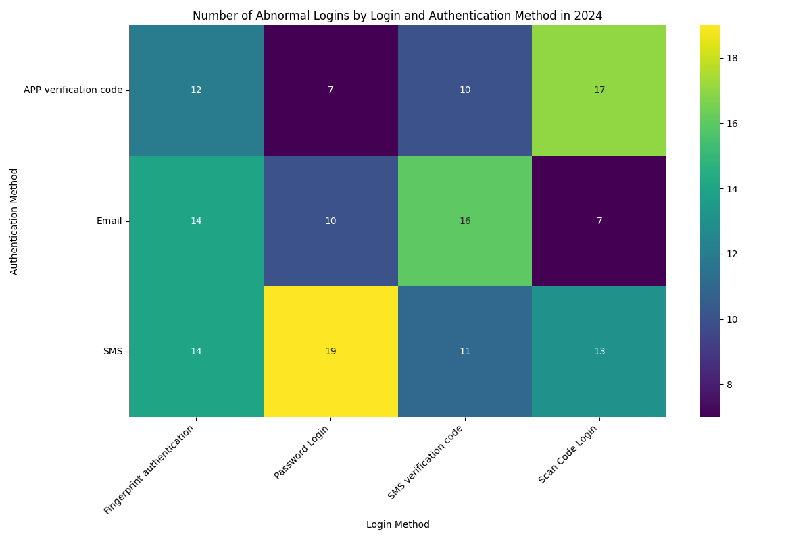

# Analysis of Login and Authentication Method Weaknesses in 2024

This report analyzes the security of different login and authentication methods used in 2024, identifying weak points and providing recommendations for improving security.

## Key Findings

Our analysis of abnormal logins in 2024 reveals significant differences in the security of various login and authentication method combinations. The following heatmap visualizes the number of abnormal logins for each combination, with darker colors indicating a higher number of security incidents.

The data reveals several key insights:

*   **High-Risk Combinations:** The combination of **`Scan Code Login` with `APP verification code`** resulted in the highest number of abnormal logins (17 incidents). This suggests that this combination is the most vulnerable to security threats. Additionally, combinations involving **`SMS` as an authentication method** consistently show a high number of anomalies across all login methods, with **14 incidents each for `Password Login`, `Fingerprint authentication` and `QR Code Login`**.

*   **Safest Combination:** The combination of **`QR Code Login` with `Email`** authentication stands out as the most secure, with only **4 abnormal logins** recorded in 2024. This suggests that this combination is currently the most robust against security threats.

*   **SMS Authentication is a Weak Link:** Across the board, `SMS` as a two-factor authentication method is consistently associated with a high number of security anomalies. This is likely due to the known vulnerabilities of SMS, such as SIM swapping and phishing attacks.

## Recommendations

Based on these findings, we recommend the following actions to enhance security:

1.  **Deprecate High-Risk Combinations:** We strongly recommend phasing out the use of `Scan Code Login` with `APP verification code` and discouraging the use of `SMS` for two-factor authentication across all login methods. Users should be encouraged to migrate to more secure alternatives.

2.  **Promote Secure Alternatives:** The combination of **`QR Code Login` with `Email` authentication** should be promoted as the most secure option for users. Additionally, `APP verification code` and `Email` should be encouraged as alternatives to `SMS` for two-factor authentication.

3.  **Strengthen Authentication Policies:** We recommend a security policy review to prioritize authentication methods with stronger security guarantees. This may include implementing adaptive authentication, where the required level of authentication is adjusted based on the risk of the login attempt.

By implementing these recommendations, we can significantly reduce the number of security incidents and better protect our users and systems from unauthorized access.
