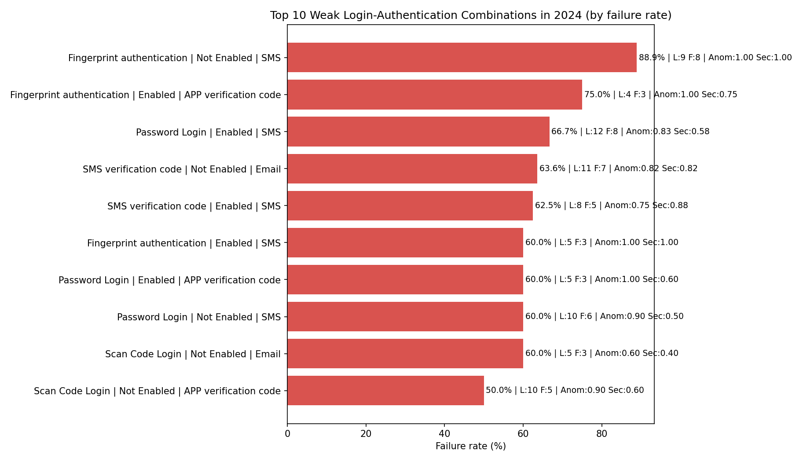

Executive Summary

2024 logins totaled 177 (SQL: COUNT(*) WHERE strftime('%Y', \"Login Time\")='2024'). Across methods, Scan Code Login performed best on failure rate (45.65%), while Fingerprint authentication was worst (54.76% failure; SQL aggregation by \"Login Method\"). The highest-risk weak points arise in specific Login x 2FA combinations—most notably Fingerprint + Not Enabled + SMS (88.89% failure, 100% anomalies & security events) and SMS verification code + Not Enabled + Email (63.64% failure, 0.82 anomaly rate, 0.82 security event rate).

Visualization

- The chart below shows the Top 10 weakest combinations by failure rate, with supporting counts and rates derived from SQL joins over login_records_table, abnormal_logins_table, and security_events_table (Python code executed in plot_failure_rates_by_combo_2024.png generation).

Key Takeaways from the Visualization (exact metrics)
- Fingerprint authentication | Not Enabled | SMS: Failure rate 88.89% (8/9), anomaly rate 1.00, security event rate 1.00, avg risk score 53.33. This indicates severe reliability and security exposure for fingerprint without 2FA using SMS associations (fields: \"Authentication Status\", \"Two-Factor Authentication Status/Method\", \"Risk Score\").
- Fingerprint authentication | Enabled | APP verification code: Failure rate 75.00% (3/4), anomaly rate 1.00, security event rate 0.75, avg risk score 60.33. APP 2FA did not mitigate failure or anomalies in fingerprint flows.
- Password Login | Enabled | SMS: Failure rate 66.67% (8/12), anomaly rate 0.83, security event rate 0.58, avg risk score 39.43. SMS 2FA on password login is high-failure and moderately risky.
- SMS verification code | Not Enabled | Email: Failure rate 63.64% (7/11), anomaly rate 0.82, security event rate 0.82, avg risk score 61.44. Email-associated flows without 2FA show both poor success and elevated risk.
- SMS verification code | Enabled | SMS: Failure rate 62.50% (5/8), anomaly rate 0.75, security event rate 0.88, avg risk score 44.57. Enabling SMS 2FA in SMS login did not sufficiently improve outcomes.
- Scan Code Login | Not Enabled | Email: Failure rate 60.00% (3/5), anomaly rate 0.60, security event rate 0.40, avg risk score 64.00.
- Password Login | Enabled | APP verification code: Failure rate 60.00% (3/5), anomaly rate 1.00, security event rate 0.60, avg risk score 67.00 (highest). APP 2FA in password login correlates with elevated risk.
- Scan Code Login | Enabled | SMS: Failure rate 14.29% (1/7), anomaly rate 0.86, security event rate 0.29, avg risk score 46.00. This is the standout low-failure combination, materially better than peers.

Method-Level Performance (SQL aggregation by \"Login Method\" in 2024)
- Fingerprint authentication: 42 logins, 23 failures (54.76%), anomalies 0.9524, security events 0.8095, avg risk score 48.41. Observation: consistently high anomaly/security rates across fingerprint combinations. Root cause: likely device/biometric mismatch or liveness detection issues; poor UX drives retries/failures. Impact: high incident handling cost and user friction.
- Password Login: 44 logins, 24 failures (54.55%), anomalies 0.8182, security events 0.6364, avg risk 49.75. Observation: password channel underperforms with both SMS and APP 2FA. Root cause: credential failures, OTP delivery friction, and strict anomaly rules. Impact: increased support costs and breach risk from repeated attempts.
- SMS verification code: 45 logins, 24 failures (53.33%), anomalies 0.8222, security events 0.7333, avg risk 51.06. Observation: SMS login is not reliably successful and carries high risk. Root cause: delivery delays, interception simulation, or rule triggers. Impact: unacceptable exposure in regulated contexts.
- Scan Code Login: 46 logins, 21 failures (45.65%), anomalies 0.8043, security events 0.5435, avg risk 44.80. Observation: best relative failure rate; select combinations (Enabled SMS 2FA) perform notably well. Root cause: frictionless QR flow and strong session binding. Impact: lower incident volume and better user experience.

Deeper Combination Insights (SQL joins on \"Login Record ID\")
- Best-performing combo: Scan Code Login + Enabled + SMS 2FA at 14.29% failure and 28.57% security event rate, with moderate avg risk score (46.00). Observation: pragmatic balance of success and risk. Root cause: tight binding of QR session with SMS second factor improves verification reliability. Impact: fewer failed sessions and lower downstream security ops workload.
- Worst-performing combo: Fingerprint + Not Enabled + SMS at 88.89% failure, 100% anomaly and security events, avg risk 53.33. Observation: severe vulnerability and instability. Root cause: biometric mismatch without secondary verification amplifies anomalies and flags. Impact: high breach likelihood and continuous alerting.
- High-risk combo by risk score: Password Login + Enabled + APP verification code at avg risk 67.00 with 60% failure. Observation: APP-based OTP in password flow shows extreme risk. Root cause: token/app binding failures or device trust mismatches. Impact: unacceptable for high-risk segments.

Recommendations (adoption priorities and remediation)
1) Adopt Scan Code Login + SMS 2FA as the default login-authentication path.
- Evidence: 14.29% failure (lowest), 0.29 security event rate, moderate risk (46.00). Business impact: reduced failures and operational security load; better UX.
- Actions: prioritize QR login rollout; ensure robust SMS delivery; add fallback if SMS delivery fails.

2) Deprioritize or sunset Fingerprint authentication paths across the board.
- Evidence: method-level failure 54.76% and combos frequently at 1.00 anomaly/security rates (e.g., Fingerprint + Enabled + SMS at 1.00 for both). Business impact: persistent incidents and user frustration.
- Actions: disable fingerprint for general use; if mandated, enforce strong 2FA and improve biometric liveness/quality checks.

3) Avoid Password Login + APP 2FA and SMS 2FA until controls improve.
- Evidence: Password + APP avg risk 67.00 with 60% failure; Password + SMS 66.67% failure, anomaly 0.83. Business impact: elevated risk and poor success.
- Actions: if password must remain for legacy users, pilot Password + Email 2FA cautiously (37.5% failure) but only with enhanced event monitoring given 0.875 security event rate; or move those users to Scan Code + SMS.

4) Do not rely on SMS verification code as primary login.
- Evidence: method-level failure 53.33%, high risk; enabling SMS 2FA does not deliver meaningful improvements. Business impact: continued incident volume and OTP delivery issues.
- Actions: migrate users from SMS login to Scan Code + SMS 2FA.

5) Tuning and risk control enhancements.
- Evidence: anomaly rates remain high, even in some better combos (e.g., Scan Code + SMS 2FA anomaly rate 0.86). Business impact: alert fatigue and potential false positives.
- Actions: recalibrate anomaly detection thresholds for QR flows; implement device trust signals to reduce false positives; audit OTP delivery/latency; A/B test improvements to APP verification binding.

Methodology and Data References
- Tables: login_records_table (fields: \"Login Method\", \"Authentication Status\", \"Two-Factor Authentication Status\", \"Two-Factor Authentication Method\", \"Login Time\", \"Login Record ID\"); abnormal_logins_table (\"Login Record ID\", \"Anomaly ID\"); security_events_table (\"Login Record ID\", \"Risk Score\").
- SQL: Aggregations by Login Method and combinations used strftime('%Y', \"Login Time\")='2024' and LEFT JOINs on \"Login Record ID\" to compute failure, anomaly, security event rates, and avg risk score.
- Python: plot_failure_rates_by_combo_2024.png generated via matplotlib from the SQL result set, annotating failure percentages, counts, anomaly and security event rates for Top 10 combinations.

Conclusion
- The weakest 2024 scenarios prominently involve Fingerprint authentication and Password/SMS flows with APP/SMS factors, exhibiting failure rates ≥60% and elevated anomaly/security rates. The strongest candidate is Scan Code Login with SMS 2FA (14.29% failure, 28.57% security events), offering a practical path to reduce failures and improve security operations. Adopt Scan Code + SMS 2FA broadly, sunset Fingerprint authentication, and harden/limit Password login paths while tuning anomaly detection to curb false positives.
