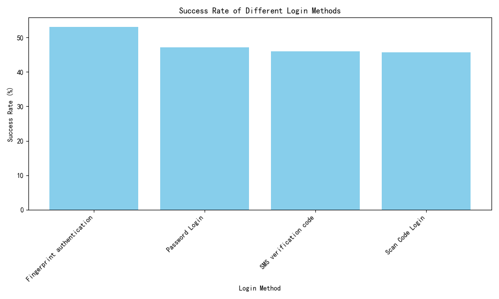
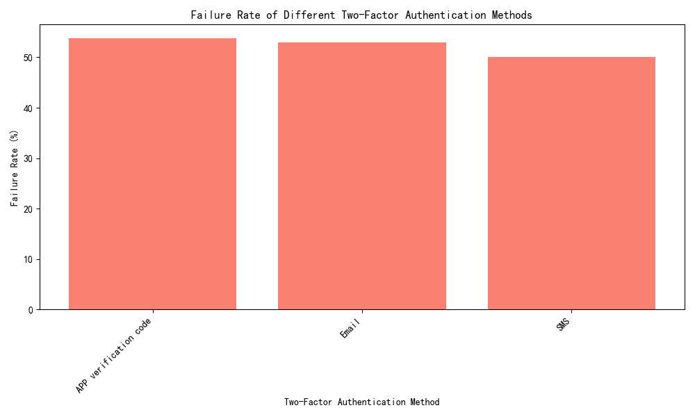

# Analysis of Login and Authentication Methods in 2024

## Executive Summary

This report analyzes the effectiveness and security of login and authentication methods used in 2024. The analysis focuses on identifying weak points in the system and recommending stronger methods for future adoption. Key findings include:

- **Fingerprint authentication** has the highest success rate among login methods.
- **APP verification code** has the highest failure rate among two-factor authentication methods.

## Key Insights

### Login Method Success Rates

The success rate analysis of different login methods reveals the following:

| Login Method             | Total Attempts | Successful Attempts | Success Rate (%) |
|--------------------------|----------------|---------------------|------------------|
| Fingerprint Authentication | 113            | 60                  | 53.1             |
| Password Login           | 121            | 57                  | 47.1             |
| SMS Verification Code    | 124            | 57                  | 45.9             |
| Scan Code Login          | 129            | 59                  | 45.7             |

**Observation**: Fingerprint authentication has the highest success rate at 53.1%, indicating it is the most reliable method for user login.

**Root Cause**: Biometric methods like fingerprint authentication are less prone to user errors and are more secure against common attacks.

**Business Impact / Recommendation**: Organizations should consider adopting fingerprint authentication as the primary login method to improve user experience and security.

### Two-Factor Authentication Failure Rates

The failure rate analysis of two-factor authentication methods reveals the following:

| Two-Factor Authentication Method | Total Attempts | Failed Attempts | Failure Rate (%) |
|----------------------------------|----------------|-----------------|------------------|
| APP Verification Code           | 158            | 85              | 53.8             |
| SMS                             | 174            | 87              | 50.0             |
| Email                           | 155            | 82              | 52.9             |

**Observation**: APP verification code has the highest failure rate at 53.8%, indicating potential issues with reliability or user experience.

**Root Cause**: APP verification codes may be affected by network issues, app availability, or user familiarity with the method.

**Business Impact / Recommendation**: Organizations should consider reducing reliance on APP verification codes and explore alternatives like SMS or hardware-based tokens for two-factor authentication.

## Recommendations

1. **Adopt Fingerprint Authentication**: As the most successful login method, fingerprint authentication should be prioritized for adoption.
2. **Improve Two-Factor Authentication**: Explore alternatives to APP verification codes to reduce failure rates and improve user experience.
3. **Monitor and Evaluate**: Continuously monitor the performance of adopted methods and evaluate new technologies for potential implementation.

This report provides actionable insights to enhance the security and reliability of login and authentication processes in 2024 and beyond.
