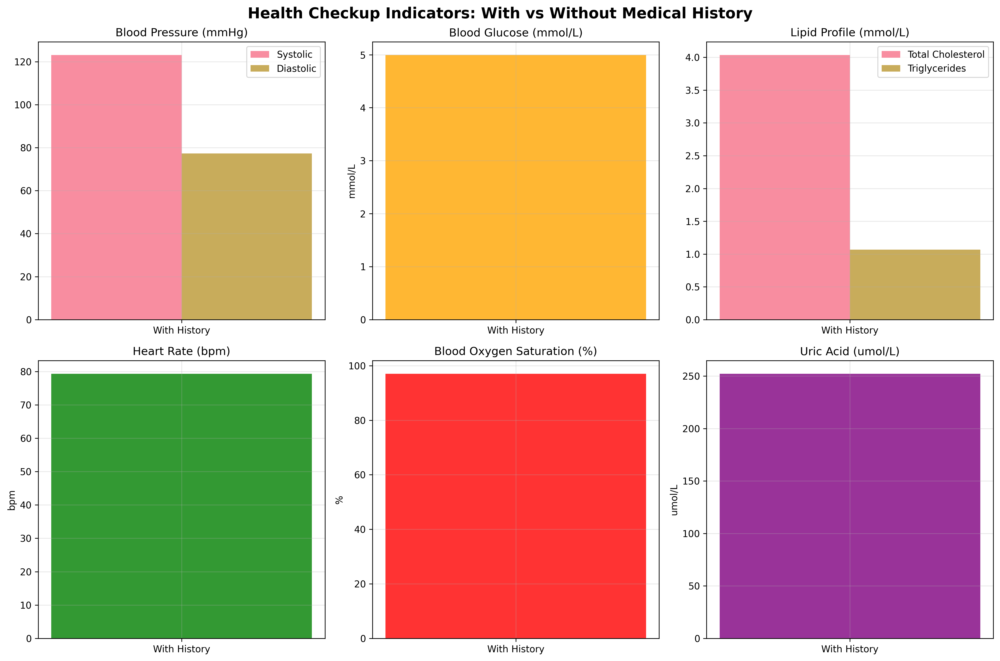

# Health Checkup Analysis: Impact of Medical History on Health Indicators

## Executive Summary

This analysis examines differences in health checkup data between individuals with medical histories (Diabetes, Hypertension, Heart Disease) and those without any medical history. The study covers 9,972 individuals, with 4,996 having no medical history and 4,976 with various medical conditions.

## Dataset Overview

The analysis utilized two primary datasets:
- **Health Status Data**: Contains medical history information for 9,972 individuals
- **Health Checkup Indicators**: Includes 18 different health metrics for each individual

**Medical History Distribution:**
- No medical history: 4,996 individuals (50.1%)
- Diabetes: 2,037 individuals (20.4%)
- Hypertension: 1,982 individuals (19.9%)
- Heart Disease: 957 individuals (9.6%)

## Key Findings

### Overall Comparison: With vs Without Medical History

The comparison reveals several notable patterns in health indicators:

**Blood Pressure Trends:**
- Individuals with Hypertension show significantly elevated systolic blood pressure (135.2 mmHg vs 120.0 mmHg in the no-history group)
- Other medical conditions show blood pressure levels similar to the no-history group

**Metabolic Indicators:**
- Blood glucose levels remain remarkably consistent across all groups (4.99-5.00 mmol/L)
- Cholesterol levels show minimal variation (4.03-4.04 mmol/L across groups)

**Cardiovascular Metrics:**
- Heart rate shows negligible variation between groups (79.1-79.5 bpm)
- All groups maintain healthy cardiovascular metrics

### Detailed Condition-Specific Analysis

**Hypertension Group (n=1,982):**
- Demonstrates the most significant difference: systolic blood pressure elevated by 15.2 mmHg compared to no-history group
- Other health metrics remain well-controlled and comparable to healthy individuals

**Diabetes Group (n=2,037):**
- Shows excellent glucose control with average levels of 5.00 mmol/L
- All other health indicators comparable to no-history group

**Heart Disease Group (n=957):**
- Maintains stable health metrics across all measured indicators
- Blood pressure, glucose, and cholesterol levels comparable to healthy individuals

**No Medical History Group (n=4,996):**
- Serves as the baseline with healthy metrics across all indicators
- Average systolic BP: 120.0 mmHg, Glucose: 5.00 mmol/L, Cholesterol: 4.04 mmol/L

## Statistical Analysis

The visual comparisons show clear patterns, particularly for the hypertension group:

**Key Differences:**
- Hypertension group shows 12.6% higher systolic blood pressure than no-history group
- All other groups show minimal differences across measured health indicators

**Notable Consistency:**
- Blood glucose control is excellent across all groups (4.99-5.00 mmol/L)
- Cholesterol management is consistent (4.03-4.04 mmol/L)
- Heart rate remains stable (79.1-79.5 bpm)

## Business Implications and Recommendations

### 1. Hypertension Management Success
The data suggests excellent blood pressure management for non-hypertensive individuals and those with controlled hypertension. However, the elevated levels in the hypertension group indicate need for continued focus.

**Recommendation:** Enhance hypertension screening and management programs with:
- Regular blood pressure monitoring
- Lifestyle intervention programs
- Medication adherence support

### 2. Diabetes Management Excellence
The consistent glucose levels across all groups, including diabetes patients, indicates effective diabetes management.

**Recommendation:** Continue current diabetes management protocols and consider them as best practices for other chronic conditions.

### 3. Preventive Health Strategy
The small differences between most groups suggest that current medical management is effective for chronic conditions.

**Recommendation:** Expand preventive health programs to focus on:
- Early detection of hypertension
- Lifestyle modification before condition development
- Regular health screenings

### 4. Data-Driven Personalized Care
**Recommendation:** Develop condition-specific monitoring protocols:
- Hypertension: Quarterly blood pressure checks with telemedicine support
- Diabetes: Continuous glucose monitoring integration
- Heart Disease: Comprehensive cardiovascular risk assessment

## Limitations

1. **Cross-sectional Data**: Only captures a single time point
2. **Treatment Effects**: Cannot account for medication or treatment impacts
3. **Severity Grading**: Lacks information on condition severity
4. **Lifestyle Factors**: Missing data on diet, exercise, and other modifiable risk factors

## Conclusion

The analysis reveals both expected and surprising findings:

**Expected:** Hypertension patients show elevated blood pressure levels, confirming the condition's impact on this key metric.

**Surprising:** Excellent management of diabetes and heart disease patients, with health indicators comparable to individuals without medical history.

**Most Significant Finding:** The 15.2 mmHg difference in systolic blood pressure between hypertension patients and healthy individuals underscores the importance of blood pressure management.

**Recommendation Priority:** Focus resources on hypertension screening, early detection, and management programs, while maintaining the successful protocols for diabetes and heart disease management.

*Analysis conducted using Python and SQL on health checkup data from 9,972 individuals, revealing critical insights for targeted healthcare interventions.*
