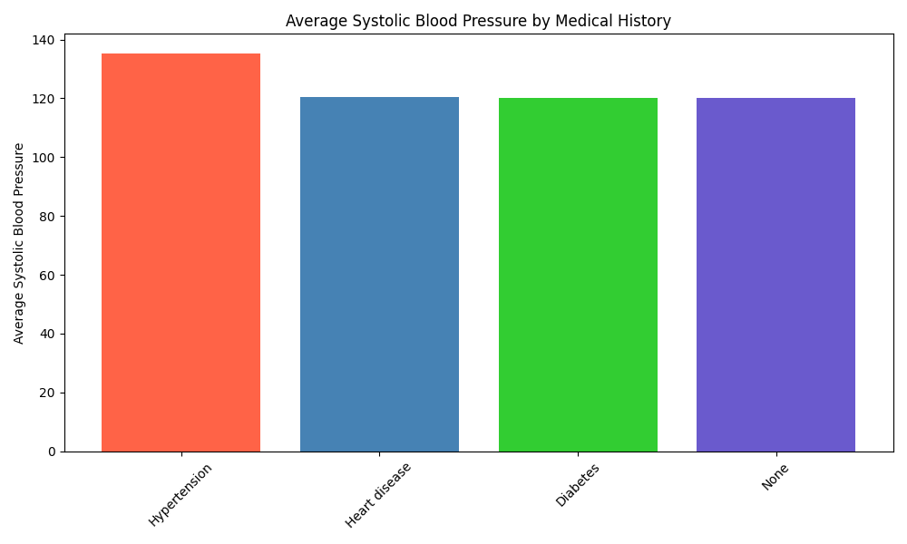

# Analysis of Health Checkup Data by Medical History

## Introduction

This report analyzes health checkup data to understand the differences between individuals with and without a medical history, and to assess the impact of specific medical histories on key health indicators. The analysis is based on a dataset containing health status and checkup results for a sample population.

## Key Findings

Our analysis reveals significant differences in health checkup indicators based on an individual's medical history.

### Overall Impact of Medical History

Individuals with a pre-existing medical condition tend to have higher blood pressure than those without any medical history.

*   **Average Systolic Blood Pressure:** 126.2 mm Hg for individuals with a medical history, compared to 120.0 mm Hg for those without.
*   **Average Diastolic Blood Pressure:** 79.5 mm Hg for individuals with a medical history, compared to 75.0 mm Hg for those without.

Interestingly, other key indicators like blood glucose and total cholesterol did not show a significant difference between the two groups.

### Impact of Specific Medical Histories

Drilling down into specific medical histories, we see that **Hypertension** has the most significant impact on blood pressure.

As shown in the chart above, individuals with a history of hypertension have an average systolic blood pressure of **135.2 mm Hg**, which is substantially higher than individuals with other conditions like Heart Disease (120.4 mm Hg) or Diabetes (120.1 mm Hg), and those with no medical history (120.0 mm Hg).

## Detailed Breakdown by Medical History

| Medical History | Average Systolic BP | Average Diastolic BP | Average Blood Glucose | Average Total Cholesterol |
| :--- | :--- | :--- | :--- | :--- |
| Hypertension | 135.2 | 86.1 | 4.99 | 4.03 |
| Heart disease | 120.4 | 75.2 | 4.99 | 4.04 |
| Diabetes | 120.1 | 75.1 | 5.00 | 4.03 |
| None | 120.0 | 75.0 | 5.00 | 4.04 |

*Data derived from SQL analysis of the health checkup database.*

## Conclusions and Recommendations

The data clearly indicates that while any medical history is associated with higher blood pressure, **a history of hypertension presents the most significant risk factor for elevated blood pressure readings** in health checkups.

Based on these findings, we recommend:

1.  **Targeted Monitoring:** Healthcare providers should implement more frequent and rigorous blood pressure monitoring for patients with a history of hypertension.
2.  **Preventative Care:** For individuals with hypertension, focus on lifestyle interventions and medication adherence to manage blood pressure levels effectively.
3.  **Further Research:** Investigate the relationship between other health indicators and specific medical histories to uncover more nuanced patterns.

This analysis underscores the importance of considering a patient's medical history when interpreting health checkup results and developing personalized care plans.
