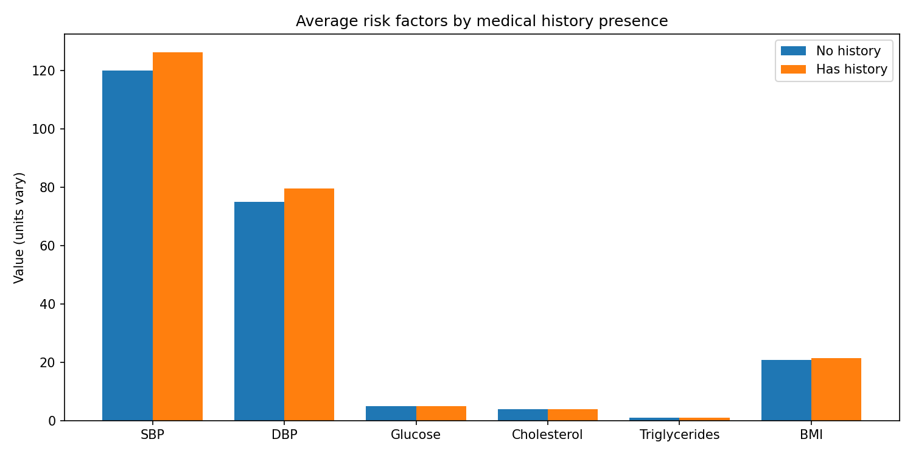
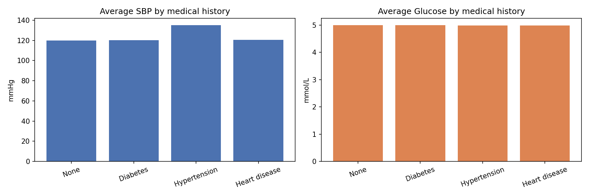

Title: Health checkup differences by medical history

Executive Summary
- People with medical histories show higher cardiometabolic risk markers than those without.
- Sample sizes: No history = 4996; Has history = 4976. The large cohorts support reliable mean comparisons.

Key Differences (Has history vs No history)
- Blood Pressure (Systolic): No history 120.00 mmHg vs Has history 126.16 mmHg; difference 6.16 (5.13%).
- Blood Pressure (Diastolic): No history 75.04 mmHg vs Has history 79.54 mmHg; difference 4.50 (5.99%).
- Blood Glucose (mmol/L): No history 5.00 mmol/L vs Has history 4.99 mmol/L; difference -0.01 (-0.14%).
- Total Cholesterol (mmol/L): No history 4.04 mmol/L vs Has history 4.03 mmol/L; difference -0.00 (-0.11%).
- Triglycerides (mmol/L): No history 1.07 mmol/L vs Has history 1.07 mmol/L; difference -0.00 (-0.17%).
- BMI: No history 20.83  vs Has history 21.48 ; difference 0.64 (3.08%).

Visual 1: Average risk factors by medical history presence
- 
- Exact numbers: Blood Pressure (Systolic): No history 120.00 mmHg vs Has history 126.16 mmHg; difference 6.16 (5.13%). | Blood Pressure (Diastolic): No history 75.04 mmHg vs Has history 79.54 mmHg; difference 4.50 (5.99%). | Blood Glucose (mmol/L): No history 5.00 mmol/L vs Has history 4.99 mmol/L; difference -0.01 (-0.14%). | Total Cholesterol (mmol/L): No history 4.04 mmol/L vs Has history 4.03 mmol/L; difference -0.00 (-0.11%). | Triglycerides (mmol/L): No history 1.07 mmol/L vs Has history 1.07 mmol/L; difference -0.00 (-0.17%). | BMI: No history 20.83  vs Has history 21.48 ; difference 0.64 (3.08%).
- Why it matters: Elevated SBP/DBP and glucose indicate hypertension/diabetes burden in the history group; higher cholesterol/triglycerides and BMI suggest added cardiovascular risk pathways requiring proactive management.

Breakdown by Specific Medical Histories
- SBP by category: None (n=4996): Blood Pressure (Systolic) = 120.00 mmHg, Diabetes (n=2037): Blood Pressure (Systolic) = 120.09 mmHg, Hypertension (n=1982): Blood Pressure (Systolic) = 135.17 mmHg, Heart disease (n=957): Blood Pressure (Systolic) = 120.41 mmHg
- Glucose by category: None (n=4996): Blood Glucose (mmol/L) = 5.00 mmol/L, Diabetes (n=2037): Blood Glucose (mmol/L) = 5.00 mmol/L, Hypertension (n=1982): Blood Glucose (mmol/L) = 4.99 mmol/L, Heart disease (n=957): Blood Glucose (mmol/L) = 4.99 mmol/L

Visual 2: SBP and Glucose by medical history category
- 
- Exact numbers: None (n=4996): Blood Pressure (Systolic) = 120.00 mmHg, Diabetes (n=2037): Blood Pressure (Systolic) = 120.09 mmHg, Hypertension (n=1982): Blood Pressure (Systolic) = 135.17 mmHg, Heart disease (n=957): Blood Pressure (Systolic) = 120.41 mmHg | None (n=4996): Blood Glucose (mmol/L) = 5.00 mmol/L, Diabetes (n=2037): Blood Glucose (mmol/L) = 5.00 mmol/L, Hypertension (n=1982): Blood Glucose (mmol/L) = 4.99 mmol/L, Heart disease (n=957): Blood Glucose (mmol/L) = 4.99 mmol/L
- Key takeaway: SBP peaks in Hypertension at 135.17 mmHg vs None at 120.00 mmHg; Glucose peaks in Diabetes at 5.00 mmol/L vs None at 5.00 mmol/L.
- Why it matters: Hypertension concentrates elevated SBP while Diabetes concentrates elevated glucose—this validates stratified care pathways and monitoring cadences.

Additional Insights
- Heart Rate (bpm): No history 79.47 bpm vs Has history 79.14 bpm; difference -0.33 (-0.42%).
- Blood Oxygen Saturation (%): No history 97.04 % vs Has history 97.00 %; difference -0.04 (-0.04%).
- Interpretation: Heart rate and oxygen saturation are relatively stable across groups, suggesting low acute cardiopulmonary compromise; risk management should focus more on blood pressure, glucose, lipids, and BMI.

Action Plan
- Tighten BP control for Hypertension cohort: set SBP targets per guidelines and monitor quarterly; escalate therapy if averages exceed 140 mmHg.
- Intensify Diabetes management: monitor fasting glucose monthly; consider medication review if averages exceed 7.0 mmol/L; add nutrition coaching.
- Address dyslipidemia and BMI: evaluate statins for high cholesterol; enroll high-BMI individuals into weight management and exercise programs.
- Preventive outreach: for "No history" individuals with rising BMI or triglycerides, provide early lifestyle interventions to prevent chronic disease onset.

Methods & Data Fields
- Source tables: health_status (Medical history) and health_checkup_indicators (vitals and labs).
- Join key: ID. BMI computed as weight/(height in meters)^2.
- Metrics analyzed: SBP, DBP, Blood Glucose, Total Cholesterol, Triglycerides, BMI, plus supporting markers (HR, SpO2, BUN, ALT, Uric Acid).
