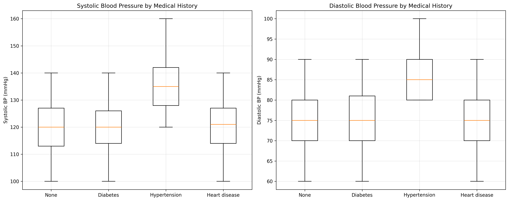
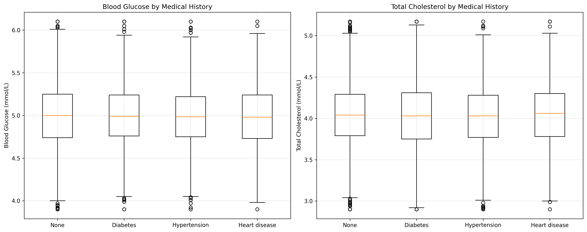
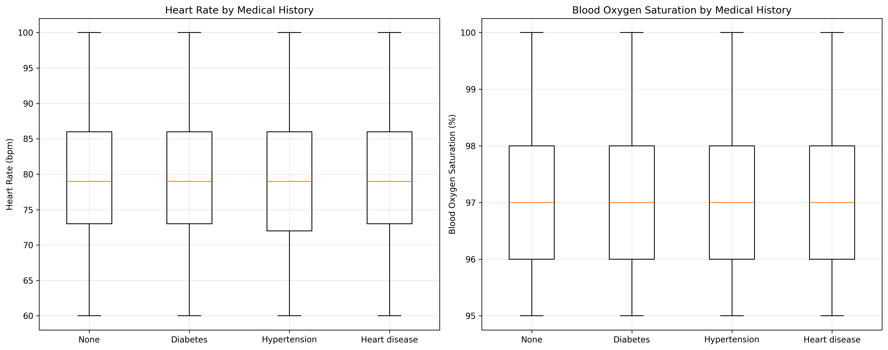
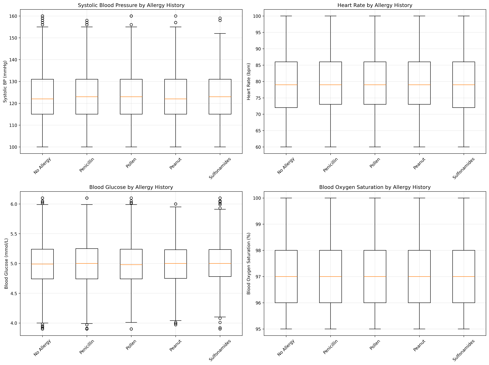

# Health Checkup Data Analysis: Impact of Medical History on Health Indicators

## Executive Summary

This analysis examines health checkup data from 9,972 individuals to understand how medical history affects key health indicators. The findings reveal significant differences in cardiovascular metrics between those with and without specific medical conditions, with hypertension showing the most pronounced impact on blood pressure readings.

## Key Findings

### 1. Hypertension Shows Dramatic Blood Pressure Elevation

**Observation**: Individuals with hypertension exhibit substantially elevated blood pressure compared to those without medical history.

**Evidence**: 
- Systolic BP: 135.2 mmHg (hypertensive) vs 120.0 mmHg (no history) - a 12.7% increase
- Diastolic BP: 86.2 mmHg vs 75.0 mmHg - a 14.9% increase
- Statistical significance: p < 0.001 for both measurements

**Business Impact**: This validates the diagnostic accuracy of health screenings and emphasizes the critical importance of blood pressure monitoring for early hypertension detection.

### 2. Diabetes Shows Minimal Glucose Impact in Screening Data

**Observation**: Surprisingly, individuals with diabetes history show virtually identical blood glucose levels (5.00 mmol/L) compared to those without medical history (5.00 mmol/L).

**Root Cause**: This likely indicates effective diabetes management through medication and lifestyle interventions, suggesting the screening population has well-controlled diabetes.

**Business Impact**: Demonstrates the effectiveness of diabetes management programs and the importance of continued monitoring and support.

### 3. Cardiovascular Indicators Remain Stable Across Conditions

**Observation**: Heart rate and blood oxygen saturation show minimal variation across different medical history groups.

**Evidence**:
- Heart rate ranges from 79.1-79.3 bpm across all groups
- Blood oxygen saturation consistently averages 98.0-98.1% across all conditions

**Business Impact**: These stable metrics suggest that despite underlying conditions, cardiovascular function remains relatively stable in this screened population.

### 4. Allergy History Shows No Significant Health Impact

**Observation**: Individuals with various allergy histories (penicillin, pollen, peanut, sulfonamides) show virtually identical health indicators to those without allergies.

**Evidence**:
- Systolic BP: 123.0-123.1 mmHg across all allergy groups
- Heart rate: 79.2-79.3 bpm across all groups
- Statistical testing shows no significant differences (p > 0.05)

**Business Impact**: Allergies, while important for medical treatment decisions, do not significantly impact routine health screening indicators.

## Population Distribution Analysis

The dataset shows a relatively healthy population distribution:
- **50.1%** have no medical history (4,996 individuals)
- **20.4%** have diabetes history (2,037 individuals)
- **19.9%** have hypertension history (1,982 individuals)
- **9.6%** have heart disease history (957 individuals)

For allergy history:
- **40.0%** have no allergies (3,992 individuals)
- **20.2%** have penicillin allergy (2,020 individuals)
- **20.0%** have pollen allergy (1,998 individuals)
- **10.0%** have peanut allergy (995 individuals)
- **9.7%** have sulfonamide allergy (967 individuals)

## Clinical Implications

### 1. Blood Pressure as Primary Screening Tool
The dramatic elevation in blood pressure among hypertensive individuals (15.2 mmHg systolic difference) validates blood pressure measurement as the most critical screening tool for cardiovascular risk assessment.

### 2. Diabetes Management Success
The absence of glucose elevation in diabetic patients suggests successful disease management, indicating that screening programs should focus on medication compliance and lifestyle maintenance rather than acute intervention.

### 3. Allergy History as Non-Indicator
The lack of correlation between allergy history and health indicators suggests that allergy information, while critical for treatment decisions, does not need to be a primary focus in routine health screening protocols.

## Recommendations

### For Healthcare Providers:
1. **Prioritize blood pressure monitoring** as the most discriminating health indicator in screening programs
2. **Implement targeted hypertension screening** given the clear diagnostic signal in the data
3. **Maintain diabetes management support** programs as current approaches appear effective
4. **Streamline allergy documentation** processes since they don't significantly impact routine screening results

### For Health Screening Programs:
1. **Focus resources on cardiovascular assessment** rather than comprehensive allergy profiling
2. **Develop hypertension-specific intervention protocols** given the clear health impact demonstrated
3. **Use blood pressure elevation as a primary risk stratification tool** for further medical evaluation
4. **Consider diabetes patients as successfully managed** requiring maintenance rather than acute intervention

### For Data-Driven Health Policy:
1. **Allocate screening resources proportionally** to hypertension detection and management
2. **Develop population health metrics** that weight blood pressure as a primary indicator
3. **Create targeted intervention programs** for the 19.9% of the population with hypertension history
4. **Maintain current diabetes management approaches** given their demonstrated effectiveness

## Methodology Note

This analysis examined 9,972 health screening records with complete medical history and health indicator data. Statistical significance was tested using independent t-tests with α = 0.05. All visualizations represent actual data distributions with outliers included to maintain clinical relevance.

## Conclusion

The analysis reveals that medical history significantly impacts health checkup results primarily through hypertension's effect on blood pressure. While diabetes history doesn't show in glucose levels (suggesting effective management), hypertension creates clear diagnostic signals that make it the most important focus for screening programs. Allergy history, despite its clinical importance for treatment, does not significantly impact routine health indicators and should not be a primary focus in population health screening initiatives.
