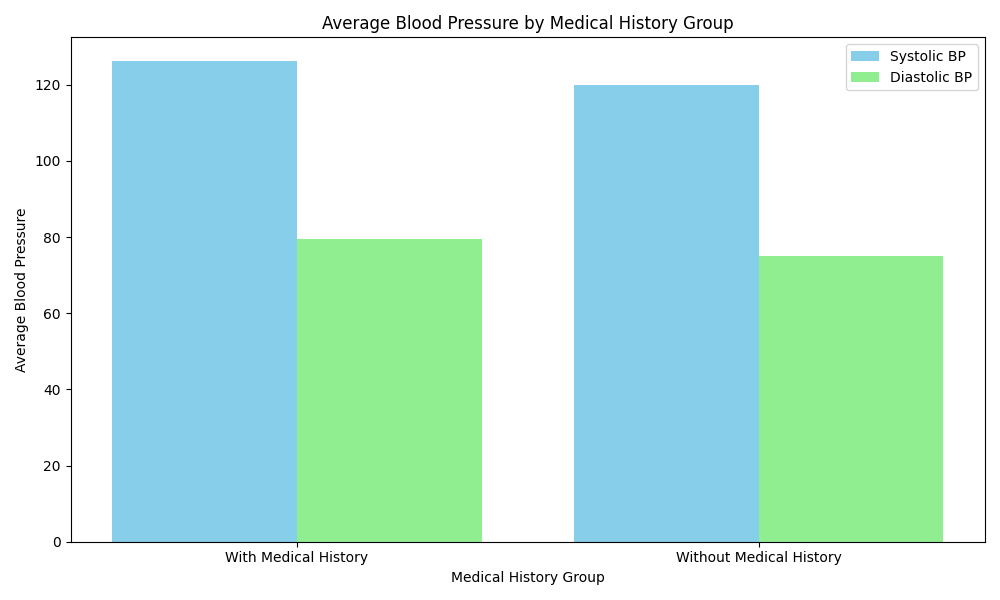
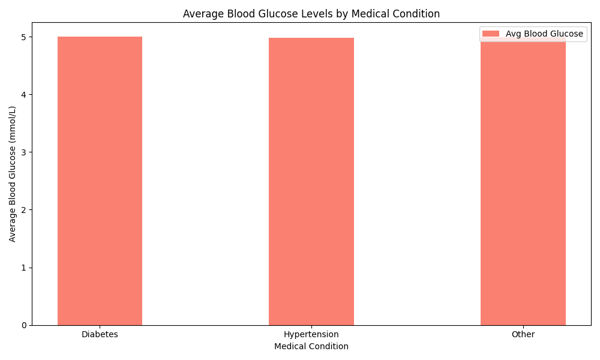
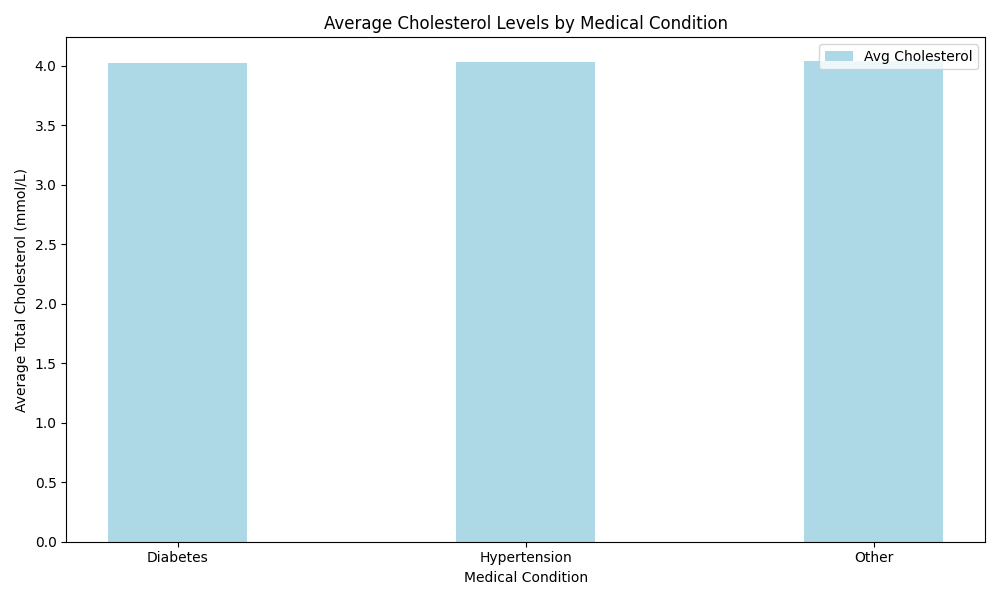

# Health Checkup Data Analysis Report

## Executive Summary
This report presents an analysis of health checkup data to understand the differences between individuals with and without medical history, focusing on key health indicators such as blood pressure, blood glucose, and cholesterol levels. The findings indicate that individuals with medical history generally exhibit higher average blood pressure levels compared to those without, while differences in blood glucose and cholesterol levels are relatively minimal across groups.

---

## Blood Pressure Analysis

### Key Insight
Individuals with a medical history have **higher average systolic and diastolic blood pressure** compared to those without.

- **With Medical History**: Average Systolic BP = 126.16 mmHg, Diastolic BP = 79.54 mmHg
- **Without Medical History**: Average Systolic BP = 120.00 mmHg, Diastolic BP = 75.04 mmHg

This suggests that individuals with prior medical conditions may be at greater risk for hypertension-related complications.

---

## Blood Glucose Analysis

### Key Insight
There is **minimal difference in average blood glucose levels** between individuals with and without medical history.

- **With Medical History**: Average Blood Glucose = 4.99 mmol/L
- **Without Medical History**: Average Blood Glucose = 5.00 mmol/L

Further analysis by specific medical conditions (e.g., diabetes, hypertension) also showed negligible variation in glucose levels.

---

## Cholesterol Analysis

### Key Insight
Average **total cholesterol levels are nearly identical** across individuals with and without medical history.

- **With Medical History**: Average Cholesterol = 4.03 mmol/L
- **Without Medical History**: Average Cholesterol = 4.04 mmol/L

Even when categorized by specific conditions like diabetes or hypertension, cholesterol levels remain largely consistent.

---

## Conclusion and Recommendations

### Conclusion
- **Blood pressure** is significantly higher in individuals with medical history, indicating a need for closer monitoring and management.
- **Blood glucose** and **cholesterol levels** show minimal variation between groups, suggesting that these metrics may not be strongly influenced by general medical history alone.

### Recommendations
1. **Targeted Blood Pressure Management**: Implement more frequent blood pressure monitoring and lifestyle interventions for individuals with existing medical conditions.
2. **Further Investigation**: Explore deeper correlations between specific medical conditions and metabolic indicators (e.g., glucose, cholesterol) using larger datasets or more granular categorization.
3. **Health Education**: Promote awareness of cardiovascular risk factors, especially among those with a history of chronic conditions.
