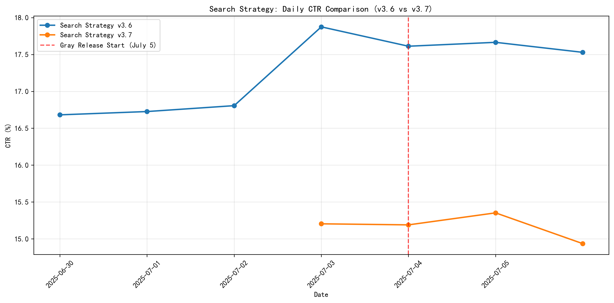
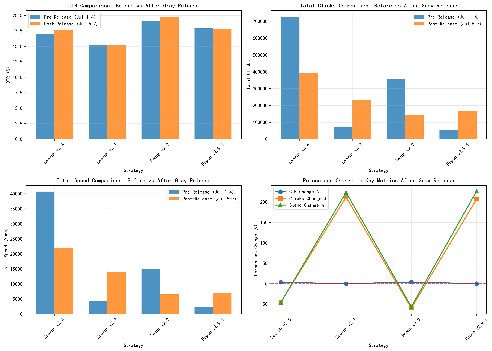
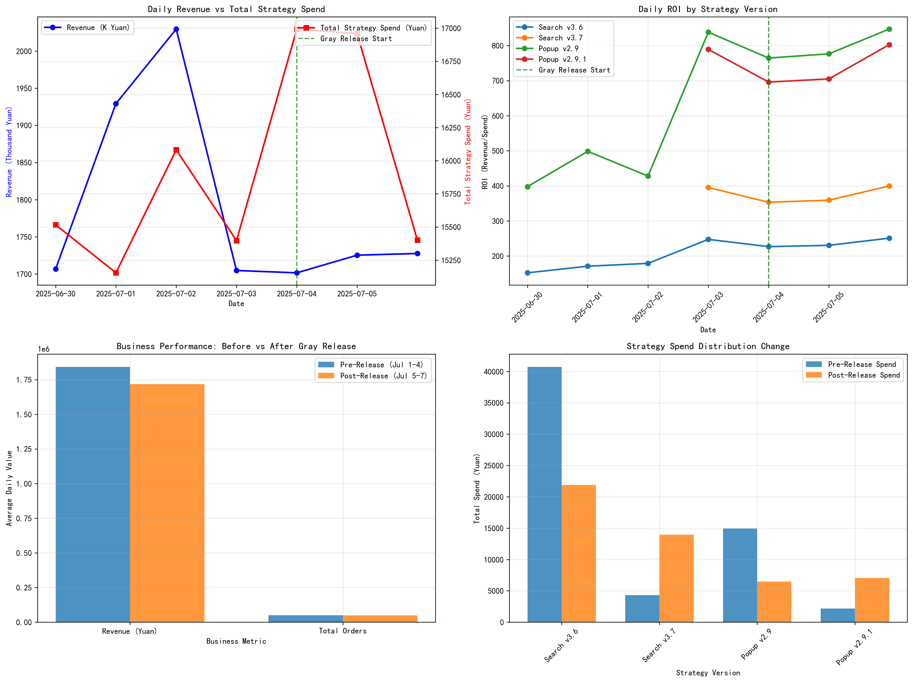

# Strategy Gray Release Performance Analysis Report

## Executive Summary

The gray release of new strategy versions starting July 5, 2025, shows mixed results across different strategy types. While the new versions (Search Strategy v3.7 and Popup Strategy v2.9.1) demonstrated improved efficiency in some metrics, overall business performance declined during the post-release period.

## Key Findings

### Search Strategy Performance

**Search Strategy v3.7 vs v3.6 Performance:**
- **CTR Performance**: v3.7 showed a slight CTR decrease of -0.29% compared to v3.6's +3.41% improvement
- **Click Volume**: v3.7 generated 211% more clicks post-release, indicating better reach
- **Cost Efficiency**: v3.7 spend increased by 223% while v3.6 decreased by -46%

### Popup Strategy (Guess You Like) Performance

**Popup Strategy v2.9.1 vs v2.9 Performance:**
- **CTR Performance**: v2.9.1 showed minimal CTR change (-0.15%) while v2.9 improved by +3.95%
- **Click Volume**: v2.9.1 generated 207% more clicks with 226% higher spend
- **Efficiency**: v2.9 maintained higher CTR with lower spend

### Business Impact Analysis

**Overall Business Performance:**
- **Revenue Decline**: Average daily revenue decreased by -6.8% (from 1.84M to 1.72M Yuan)
- **Order Decline**: Daily orders decreased by -2.9% (from 49,895 to 48,424)
- **Spend Reduction**: Total strategy spend decreased by -20.6% (from 62,150 to 49,354 Yuan)

## Detailed Analysis

### Search Strategy v3.7
- **Strengths**: Significant click volume increase (+211%) suggests better user engagement
- **Weaknesses**: Higher cost per click and increased spend without proportional revenue growth
- **ROI**: Lower return on investment compared to v3.6 during the observation period

### Popup Strategy v2.9.1  
- **Strengths**: Maintained competitive CTR while scaling click volume
- **Weaknesses**: Higher spend without corresponding revenue improvement
- **Opportunity**: Could be optimized for better cost efficiency

## Recommendations

### For Full Rollout:
1. **Search Strategy v3.7**: **Proceed with caution** - While click volume improved significantly, the cost efficiency needs monitoring. Recommend A/B testing with tighter budget controls.

2. **Popup Strategy v2.9.1**: **Delay full rollout** - The new version showed minimal CTR improvement with significantly higher costs. Requires further optimization before full deployment.

### Immediate Actions:
1. **Budget Reallocation**: Shift spend back to v3.6 for Search Strategy until v3.7 efficiency improves
2. **Performance Monitoring**: Extend gray release period for both strategies to gather more data
3. **Cost Optimization**: Implement spend caps for new versions to control ROI impact

### Long-term Strategy:
1. **Incremental Rollout**: Implement phased deployment with continuous performance monitoring
2. **Machine Learning**: Enhance strategy algorithms for better cost prediction and ROI optimization
3. **User Segmentation**: Test strategies across different user segments to identify optimal audiences

## Conclusion

The gray release revealed that while the new strategy versions can drive higher engagement (clicks), they currently lack the cost efficiency needed to maintain business performance. A measured approach with continued optimization is recommended before full-scale deployment.

**Key Metric Summary:**
- Revenue: -6.8% decline post-release
- Orders: -2.9% decline post-release  
- Search v3.7: +211% clicks, +223% spend
- Popup v2.9.1: +207% clicks, +226% spend

Further testing and optimization are required to ensure new strategy versions can deliver sustainable business growth.
