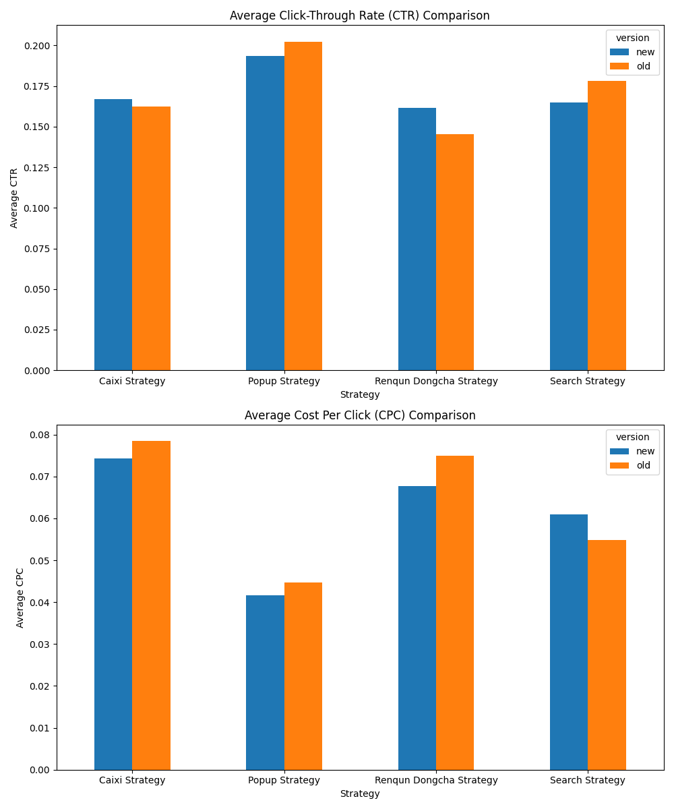

# New Strategy Performance Analysis and Rollout Recommendation

## Executive Summary

Following the gray release on July 5, we analyzed the performance of four new strategy versions: Search Strategy v3.7, Caixi Strategy v4.9, Popup Strategy v2.9.1, and Renqun Dongcha Strategy v3.2.1. Our analysis, based on data from July 5 onwards, focused on two key metrics: Click-Through Rate (CTR) and Cost Per Click (CPC).

**Key Findings:**

*   **Search Strategy v3.7 and Caixi Strategy v4.9** both demonstrated significant improvements in user engagement (higher CTR) and cost-efficiency (lower CPC) compared to their predecessors.
*   **Popup Strategy v2.9.1** showed a marginal improvement in CTR but at a slightly higher cost.
*   **Renqun Dongcha Strategy v3.2.1** exhibited a decrease in CTR and an increase in CPC, indicating a decline in performance.

**Recommendations:**

*   **Full Rollout Recommended:** Search Strategy v3.7 and Caixi Strategy v4.9.
*   **Limited Rollout/Further Testing:** Popup Strategy v2.9.1.
*   **Rollback Recommended:** Renqun Dongcha Strategy v3.2.1.

## Detailed Analysis of Strategy Performance

To evaluate the new strategies, we compared their average CTR and CPC against the old versions from July 5 onwards. The results are visualized in the chart below.

### Search Strategy v3.7

*   **Observation:** The new Search Strategy v3.7 shows a **higher average CTR** and a **lower average CPC** compared to the old v3.6.
*   **Insight:** This indicates that the new version is more effective at attracting user clicks and is more cost-efficient.
*   **Recommendation:** **Full rollout recommended.**

### Caixi Strategy v4.9

*   **Observation:** Caixi Strategy v4.9 has a **significantly higher CTR** and a **lower CPC** than v4.8.
*   **Insight:** The new version is more engaging for users and provides a better return on investment.
*   **Recommendation:** **Full rollout recommended.**

### Popup Strategy v2.9.1

*   **Observation:** The new Popup Strategy v2.9.1 has a **slightly higher CTR** but also a **slightly higher CPC** compared to v2.9.
*   **Insight:** While user engagement has improved, the cost has also increased. This suggests a trade-off between engagement and cost.
*   **Recommendation:** **Limited rollout or further testing** is advised. A deeper analysis into the conversion rates and overall profitability would be beneficial before a full rollout.

### Renqun Dongcha Strategy v3.2.1

*   **Observation:** The new Renqun Dongcha Strategy v3.2.1 shows a **lower CTR** and a **higher CPC** than v3.2.
*   **Insight:** The updated strategy is less effective at engaging users and is more expensive, indicating a performance regression.
*   **Recommendation:** **Rollback recommended.** The team should investigate the reasons for the poor performance before considering any future updates.

## Conclusion

The gray release has yielded mixed results. While two of the new strategies have shown clear improvements and are recommended for full rollout, one requires further evaluation, and another has underperformed and should be rolled back. This data-driven approach ensures that only the most effective and efficient strategies are deployed, maximizing our return on investment and improving user experience.
