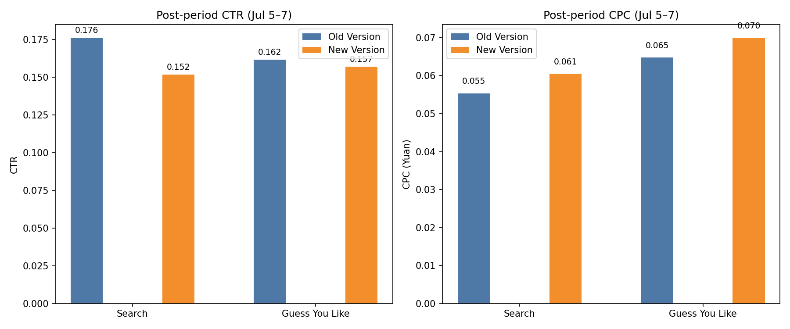

Executive Summary
- Conclusion: Do NOT proceed to full rollout for Search Strategy v3.7; it underperforms the incumbent v3.6 in CTR (-13.8%) and cost efficiency (+9.2% CPC) post-release. Keep Guess You Like (Caixi) v4.9 in gray release; it shows slightly lower CTR (-2.8%) and higher CPC (+8.0%) versus v4.8, but improved budget utilization (+7.9%) suggests operational changes may be paying off—validate conversion quality before scaling.

- Why it matters: Rolling out v3.7 would likely reduce traffic and increase acquisition cost per click; v4.9 appears closer to parity but still slightly costlier. Full rollout decisions should hinge on both upper-funnel efficiency (CTR, CPC) and downstream conversion (orders, revenue).

Data & Method
- Source: dacomp-en-038.sqlite (tables: sheet1 for exposure/click/budget metrics; sheet2 for T+0 strategy-guided orders and transaction amount).
- Time window: July 1–7, 2025. Gray release began July 5; analysis splits pre (Jul 1–4) vs post (Jul 5–7).
- Metrics computed via SQL (sheet1): impressions, clicks, spend, CTR = clicks/impressions, CPC = spend/clicks, CPM = 1000*spend/impressions, budget utilization = spend/daily budget.
- Key SQL (Search Strategy pre/post by version):
  SELECT date(\"Promotion Date\") AS d, CASE WHEN date(\"Promotion Date\") <= '2025-07-04' THEN 'pre' ELSE 'post' END AS period, Strategy, SUM(\"Impressions\") impressions, SUM(\"Clicks\") clicks, SUM(\"Spend (Yuan)\") spend FROM sheet1 WHERE Strategy LIKE 'Search Strategy%' GROUP BY d, period, Strategy;
  Then aggregated period-level totals and derived CTR, CPC, CPM, budget utilization.
- Key SQL (Guess You Like via Caixi Strategy, pre/post by version): identical structure filtered by Strategy LIKE 'Caixi Strategy%'.
- Visualization: Python matplotlib plotting post-period CTR and CPC for old vs. new versions for both strategy families.

Visualization & Key Takeaways

- Search Strategy: Post CTR is 0.1760 for v3.6 vs 0.1516 for v3.7 (−13.8% vs incumbent); CPC is 0.0554 Yuan (v3.6) vs 0.0605 Yuan (v3.7) (+9.2% cost per click). Clicks were 395,261 (v3.6) vs 230,452 (v3.7), with spend 21,878.63 Yuan vs 13,942.67 Yuan.
  Observation → Root Cause → Impact/Recommendation:
  • Observation: v3.7 drives fewer clicks at lower CTR and higher CPC than v3.6.
  • Root Cause: Likely stricter matching/bidding or targeting changes reducing reach and engagement while raising bid price per click.
  • Impact/Recommendation: Higher acquisition costs and lower traffic risk revenue shortfall; do not fully roll out v3.7. Keep v3.7 in gray and iterate on matching rules/bids; test uplift in conversion quality before reconsidering rollout.

- Guess You Like (Caixi): Post CTR is 0.1616 for v4.8 vs 0.1570 for v4.9 (−2.8%); CPC is 0.0648 Yuan (v4.8) vs 0.0700 Yuan (v4.9) (+8.0%). Post CPM is 10.4683 (v4.8) vs 10.9823 (v4.9) (+4.9%). Budget utilization is 0.7177 (v4.8) vs 0.7745 (v4.9) (+7.9%).
  Observation → Root Cause → Impact/Recommendation:
  • Observation: v4.9 slightly underperforms v4.8 on CTR and cost metrics but uses budget more fully.
  • Root Cause: v4.9 may favor broader inventory or different bid pacing, increasing cost per engagement while improving budget drawdown.
  • Impact/Recommendation: Because efficiency is slightly worse, avoid immediate full rollout; keep v4.9 in gray, focus on optimizing bids/targeting to recapture CTR and CPC. Proceed to full rollout only if downstream conversion rate or revenue per click (not directly attributable in current data) proves superior to offset higher CPC.

Supporting Numbers (SQL outputs)
- Search Strategy (post): v3.6 impressions 2,245,290; clicks 395,261; spend 21,878.63; CTR 0.1760; CPC 0.0554; CPM 9.7442; budget utilization 0.7305.
- Search Strategy (post): v3.7 impressions 1,519,810; clicks 230,452; spend 13,942.67; CTR 0.1516; CPC 0.0605; CPM 9.1740; budget utilization 0.7834.
- Caixi (post): v4.8 impressions 1,479,051; clicks 238,950; spend 15,483.16; CTR 0.1616; CPC 0.0648; CPM 10.4683; budget utilization 0.7177.
- Caixi (post): v4.9 impressions 1,461,592; clicks 229,452; spend 16,051.68; CTR 0.1570; CPC 0.0700; CPM 10.9823; budget utilization 0.7745.

Pre vs Post Context
- Search v3.6 CTR improved slightly from 0.1693 (pre) to 0.1760 (post), while v3.7 stayed ~flat (0.1520→0.1516) with rising CPC (0.0583→0.0605).
- Caixi v4.9 CTR rose marginally (0.1548→0.1570) but CPC also ticked up (0.0697→0.0700); still trails v4.8 in post-period.

Limitations
- Downstream conversion metrics (sheet2: T+0 strategy-guided orders and transaction amount) are available but lack a Strategy field, making precise attribution to strategy versions ambiguous. A robust decision would incorporate per-strategy conversion rate and revenue per click; recommend instrumenting strategy IDs into sheet2 for clean joins.

Recommendations
1) Search Strategy v3.7: Do not fully roll out. Prioritize iterations on query matching, bidding, and targeting to lift CTR (+10% target) and reduce CPC (−8% target) before reconsidering.
2) Guess You Like (Caixi) v4.9: Continue gray release. Launch bid shading and audience tuning experiments to recover CTR and CPC parity with v4.8; only promote to full rollout if conversion rate or AOV improves enough to offset higher CPC.
3) Measurement: Add Strategy ID to sheet2 to directly attribute T+0 orders and revenue by strategy version; monitor CVR and RPC (revenue per click) to ensure end-to-end ROI.

Python Code Used to Generate the Plot
import sqlite3
import pandas as pd
import matplotlib.pyplot as plt

# ... see plot_strategy_performance.py created and executed in this session (includes SQL aggregation and plotting).

File Saved
- post_comparison_ctr_cpc.png (embedded above).
