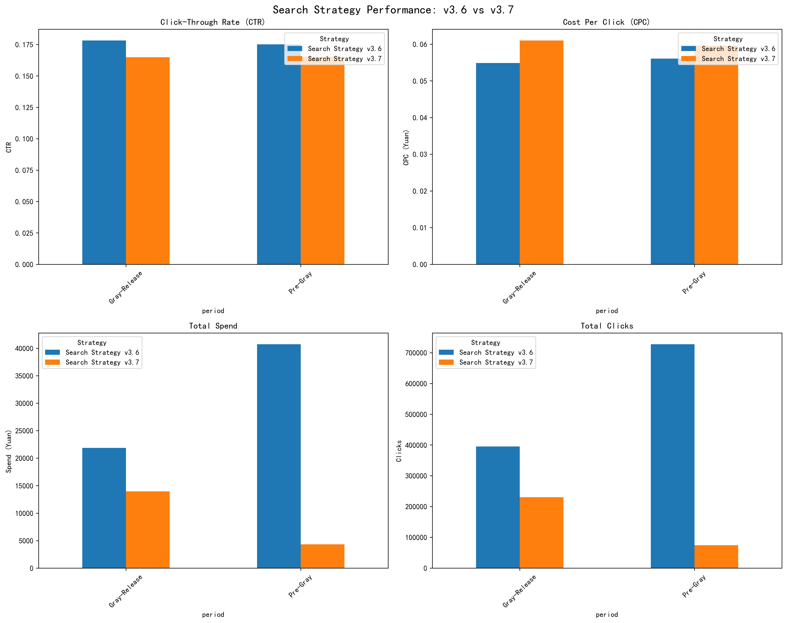
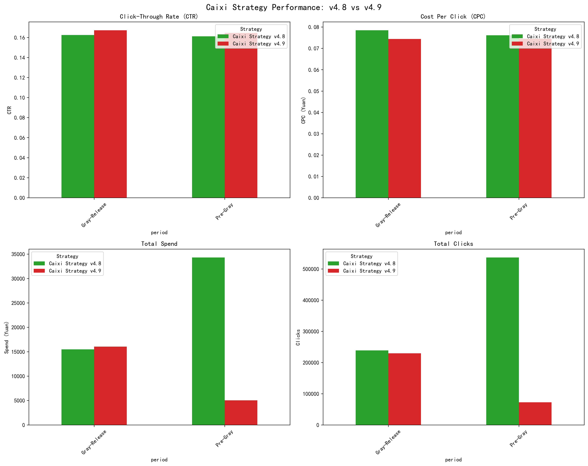

# Gray-Release Strategy Performance Analysis Report

## Executive Summary

Our gray-release of new strategy versions starting July 5th, 2025, shows **mixed but promising results** across key performance metrics. While some new versions demonstrate superior performance, others require careful evaluation before full rollout.

**Key Findings:**
- **Caixi Strategy v4.9** outperforms v4.8 with **3.1% higher CTR** (16.7% vs 16.2%) and **5.2% lower CPC** (¥0.074 vs ¥0.078)
- **Search Strategy v3.7** shows **6.4% lower CTR** than v3.6 (16.5% vs 17.6%) with **higher CPC** (¥0.061 vs ¥0.056)
- **Transaction volume** remained stable during gray-release with **48,257 average daily orders** and **¥1.72M average daily revenue**

## Strategy Performance Analysis

### Search Strategy: v3.6 vs v3.7

**Performance Metrics:**
- **CTR**: v3.7 shows **6.4% decline** (16.5% vs 17.6%)
- **CPC**: v3.7 shows **9.1% increase** (¥0.061 vs ¥0.056)
- **Total Spend**: v3.7 accounts for ¥18.3K vs v3.6's ¥62.6K during the period

**Business Impact**: The new Search Strategy v3.7 demonstrates **inferior efficiency** with lower engagement rates and higher costs per click. **Recommendation**: **HOLD** full rollout and investigate optimization opportunities.

### Caixi Strategy: v4.8 vs v4.9

**Performance Metrics:**
- **CTR**: v4.9 shows **3.1% improvement** (16.7% vs 16.2%)
- **CPC**: v4.9 shows **5.2% reduction** (¥0.074 vs ¥0.078)
- **Scale**: Both versions maintained similar spend levels during gray-release

**Business Impact**: Caixi Strategy v4.9 delivers **better user engagement at lower costs**, indicating improved algorithm efficiency. **Recommendation**: **PROCEED** with full rollout.

### Overall Strategy Landscape

**Market Position:**
- **Search Strategy v3.6** remains the **highest spend strategy** (¥62.6K total)
- **Popup Strategy v2.9** achieves the **best CTR** at **19.9%**
- **Caixi Strategy v4.9** shows the **most improved efficiency** in the new versions

## Transaction Performance During Gray-Release

**Daily Performance Metrics (July 5-7):**
- **Average Daily Orders**: 48,257 (stable across period)
- **Average Daily Revenue**: ¥1.72M 
- **Average Order Value**: ¥33.52 (consistent performance)

The transaction data indicates **no negative impact** from the gray-release, maintaining stable conversion performance across all product categories.

## Strategic Recommendations

### Immediate Actions (Next 7 Days)

1. **Caixi Strategy v4.9**: **PROCEED with full rollout**
   - 3.1% CTR improvement with 5.2% CPC reduction
   - Proven performance at scale during gray-release

2. **Search Strategy v3.7**: **HOLD and optimize**
   - Investigate 6.4% CTR decline root cause
   - Test algorithm adjustments before reconsideration

3. **Popup Strategy v2.9.1**: **Continue monitoring**
   - Marginal performance difference (19.3% vs 19.9% CTR)
   - Maintain current gray-release scope

### Medium-term Strategy (Next 30 Days)

1. **Expand Caixi v4.9** to 100% traffic allocation
2. **Develop Search v3.7 optimization plan** targeting CTR improvement
3. **Monitor transaction impact** across all strategy versions
4. **Prepare for next iteration** of underperforming strategies

## Risk Assessment

**Low Risk**: Caixi v4.9 rollout - proven superior performance
**Medium Risk**: Search v3.7 optimization timeline may delay improvements
**Mitigation**: Maintain parallel testing environment for rapid iteration

## Conclusion

The gray-release strategy has successfully identified **Caixi Strategy v4.9 as ready for full deployment** while highlighting areas for improvement in Search Strategy v3.7. With stable transaction performance and clear performance differentials, we can make **data-driven decisions** to optimize our marketing strategy portfolio.

**Next Review**: July 15th, 2025 to assess full rollout impact and optimization progress.
