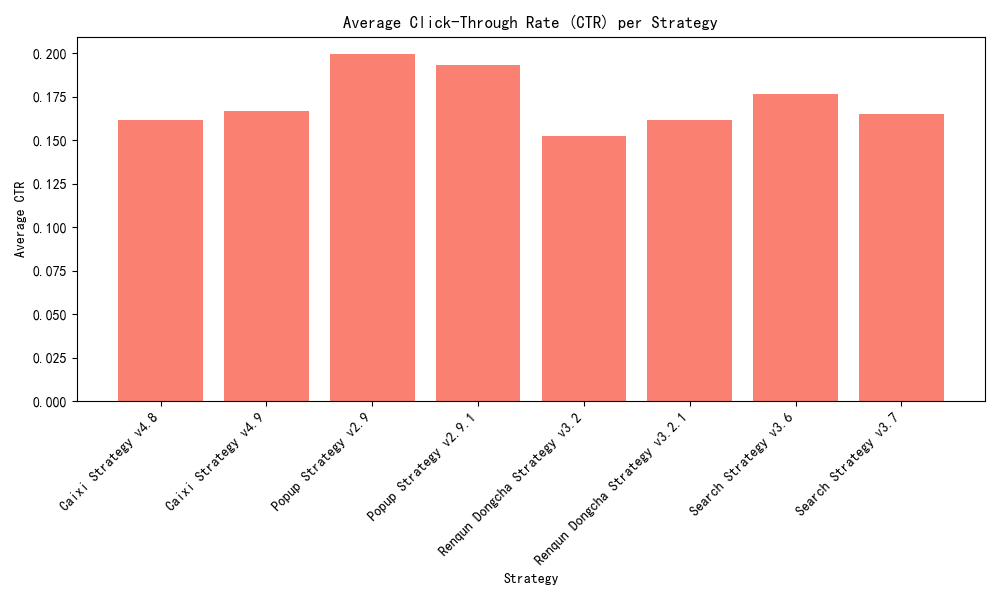

# Strategy Performance Analysis Report

## Overview
This report analyzes the performance of different marketing strategies based on average spend, impressions, clicks, and click-through rate (CTR). The goal is to determine which strategies are most effective and should be considered for full rollout.

## Key Findings
- **Popup Strategy v2.9** and **Popup Strategy v2.9.1** showed the highest average clicks, with **Popup Strategy v2.9** leading at 10,057.74 clicks.
- **Popup Strategy v2.9** also had the highest CTR at 19.94%, indicating better user engagement.
- **Search Strategy v3.6** and **Search Strategy v3.7** performed well in terms of CTR, with rates of 17.63% and 16.50%, respectively.

## Visualizations
### Average Clicks per Strategy

### Average CTR per Strategy

## Recommendations
- **Popup Strategy v2.9** should be prioritized for full rollout due to its superior performance in both clicks and CTR.
- **Search Strategy v3.6** and **Search Strategy v3.7** should be considered for further testing to evaluate their long-term performance and potential for optimization.

## Conclusion
The analysis highlights the importance of user engagement metrics in determining strategy effectiveness. By focusing on strategies with higher clicks and CTR, we can enhance user interaction and potentially increase conversion rates.
