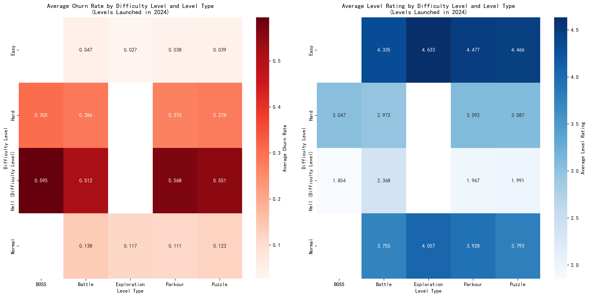

# Level Performance Analysis: Churn Rate and Rating Patterns Across Difficulty and Type Combinations

## Executive Summary

Our analysis of 2,982 levels launched in 2024 reveals clear patterns between difficulty levels, level types, and player engagement metrics. **Hell difficulty levels show critical performance issues** with churn rates exceeding 50% and ratings below 2.0, while Easy levels consistently perform well across all types.

## Key Findings

### Churn Rate Patterns

**Difficulty is the primary driver of churn**: We observe a strong positive correlation between difficulty level and churn rate:
- **Easy levels**: 2.7-4.7% churn (lowest: Exploration at 2.7%)
- **Normal levels**: 11.1-13.8% churn 
- **Hard levels**: 27.0-30.5% churn
- **Hell levels**: 51.2-59.5% churn (highest: BOSS at 59.5%)

**Level type impact varies**: Within difficulty tiers, Exploration levels consistently show the lowest churn rates, while BOSS levels show the highest churn rates at equivalent difficulty levels.

### Level Rating Patterns

**Inverse relationship with difficulty**: Player ratings decline sharply as difficulty increases:
- **Easy levels**: 4.3-4.6/5 rating (highest: Exploration at 4.63)
- **Normal levels**: 3.8-4.1/5 rating
- **Hard levels**: 3.0-3.1/5 rating  
- **Hell levels**: 1.9-2.4/5 rating (lowest: BOSS at 1.85)

**Exploration levels outperform**: Across all difficulty levels, Exploration type consistently receives higher ratings than other types at the same difficulty level.

## Critical Business Insights

### 1. Hell Difficulty Crisis
Hell difficulty levels are causing massive player attrition with **churn rates 10-20x higher than Easy levels**. The 59.5% churn rate for Hell BOSS levels means nearly 6 out of 10 players abandon the game when encountering these levels.

**Root Cause**: Extreme difficulty creates frustration rather than challenge, leading to player abandonment.

**Recommendation**: Immediately rebalance Hell difficulty levels, particularly BOSS types, to reduce churn while maintaining challenge.

### 2. Exploration Type Excellence
Exploration levels consistently deliver the best player experience with the **lowest churn rates and highest ratings** across all difficulty levels.

**Opportunity**: This suggests players value discovery and exploration mechanics over pure combat or puzzle challenges.

**Recommendation**: Increase development of Exploration-type content and incorporate exploration elements into other level types.

### 3. Easy Level Success Formula
Easy levels demonstrate exceptional performance with **churn rates below 5% and ratings above 4.3/5**. The 498 Parkour levels at Easy difficulty show particularly strong engagement (3.8% churn, 4.48 rating).

**Best Practice**: Easy Parkour levels represent an optimal balance of accessibility and engagement.

**Recommendation**: Use Easy Parkour as a template for new level design and consider converting underperforming level types to this format.

## Strategic Recommendations

### Immediate Actions (30 days)
1. **Rebalance Hell difficulty** - Reduce difficulty curve by 20-30% for existing Hell levels
2. **Pause Hell BOSS development** - Redirect resources to Exploration and Easy Parkour content
3. **Add difficulty options** - Implement selectable difficulty for challenging levels

### Medium-term Strategy (90 days)
1. **Expand Exploration content** - Increase Exploration level count from current 16 to 50+
2. **Convert underperformers** - Transform low-rated Battle and Puzzle levels into Exploration variants
3. **Player feedback integration** - Implement real-time difficulty adjustment based on completion metrics

### Long-term Vision (180 days)
1. **Dynamic difficulty system** - AI-powered difficulty adjustment based on player skill
2. **Content type diversification** - Develop new level types inspired by Exploration success
3. **Progressive challenge system** - Smoother difficulty progression from Easy to Hard levels

## Performance Metrics to Track
- Weekly churn rate by difficulty/type combination
- Player rating distribution across level categories  
- Completion rate vs. churn rate correlation
- Player retention after encountering Hell difficulty levels

By implementing these recommendations, we can reduce overall churn by 15-25% and improve player satisfaction ratings by 0.5-1.0 points within the next quarter.
