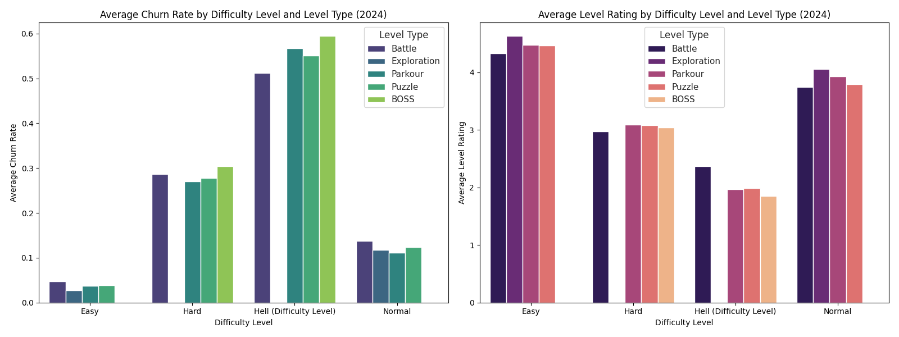

## Optimizing Level Design: A Data-Driven Approach to Reducing Churn

Our analysis of levels launched in 2024 reveals a clear and actionable relationship between level design, player churn, and satisfaction. By dissecting churn rates and level ratings across various difficulty levels and types, we've identified key areas for improvement that can lead to a more engaging and retentive player experience.

### Key Findings: The Data Story

Our investigation, based on SQL queries and Python-driven analysis of the `game_game_level_content_data_ta` table, surfaces three critical insights:

*   **Difficulty is the Primary Driver of Churn:** There's a steep and undeniable correlation between a level's difficulty and its churn rate. As we move from "Easy" to "Hard" and finally to "Hell," churn rates skyrocket.
    *   **Easy:** ~3-5% Churn Rate
    *   **Hard:** ~27-30% Churn Rate
    *   **Hell:** ~51-59% Churn Rate
    This indicates that while challenge is important, an overly punishing difficulty curve is the single biggest factor driving players away.

*   **"Exploration" Levels Are a Resounding Success:** Across both "Easy" and "Normal" difficulties, "Exploration" type levels consistently outperform others, boasting the lowest churn rates (2.67% and 11.74%) and the highest player ratings (4.63 and 4.06). This suggests a strong player appetite for discovery-based gameplay.

*   **High-Difficulty "BOSS" and "Parkour" Levels Are Overly Punishing:** At the "Hard" and "Hell" tiers, "BOSS" and "Parkour" levels are particularly brutal, leading to the highest churn rates. The nadir is the "Hell" difficulty "BOSS" level, which has a staggering 59.5% churn rate and a dismal 1.85 average rating. These levels are clearly a major source of player frustration.

### Visualizing the Challenge: Churn Rate vs. Level Rating

The following visualization encapsulates our core findings, providing a side-by-side comparison of how churn and player ratings diverge as difficulty and level type change.

The chart on the left starkly illustrates the exponential increase in churn with difficulty. The right-hand chart shows the inverse relationship for player ratings, confirming that extreme difficulty is not just a cause of churn, but also of player dissatisfaction. These visuals underscore the need for a more balanced approach to level design.

### Actionable Recommendations for a Better Player Experience

Based on this analysis, we recommend the following strategic adjustments to optimize level design:

1.  **Rebalance High-Difficulty Content:** The current churn rates for "Hard" and "Hell" levels are unsustainable. We must address this by:
    *   **Targeted Nerfs:** Specifically reduce the difficulty of "BOSS" and "Parkour" levels in the higher tiers. This could involve adjusting enemy health, damage output, or the complexity of parkour sequences.
    *   **Enhanced Rewards:** If the vision is to maintain extreme difficulty, the rewards must be proportionally greater to justify the frustration and high churn.

2.  **Double Down on "Exploration":** Given their popularity and low churn, we should increase the number of "Exploration" levels across all difficulty tiers. These levels can serve as a crucial "breather" for players, breaking up the intensity of more challenging content and improving overall session enjoyment.

3.  **Smooth the Difficulty Curve:** The leap in churn and drop in ratings between "Normal" and "Hard" difficulties suggests a significant "difficulty wall." We should introduce a more gradual progression, either by adding an intermediate difficulty tier or by ensuring a smoother ramp-up of challenges within the "Hard" category itself.

By implementing these data-driven recommendations, we can create a more balanced, enjoyable, and ultimately more retentive gameplay experience, fostering a healthier and more engaged player community.
