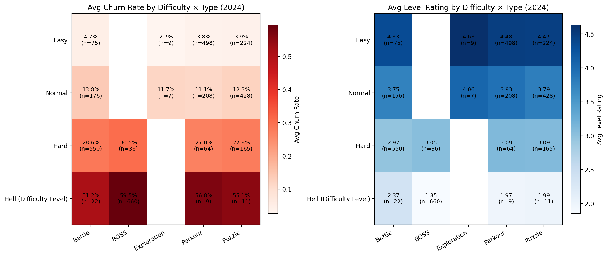

2024 Levels: Churn vs. Rating across Difficulty × Type — How to Optimize Levels

Executive summary
- Churn rises sharply with difficulty, and ratings fall in lockstep. Easy levels have 2.7–4.7% churn and 4.33–4.63 ratings, Normal 11–13.8% churn and 3.75–4.06 ratings, Hard 27–30.5% churn and ~3.0 ratings, and Hell 51–59.5% churn and 1.85–2.37 ratings (SQL aggregation on Difficulty Level, Level Type; Launch Time in 2024).
- The inverse relationship is extremely strong (correlation = -0.989 from Python code), meaning any reduction in churn is likely to improve ratings and vice versa.
- The worst-performing combination is Hell × BOSS (n=660): churn 59.46% and rating 1.85. The best is Easy × Exploration (n=9): churn 2.67% and rating 4.63, though sample size is small. Robust bright spots include Easy × Parkour (n=498): churn 3.76%, rating 4.48; Easy × Puzzle (n=224): churn 3.88%, rating 4.47; Normal × Parkour (n=208): churn 11.11%, rating 3.93.

Visualization

- Key takeaway: Churn increases and ratings decrease as difficulty escalates across all types. For example, Battle churn climbs from 4.67% (Easy, rating 4.33, n=75) to 13.77% (Normal, rating 3.75, n=176), to 28.62% (Hard, rating 2.97, n=550), and peaks at 51.24% (Hell, rating 2.37, n=22).
- BOSS types underperform at every difficulty tier, culminating in Hell × BOSS at 59.46% churn and 1.85 rating (n=660). In contrast, Parkour and Puzzle tend to be safer bets within the same difficulty (e.g., Normal × Parkour churn 11.11%, rating 3.93, n=208).
- This matters because high churn directly reduces engagement and lifetime value, while low ratings dampen organic discovery and retention. The strong negative correlation (-0.989) signals that tuning difficulty and encounter design can simultaneously lift both KPIs.

What the data shows (SQL/Python basis)
- Data fields used: Difficulty Level, Level Type, Churn Rate, Level Rating, Launch Time (from table game_game_level_content_data_ta).
- SQL grouped 2024 levels by Difficulty × Type and averaged Churn Rate and Level Rating; Python built heatmaps and computed the correlation between group averages.
- Summary numbers by tier:
  - Easy: Exploration 2.67% churn, 4.63 rating (n=9); Parkour 3.76%, 4.48 (n=498); Puzzle 3.88%, 4.47 (n=224); Battle 4.67%, 4.33 (n=75).
  - Normal: Parkour 11.11%, 3.93 (n=208); Puzzle 12.32%, 3.79 (n=428); Battle 13.77%, 3.75 (n=176); Exploration 11.74%, 4.06 (n=7; small).
  - Hard: Parkour 27.04%, 3.09 (n=64); Puzzle 27.82%, 3.09 (n=165); Battle 28.62%, 2.97 (n=550); BOSS 30.45%, 3.05 (n=36).
  - Hell: Battle 51.24%, 2.37 (n=22); Puzzle 55.10%, 1.99 (n=11); Parkour 56.77%, 1.97 (n=9); BOSS 59.46%, 1.85 (n=660).

Key insights and optimization levers
1) Observation: Churn escalates and ratings fall with difficulty across all types.
   - Root cause: Difficulty spikes likely exceed player skill ramp, increasing retries and failure, which drives frustration and negative ratings.
   - Business impact / Recommendation: Introduce dynamic difficulty scaling and smoother ramping, especially at transitions into Hard and Hell tiers. Define explicit KPIs: reduce Hard-tier churn to ≤25% and improve ratings to ≥3.2 within 30–60 days.

2) Observation: BOSS encounters are the most punitive, especially in Hell (59.46% churn, 1.85 rating; n=660).
   - Root cause: BOSS fights often combine high damage, long phases, and limited checkpoints; failure loops amplify churn.
   - Business impact / Recommendation: Re-tune Hell/Hard BOSS by splitting phases, adding mid-fight checkpoints, better telegraphs, and scaling HP/damage. Pilot targeted changes on 20–30 BOSS levels; aim to cut Hell BOSS churn to ≤50% and lift rating to ≥2.2 in the first iteration.

3) Observation: Parkour and Puzzle outperform within the same difficulty tiers (e.g., Normal × Parkour 11.11% churn, 3.93 rating; Easy × Parkour/Puzzle ~3.8% churn, ~4.47–4.48 rating).
   - Root cause: These modes provide steadier learning curves and clearer feedback, reducing friction compared to BOSS/Battle.
   - Business impact / Recommendation: Increase the share of Parkour/Puzzle content at Easy and Normal tiers to provide onboarding and retention scaffolding. Consider sequencing: start chapters with Parkour/Puzzle, gate Battle/BOSS later with tutorials.

4) Observation: Battle underperforms relative to Parkour/Puzzle at each tier (e.g., Hard × Battle 28.62% churn vs Hard × Parkour 27.04%).
   - Root cause: Combat timing/precision requirements and enemy tuning may be too strict without adequate training or gear progression.
   - Business impact / Recommendation: Add early micro-tutorials that teach core combat mechanics, tweak enemy density, and provide starter gear/perks. Target Battle churn reductions of 2–3 percentage points per tier and +0.2 rating within the next content update.

5) Observation: Small sample sizes in some combos (e.g., Easy/Exploration n=9; Normal/Exploration n=7) show strong promise but limited certainty.
   - Root cause: Limited content volume hinders statistical confidence.
   - Business impact / Recommendation: A/B test expanded Exploration content at Easy/Normal to validate its low-churn/high-rating profile. Use phased rollouts and compare cohort-level churn and ratings.

Operational plan (how to implement and measure)
- Prioritize: Hell × BOSS (largest n=660, worst metrics), then Hard × Battle (n=550).
- Tuning checklist: break boss phases; insert checkpoints; telegraph attacks; adjust damage/HP; reduce spike mechanics; add training encounters; tweak reward pacing to offset difficulty.
- Sequencing: Use Parkour/Puzzle as onboarding anchors in new chapters; delay intense Battle/BOSS until players demonstrate mastery via preceding levels.
- Measurement: Track Churn Rate, Level Rating, Completion Rate cohorts per Difficulty × Type with weekly monitoring. Success targets: Hell BOSS churn ≤50% and rating ≥2.2; Hard Battle churn ≤25% and rating ≥3.2; Normal Parkour rating ≥4.0 with churn ≤10.5%.

Methodology notes
- SQL query: averaged Churn Rate and Level Rating grouped by Difficulty Level and Level Type for 2024 launches (WHERE strftime('%Y',[Launch Time])='2024').
- Python: generated two heatmaps and computed the correlation (-0.989), saved as churn_rating_heatmaps_2024.png. Each cell annotation includes the sample size (n) to guide confidence and prioritization.

Bottom line
- Difficulty and type design strongly shape player outcomes: tougher tiers, especially BOSS, generate high churn and poor ratings. Prioritize Hell/Hard BOSS and Battle tuning, expand Parkour/Puzzle at earlier tiers, and add training plus checkpoints. Expect simultaneous gains in retention and ratings due to the near-linear inverse relationship between churn and satisfaction.
