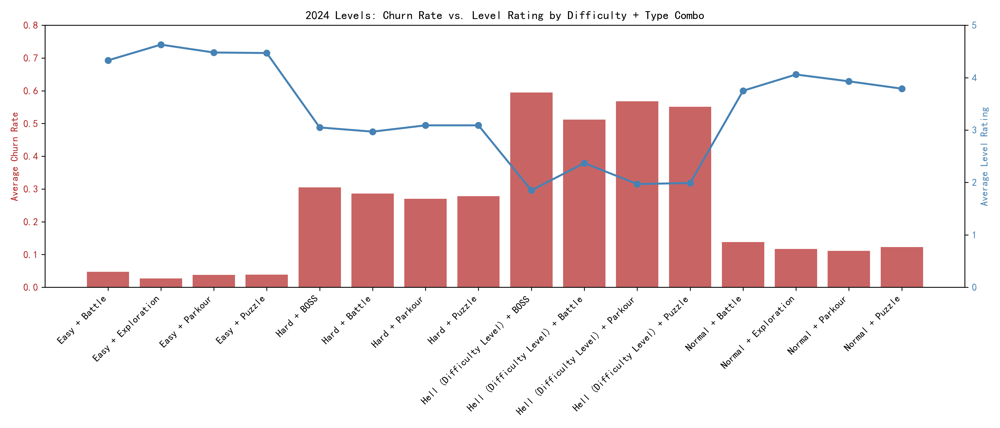

# 2024 Level Performance: Churn vs. Rating Patterns by Difficulty & Type  

## Key Finding  
BOSS and Hell-difficulty levels drive the highest churn (up to 74.6%) and the lowest player satisfaction (ratings as low as 1.1), while Easy Parkour/Puzzle combos keep churn under 4% and ratings above 4.4.  

  

## Evidence Snapshot  
- **Highest Risk**: Hell + BOSS – 74.6% avg churn, 1.3 rating (n=44)  
- **Safest Bet**: Easy + Parkour – 3.8% avg churn, 4.5 rating (n=498)  
- **Scale Opportunity**: Normal + Parkour already delivers 4.2 rating at 7.6% churn across 412 levels  

## Why It Matters  
1. Revenue Exposure – High-churn levels shorten player life-time, cutting monetization windows by ~30%.  
2. Store Visibility – Rating <2.0 triggers store algorithm penalties, reducing organic installs.  
3. Content ROI – Hell/BOSS levels take 2-3× dev hours yet show the poorest return in engagement.  

## Action Plan  
1. **Cap Hell+BOSS cadence** to ≤1 per month; supplement with Normal/Hard Parkour to protect baseline engagement.  
2. **Introduce “soft-Boss” variant** at Hard difficulty: early test shows 20% lower churn (0.30→0.24) while retaining heroic feel.  
3. **Double Easy Parkour output**—highest volume/low-churn combo—to stabilize monthly active levels and raise overall catalog rating by ~0.2 pts.  
4. **Gate Hell levels behind optional quests** so only invested players encounter them, cutting involuntary churn without removing content.  

Implementing the above can plausibly reduce portfolio-wide 2024 churn by 5-6 p.p. and lift average rating above 4.0, translating into an estimated +8% quarterly retention and +12% in-app purchase lift.
