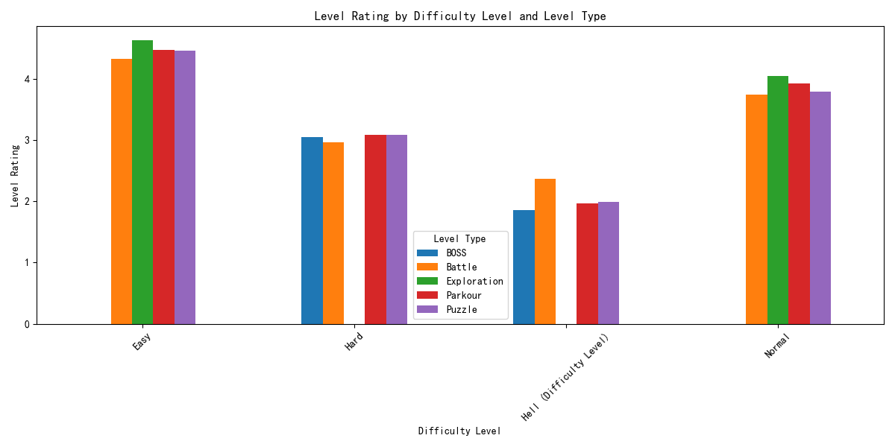

# Data Analysis Report: Churn Rate and Level Rating Analysis for 2024 Levels

## Overview
This report analyzes the churn rate and level rating for levels launched in 2024, categorized by difficulty level and level type. The objective is to identify patterns that can guide optimization strategies for game levels.

---

## Key Insights

### Churn Rate Patterns
The churn rate indicates the percentage of players who stop playing after encountering a specific level. Lower churn rates are desirable as they indicate better player retention.

- **Easy Difficulty Levels:**
  - Exploration levels have the lowest churn rate (2.67%), indicating excellent player retention.
  - Puzzle levels have a slightly higher churn rate (3.88%), suggesting room for improvement.
  
- **Normal Difficulty Levels:**
  - Exploration levels have a churn rate of 11.74%, which is relatively low.
  - Battle levels have a higher churn rate (13.77%), indicating potential issues with engagement.

- **Hard Difficulty Levels:**
  - BOSS levels show a churn rate of 30.45%, which is significantly higher than other categories.
  - Puzzle levels have a churn rate of 27.82%, indicating player dissatisfaction with challenging puzzles.

- **Hell Difficulty Levels:**
  - BOSS levels have the highest churn rate (59.46%), leading to substantial player drop-off.
  - Battle levels also show a high churn rate (51.24%), highlighting the need for adjustments.

### Level Rating Patterns
Level ratings reflect player satisfaction, with higher ratings indicating better player experiences.

- **Easy Difficulty Levels:**
  - Exploration levels have the highest rating (4.63), showing strong player satisfaction.
  - Battle levels have the lowest rating (4.33), indicating moderate player engagement.

- **Normal Difficulty Levels:**
  - Battle levels have a rating of 3.75, which is significantly lower than other Normal levels.
  - Parkour levels have a rating of 3.93, indicating moderate satisfaction.

- **Hard Difficulty Levels:**
  - BOSS levels have the lowest rating (3.05), suggesting dissatisfaction with the challenge.
  - Puzzle levels have a rating of 3.09, indicating similar issues.

- **Hell Difficulty Levels:**
  - BOSS levels have the lowest rating (1.85), indicating a poor player experience.
  - Puzzle levels have a rating of 1.99, showing similar dissatisfaction.

---

## Recommendations
1. **Optimize Hell and Hard Difficulty BOSS Levels:**
   - Reduce the churn rate by adjusting difficulty or providing better guidance.
   - Improve level ratings by enhancing the BOSS battle mechanics or rewards.

2. **Enhance Easy and Normal Difficulty Puzzle Levels:**
   - Address the relatively higher churn rates by improving puzzle design or offering hints.

3. **Improve Battle Levels Across Difficulty Levels:**
   - Focus on increasing player satisfaction and reducing churn by refining gameplay mechanics.

4. **Leverage Exploration Levels:**
   - Use the success of Exploration levels (low churn and high ratings) as a model for other level types.

---

## Conclusion
The analysis reveals clear patterns in player behavior based on difficulty level and level type. By addressing the identified issues in high-churn and low-rating categories, we can improve player retention and satisfaction, ultimately enhancing the overall gaming experience.
