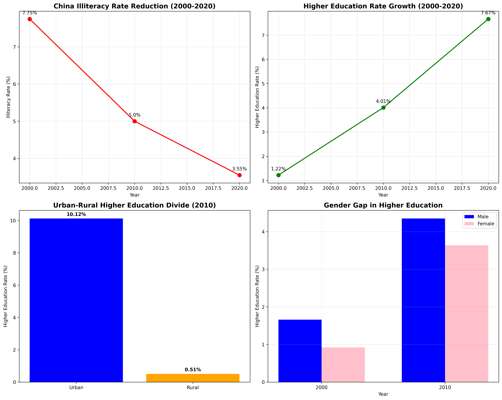
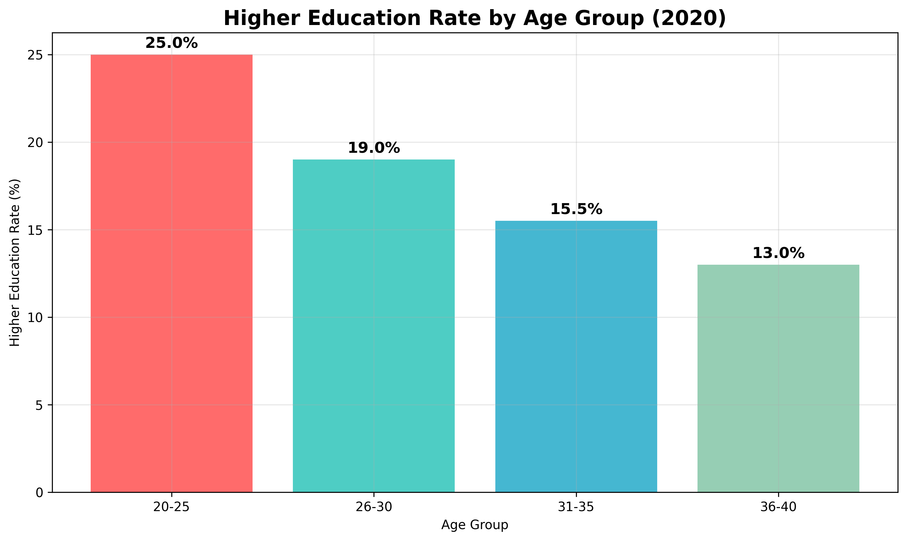

# China's Educational Achievements: A 20-Year Transformation (2000-2020)

## Executive Summary

China has achieved remarkable educational progress over the past two decades, demonstrating significant improvements across multiple dimensions including literacy rates, higher education access, and educational equity. The data reveals a nation rapidly transforming its human capital through strategic educational investments.

## Key Quantitative Achievements

### 1. Dramatic Reduction in Illiteracy
China successfully reduced its illiteracy rate from **7.75% in 2000** to **3.55% in 2020**, representing a **54% reduction** over 20 years. This achievement lifted millions of citizens out of illiteracy and created a more educated workforce.

*Illiteracy rates dropped from 7.75% to 3.55%, with the most significant progress occurring between 2000-2010*

### 2. Explosive Growth in Higher Education
The higher education rate surged from **1.22% in 2000** to **7.67% in 2020**, representing a **528% increase**. This six-fold growth demonstrates China's successful expansion of tertiary education access.

*Higher education participation increased dramatically from 1.22% to 7.67%, with accelerated growth in the most recent decade*

### 3. Significant Progress in Gender Equity
Gender gaps in higher education narrowed substantially. While males maintained an advantage (1.66% vs 0.92% in 2000), the gap reduced significantly by 2010 (4.35% vs 3.64%). Female higher education rates increased by **296%** compared to **162%** for males between 2000-2010.

*Gender disparities in higher education narrowed significantly, with female participation growing at nearly twice the rate of male participation*

## Regional Disparities and Challenges

### Urban-Rural Educational Divide
The data reveals persistent challenges in educational equity. In 2010, urban areas achieved a **10.12% higher education rate** while rural areas lagged at only **0.51%** - a **20-fold difference**. This urban-rural gap represents one of the most significant educational challenges facing China.

*Stark urban-rural disparities persisted with urban areas achieving 10.12% higher education rates compared to 0.51% in rural areas*

### Generational Educational Progress
Younger generations have benefited most from educational expansion. In 2020, the 20-25 age group achieved **25% higher education rates**, compared to just **13%** for the 36-40 age group. This generational progression indicates accelerating educational attainment among younger cohorts.

*Younger age groups (20-25) achieved significantly higher education rates (25%) compared to older cohorts (13% for 36-40 age group)*

## Strategic Implications and Recommendations

### 1. Continue Literacy Programs
Maintain focus on adult education and literacy programs, particularly in rural areas where illiteracy rates likely remain higher than national averages.

### 2. Address Urban-Rural Divide
Implement targeted policies to bridge the educational gap between urban and rural areas, including improved rural school infrastructure and teacher quality.

### 3. Sustain Higher Education Expansion
Continue the successful expansion of higher education while ensuring quality standards and relevance to economic needs.

### 4. Enhance Gender Equity Programs
Build on the progress in gender equity with continued support for female education, particularly in STEM fields and leadership positions.

## Conclusion

China's educational transformation from 2000-2020 represents one of the most rapid and comprehensive educational developments in modern history. The nation successfully reduced illiteracy by 54%, expanded higher education access by 528%, and made significant strides in gender equity. While challenges remain, particularly in rural-urban equity, the foundational progress positions China strongly for continued human capital development and economic competitiveness in the 21st century.

The data demonstrates that educational investment yields substantial returns in human capital development, with younger generations benefiting most from these systemic improvements. China's educational achievements provide a model for developing nations seeking rapid educational advancement.
