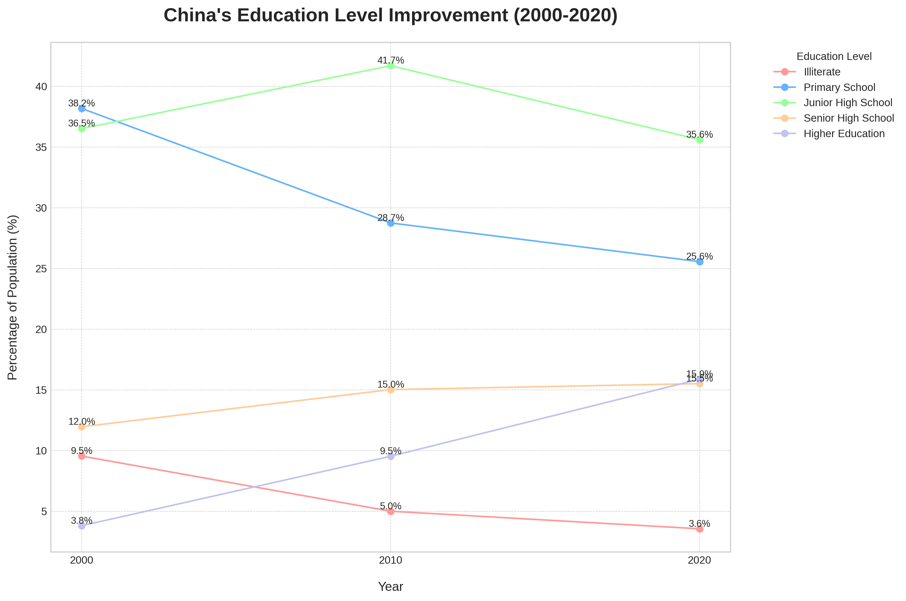

# China's Educational Transformation: A 20-Year Analysis (2000-2020)

## Executive Summary

Over the past two decades, China has made monumental strides in education, fundamentally reshaping its workforce and society. An analysis of census data from 2000, 2010, and 2020 reveals a dramatic decline in illiteracy and a significant expansion of higher education. This report breaks down these key achievements, providing data-driven insights into the magnitude of this transformation.

## Key Findings

Our analysis, based on the `2000_cn_pop_6_up_age_sex_edu`, `2010_cn_pop_6_up_age_sex_edu`, and `2020_cn_pop_3_up_age_sex_edu` census tables, highlights several key trends:

### 1. Near-Eradication of Illiteracy

One of the most significant achievements is the sharp decline in the illiteracy rate, which fell from **9.5%** in 2000 to just **3.6%** in 2020. This represents a reduction of over 60% in two decades, signifying a major success in basic education policies.

### 2. Explosive Growth in Higher Education

The proportion of the population with higher education qualifications has more than quadrupled, surging from **3.8%** in 2000 to **15.9%** in 2020. This explosive growth underscores China's commitment to building a knowledge-based economy.

### 3. Upward Shift in Educational Attainment

As shown in the chart below, there has been a clear upward shift in the overall educational attainment of the population. While the proportion of the population with only primary school education has decreased, the shares of those with senior high school and, most notably, higher education have grown substantially.

*The chart above illustrates the changing distribution of educational attainment in China over 20 years. The most striking trends are the decline in illiteracy and the steep rise in higher education.*

### Detailed Breakdown of Educational Attainment (2000-2020)

| Education Level | 2000 | 2010 | 2020 |
| :--- | :--- | :--- | :--- |
| Illiterate Rate (%)| 9.5% | 5.0% | 3.6% |
| Primary School Rate (%) | 38.2% | 28.7%| 25.6% |
| Junior High School Rate (%) | 36.5% | 41.7%| 35.6% |
| Senior High School Rate (%) | 12.0%| 15.0% | 15.5% |
| Higher Education Rate (%) | 3.8% | 9.5% | 15.9% |

## Conclusion & Recommendations

The data tells a clear story: China has successfully transformed its educational landscape over the last 20 years. The focus has shifted from universalizing basic education to expanding access to higher education.

**Recommendations for the future would be:**

*   **Focus on quality:** With quantitative goals largely met, the next phase of educational development should focus on the quality of education, particularly in higher education, to foster innovation and research.
*   **Address regional disparities:** While this analysis focuses on the national level, further investigation into regional and urban-rural disparities would be crucial to ensure equitable educational opportunities for all.
*   **Lifelong learning:** As the population ages and the economy evolves, promoting lifelong learning and vocational training will be essential to keep the workforce competitive.

This analysis was conducted by exporting the relevant tables from the `dacomp-en-040.sqlite` database to CSV files and then processing them using a Python script with the pandas and matplotlib libraries.
