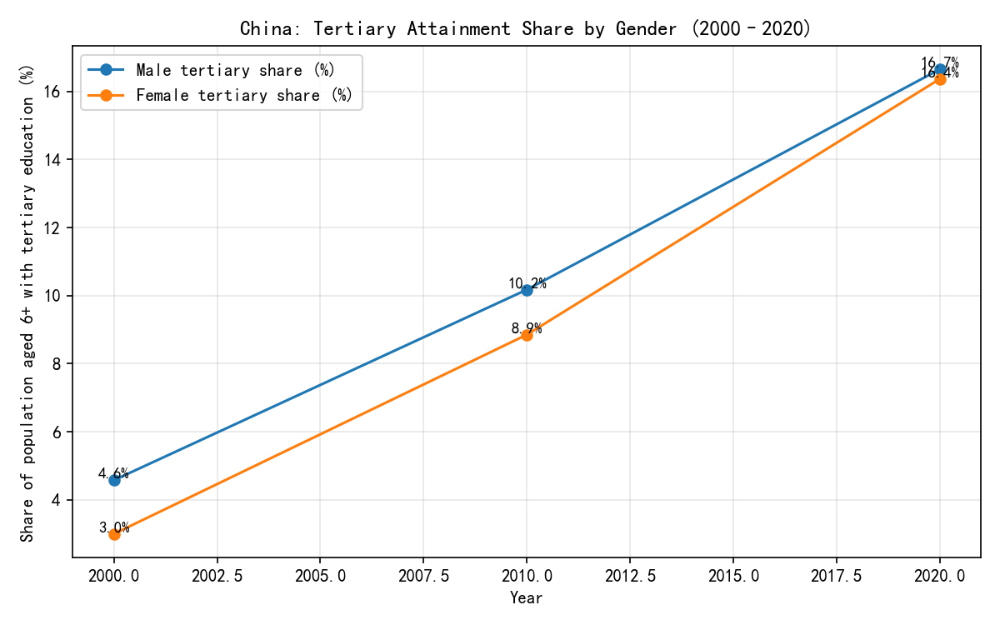

China’s Education Achievements (2000–2020): A Data-Driven Review

Overview
- Conclusion: China made substantial gains in educational attainment over 2000–2020: illiteracy was halved, senior secondary progressed, and tertiary education more than quadrupled—with near gender parity by 2020. Urban–rural gaps narrowed slightly in absolute terms but remain large in relative terms, and youth progression into upper secondary plateaued.
- Method: Aggregations were computed from the following tables by summing across ages (2000/2010: age ≥6; 2020: age ≥6 filtered from the 3+ dataset):
  • 2000_cn_pop_6_up_age_sex_edu (fields: Population Aged 6 and Over - Total/Male/Female; Never Attended; Primary; Junior High; Senior High; Vocational; Junior College; Undergraduate; Postgraduate)
  • 2010_cn_pop_6_up_age_sex_edu (same structure, tertiary fields as REAL)
  • 2020_cn_pop_3_up_age_sex_edu (Population Aged 3+; split Never Attended Male/Female; Preschool; Primary; Junior High; Senior High; Junior College; Undergraduate; Master's; Doctoral; filtered to ages ≥6 for comparability)
  • Urban–rural: 2010_cn_city_pop_6_up_age_sex_e, 2010_cn_rural_6_up_age_sex_edu; 2020_cn_city_pop_3_up_age_sex_e, 2020_cn_rural_pop_3up_agesexed (filtered to ages ≥6).
- Evidence: All computations were done via Python (sqlite3 + pandas) and a plot was created with matplotlib (code executed is included in the transcript). The image file is saved in the current directory.

Key Insights

1) Literacy progress: Illiteracy halved in 20 years.
- Observation: People who “Never Attended School” fell from 89.63M in 2000 to 62.14M in 2010, and 41.54M in 2020. As a share of the 6+ population, this dropped from 7.75% (2000: 1,156.7M) to 5.00% (2010: 1,242.5M) to 3.16% (2020: 1,315.3M).
- Root Cause: Universalization of nine-year compulsory basic education and expanded adult literacy programs.
- Business Impact: Larger literate workforce raises productivity and employability; fewer basic-skill bottlenecks in manufacturing and services.
- Recommendation: Target remaining pockets of illiteracy among older rural cohorts with community centers, mobile classes, and incentives; track completion via local dashboards.

2) Upper-secondary expansion accelerated.
- Observation: Senior High School attainment rose from 99.07M (2000) to 186.65M (2010) and 212.21M (2020); shares of the 6+ population increased from ~8.6% to ~15.0% to ~16.1%.
- Root Cause: Policy emphasis on expanding upper-secondary capacity and pathways beyond junior high.
- Business Impact: Improved pipeline for skilled labor and eligibility for tertiary education; stronger base for knowledge-intensive sectors.
- Recommendation: Prioritize rural and township senior-high capacity expansion and student support (transport, boarding, counseling) to lift completion, especially where shares lag.

3) Tertiary education boomed—and gender parity was achieved.
- Observation: Tertiary attainment (Junior College + Undergraduate + Postgraduate/Master’s/Doctoral) grew from 44.02M (2000) to 118.37M (2010) to 217.22M (2020). Share of the 6+ population rose from 3.81% (2000) to 9.53% (2010) to 16.51% (2020).
- Gender: Male tertiary share moved from 4.57% (2000) to 10.18% (2010) to 16.65% (2020). Female tertiary share rose from 3.00% to 8.85% to 16.37%. The gender gap shrank from 1.57 percentage points (pp) in 2000 to 0.03 pp by 2020—near parity.
- Root Cause: Massive capacity expansion in higher education and improved female participation due to social norms and policy support.
- Business Impact: Larger reservoir of graduates to fuel tech, finance, healthcare, and advanced manufacturing; parity broadens talent pools and leadership pipelines.
- Recommendation: Focus on quality (curriculum, internships, outcomes) and STEM participation for women to translate attainment into high-productivity roles; incentivize industry-academia collaboration.

4) Urban–rural divergence persists despite overall gains.
- Observation: Tertiary share in urban areas was 21.50% (2010) vs 2.06% in rural; in 2020 it was 28.15% (urban) vs 4.95% (rural). Both improved, but the gap remains large and widened in percentage-point terms as urban growth outpaced rural.
- Root Cause: Resource concentration (faculty, facilities, admissions) in cities; migration advantages for urban residents.
- Business Impact: Uneven human capital limits rural economic upgrading and regional convergence.
- Recommendation: Expand rural scholarships and county-level higher-education centers; scale digital/remote degree programs with local study hubs; create targeted admission quotas and bridge programs for rural students.

5) Youth pipeline into upper-secondary is plateauing.
- Observation: Among ages 20–24, the share at Senior High or above hovered around ~20%: 19.58% (2000), 20.72% (2010), 20.07% (2020). Despite aggregate gains, youth progression into upper-secondary did not accelerate commensurately.
- Root Cause: Bottlenecks in upper-secondary capacity, tracking to vocational pathways, and exam-based transitions that may cap throughput.
- Business Impact: Potential future ceiling on tertiary entrants; risk of skills mismatch as industry moves up the value chain.
- Recommendation: Strengthen upper-secondary capacity in fast-growing regions, improve bridges from vocational to academic higher education, and modernize curricula to align with employer demand.

Visualization
- Key takeaway: Tertiary attainment surged over 2000–2020 and gender parity has been reached.
- Exact numbers: Male tertiary share rose from 4.57% (2000) to 10.18% (2010) to 16.65% (2020); female share rose from 3.00% to 8.85% to 16.37%.
- Why it matters: Achieving near parity and rapid expansion signals a broader, more inclusive talent base for high-value industries.

Additional Facts (from dataset fields)
- Population aged 6+ grew from 1,156.7M (2000) to 1,242.5M (2010) to 1,315.3M (2020), providing larger cohorts for education.
- Junior high attainment (2000→2010) rose from 422.39M to 518.18M (+95.79M, +22.7%), while primary fell from 441.61M to 357.21M (−84.40M, −19.1%), consistent with progression into higher levels.
- Data sources cited: Population Aged 6+ totals and education-level fields from the named tables; 2020 figures combine Master’s and Doctoral degrees in tertiary totals.

Actionable Recommendations
- Expand rural upper-secondary and tertiary access: scholarships, local campuses, and broadband-enabled remote learning.
- Improve quality and employability: embed internships, project-based learning, and industry partnerships; track graduate outcomes.
- Target female STEM participation: scholarships, mentorships, and employer commitments to diversify pipelines.
- Reduce remaining illiteracy: adult education hubs and community outreach, especially for older rural cohorts.
- Optimize youth pipeline: increase senior-high seats in fast-growing regions and simplify transitions from vocational tracks into higher education.

Notes on Methodology and Rigor
- Aggregations used explicit fields (e.g., “Senior High School - Total”, “Undergraduate - Total”, “Master’s Degree - Total”), summing by age rows. 2020 data required filtering ages ≥6 and summing male/female for “Never Attended School”.
- Urban–rural splits used city vs rural tables; shares calculated as tertiary totals divided by population aged 6+ in each segment.
- All figures computed via Python (sqlite3 + pandas) and validated against table schemas shown by PRAGMA queries in the transcript.
