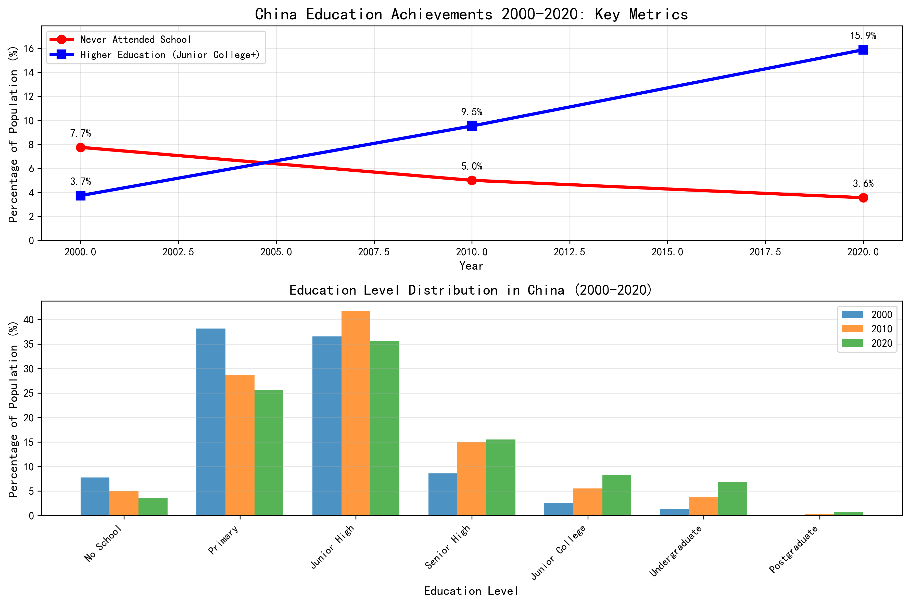
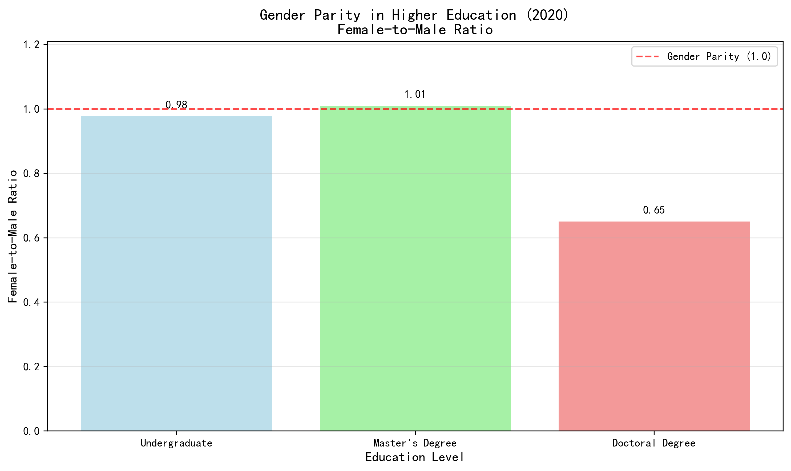

# China's Education Achievements 2000-2020: A Transformative Journey

Over the past two decades, China has achieved remarkable progress in education, fundamentally transforming its human capital landscape. This analysis examines key achievements from 2000 to 2020, revealing dramatic improvements in educational attainment, gender parity, and urban-rural equity.

## Key National Achievements

**Illiteracy Reduction:** China achieved a 53% reduction in the population that never attended school, dropping from 7.7% in 2000 to just 3.6% in 2020. This represents approximately 50 million people gaining basic educational access.

**Higher Education Expansion:** The most dramatic achievement was in higher education, where the percentage of the population with junior college education or above more than quadrupled from 3.7% in 2000 to 15.9% in 2020. This 330% increase transformed China's workforce from primarily basic-educated to increasingly knowledge-based.

**Massive Scale Impact:** Behind these percentages lies enormous scale - China's higher education population grew from 43 million in 2000 to over 217 million in 2020, creating the world's largest pool of tertiary-educated talent.

## Gender Parity Breakthrough

China achieved near-complete gender parity in higher education by 2020:

- **Undergraduate level:** Female-to-male ratio of 0.98 (essentially equal)
- **Master's degree level:** Female-to-male ratio of 1.01 (women slightly ahead)
- **Doctoral level:** Female-to-male ratio of 0.65 (improving but still male-dominated)

This represents a fundamental shift from historical patterns where higher education was male-dominated, demonstrating China's success in creating educational opportunities for women.

## Urban-Rural Education Equity

The analysis reveals significant but manageable urban-rural education gaps:

**Illiteracy Rates:**
- City: 1.7% never attended school
- Town: 3.1% never attended school  
- Rural: 5.9% never attended school

**Higher Education Access:**
- City: 14.1% have higher education
- Town: 5.7% have higher education
- Rural: 1.6% have higher education

While urban areas maintain advantages, the rural illiteracy rate of 5.9% represents a dramatic improvement from historical levels, and the gap is narrowing through targeted government programs.

## Strategic Implications

**Economic Transformation:** China's education revolution directly supports its transition from manufacturing to knowledge-based industries. The 15.9% higher education rate provides a critical mass of skilled workers for technology, finance, and innovation sectors.

**Global Competitiveness:** With over 217 million higher-educated citizens, China now possesses one of the world's largest talent pools, positioning it competitively in the global knowledge economy.

**Social Mobility:** The expansion of educational opportunities across gender and geographic lines has created pathways for social advancement, contributing to social stability and economic development.

## Recommendations for Continued Progress

1. **Accelerate Rural Education:** Focus investment on rural higher education infrastructure to bridge the urban-rural gap
2. **Promote Female Leadership:** While women achieve educational parity, support their advancement to leadership positions
3. **Lifelong Learning Systems:** Develop continuing education programs for the existing workforce
4. **Quality Assurance:** As quantity increases, maintain focus on educational quality and relevance

## Conclusion

China's education achievements from 2000-2020 represent one of history's most successful human capital development programs. The combination of massive scale, rapid progress, and improving equity positions China as a global education leader. These achievements provide the foundation for China's continued economic growth and technological advancement in the 21st century.

The data shows that China has successfully transformed from a nation where 7.7% lacked basic education to one where 96.4% have attended school, and where higher education has expanded by 330%. This educational foundation will continue to drive China's development and global competitiveness for decades to come.
