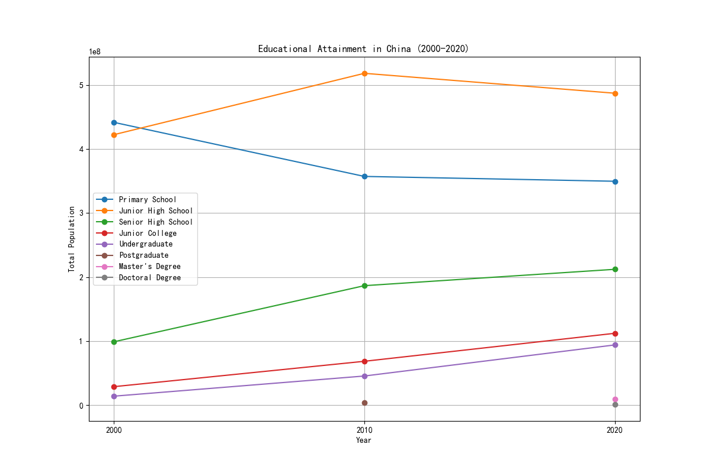

# Key Achievements in China's Education System (2000-2020)

## Introduction
This report analyzes the evolution of educational attainment in China from 2000 to 2020, focusing on key educational levels across different demographics. The analysis is based on national population and education data for the years 2000, 2010, and 2020.

## Key Findings

### 1. **Expansion of Higher Education**
- **Undergraduate Enrollment**: Increased from **14.15 million** in 2000 to **94.16 million** in 2020 — a **6.7x increase**.
- **Postgraduate/Master’s and Doctoral Programs**: In 2010, there were **4.14 million** postgraduate students. By 2020, this number grew to **10.77 million** (including **9.49 million** Master’s and **1.28 million** Doctoral students).

### 2. **Growth in Secondary and Vocational Education**
- **Senior High School Enrollment**: Increased from **99.07 million** in 2000 to **212.21 million** in 2020 — a **2.1x increase**.
- **Junior College Enrollment**: Grew from **29.0 million** in 2000 to **112.30 million** in 2020 — a **3.9x increase**.

### 3. **Improvement in Basic Education**
- **Junior High School Enrollment**: Increased from **422.39 million** in 2000 to **487.10 million** in 2020.
- **Primary School Enrollment**: Slight decline from **441.61 million** in 2000 to **349.66 million** in 2020, likely due to demographic changes and improved education efficiency.

## Visual Summary

The line chart above illustrates the upward trend in educational attainment across all levels, particularly in higher education.

## Conclusion
China has made remarkable progress in expanding access to education over the past two decades:
- **Massive expansion of higher education**, with a significant rise in undergraduate and postgraduate enrollment.
- **Strong growth in secondary and vocational education**, indicating improved access and investment in skill development.
- **Steady improvement in basic education**, despite demographic shifts.

These achievements reflect China's commitment to improving education quality and accessibility, contributing to its economic and technological development.

## Recommendations
1. **Continue investing in higher education and research** to maintain global competitiveness.
2. **Address regional and urban-rural disparities** in education access and quality.
3. **Support lifelong learning and adult education programs** to adapt to changing labor market needs.
