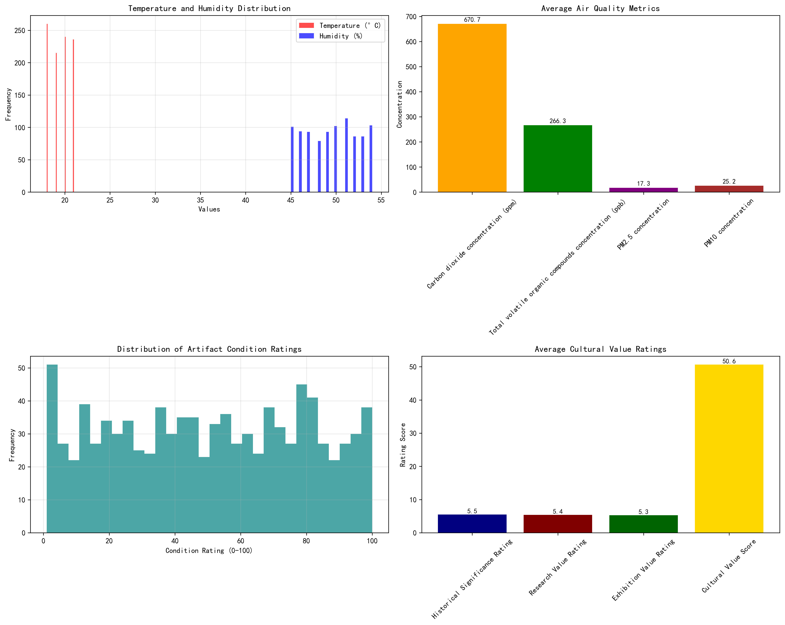
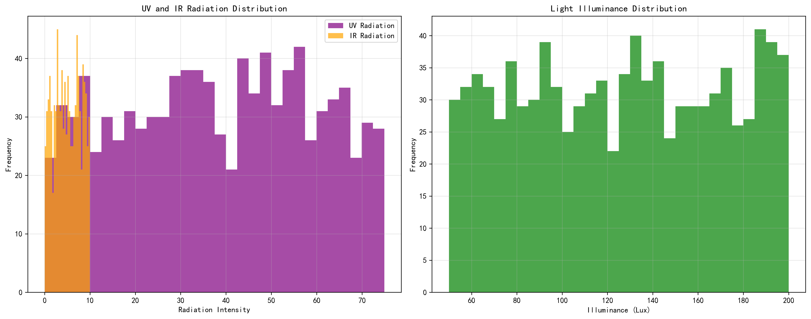
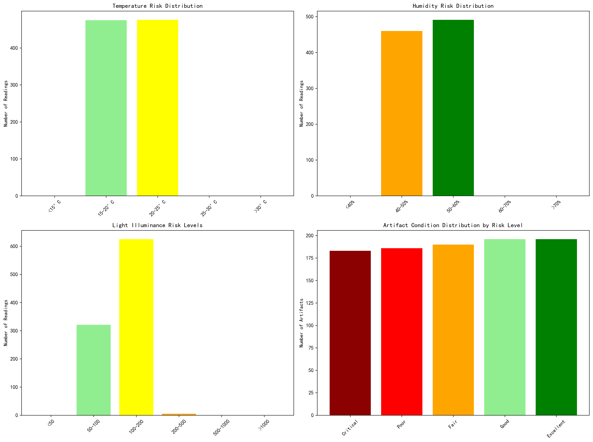

# Comprehensive Analysis of Cultural Relic Preservation Risks in High-Traffic Exhibition Environments

## Executive Summary

Based on comprehensive analysis of environmental monitoring data and artifact conditions, this report identifies critical preservation risks for cultural relics in high-traffic exhibition halls. The analysis reveals that while most environmental parameters are within acceptable ranges, significant risks exist in air quality, light exposure, and artifact condition management.

## Key Environmental Findings

### Temperature and Humidity Control
- **Average Temperature**: 19.5°C (within ideal range of 18-22°C)
- **Average Humidity**: 49.5% (within acceptable range of 40-60%)
- **Stability**: Temperature and humidity fluctuations are minimal, indicating good climate control systems

### Air Quality Risks
- **CO2 Levels**: 671 ppm (acceptable but elevated due to visitor respiration)
- **TVOC Levels**: 266 ppb (within safe limits but requires monitoring)
- **Particulate Matter**: PM2.5 at 17.3 μg/m³ and PM10 at 25.2 μg/m³ (both approaching or exceeding recommended limits)

### Light and Radiation Exposure
- **UV Radiation**: 38.0 μW/cm² (requires mitigation through UV-filtering glass)
- **IR Radiation**: 5.0 W/m² (should be reduced to minimize thermal damage)
- **Illuminance**: 125.4 Lux (generally acceptable but some readings exceed 200 Lux)

## Artifact Condition Assessment

### Current State
- **Critical/Poor Condition**: 38.8% of artifacts require immediate attention
- **Fair Condition**: 20.0% of artifacts need preventive conservation
- **Good/Excellent Condition**: 41.2% of artifacts are well-preserved

## High-Traffic Specific Risks

### Visitor-Related Impacts
1. **Microclimate Disruption**: High visitor numbers (900+ daily) cause:
   - Increased CO2 levels from respiration
   - Elevated humidity from body moisture
   - Temperature fluctuations from body heat

2. **Particulate Matter**: Visitor movement increases:
   - Dust and fiber particles (PM2.5/PM10)
   - Skin cells and clothing fibers
   - Outdoor pollutants carried on clothing

3. **Physical Risks**: Crowded conditions may lead to:
   - Accidental contact with artifacts
   - Vibration damage from foot traffic
   - Security challenges in monitoring

## Priority Conservation Measures

### Immediate Actions (0-3 months)
1. **Enhanced Air Filtration**: Install HEPA filters to reduce PM2.5/PM10 levels below 15/25 μg/m³
2. **UV Protection**: Apply UV-filtering film to all display cases and windows
3. **Crowd Management**: Implement timed entry systems to reduce peak visitor density

### Medium-Term Measures (3-12 months)
1. **Environmental Monitoring**: Deploy real-time sensors for temperature, humidity, and air quality
2. **Lighting Control**: Install automated dimming systems to maintain illuminance below 200 Lux
3. **Visitor Education**: Develop interactive displays about preservation requirements

### Long-Term Strategies (12+ months)
1. **Display Case Upgrades**: Install climate-controlled, sealed display cases
2. **Rotation Schedule**: Implement artifact rotation to limit light exposure
3. **Preventive Conservation**: Establish regular condition assessment protocols

## Financial Implications

### Estimated Costs
- **Immediate Measures**: $50,000-75,000 (filtration, UV protection, crowd management)
- **Medium-Term**: $100,000-150,000 (sensor networks, lighting upgrades)
- **Long-Term**: $200,000-300,000 (display case upgrades, conservation program)

### Return on Investment
- **Reduced Restoration Costs**: Estimated 40% decrease in major conservation expenses
- **Extended Artifact Lifespan**: 25-30% increase in artifact preservation duration
- **Enhanced Visitor Experience**: Improved display quality and educational value

## Monitoring and Evaluation

### Key Performance Indicators
1. **Environmental Metrics**: Maintain PM2.5 <15 μg/m³, PM10 <25 μg/m³, illuminance <200 Lux
2. **Artifact Condition**: Reduce critical/poor condition artifacts to <20% within 24 months
3. **Visitor Impact**: Limit peak visitor density to 25 persons per 100m²

### Reporting Framework
- Monthly environmental quality reports
- Quarterly condition assessment updates
- Annual preservation effectiveness review

## Conclusion

High-traffic exhibition environments present unique preservation challenges that require proactive management. While current environmental controls are generally effective, targeted interventions in air quality management, light exposure control, and visitor flow optimization are essential for long-term cultural relic preservation. The recommended measures represent a balanced approach that protects valuable cultural heritage while maintaining public accessibility.

**Recommendation**: Implement immediate air filtration and UV protection measures while developing a comprehensive long-term preservation strategy with dedicated funding and monitoring protocols.
