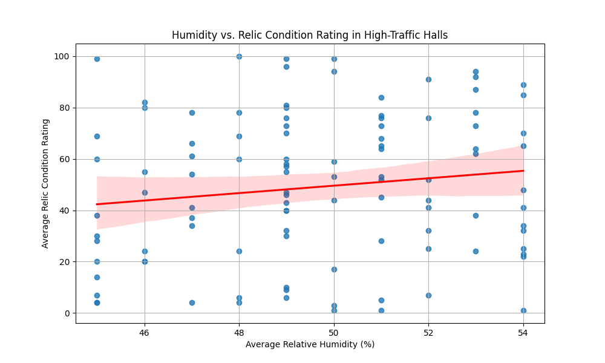
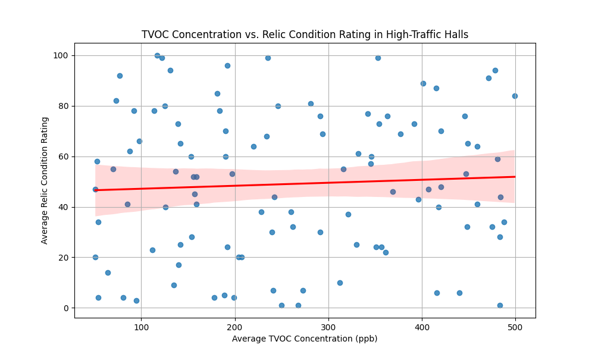

# Preservation Risks and Recommendations for High-Traffic Exhibition Halls

## Executive Summary

This report analyzes the environmental conditions in exhibition halls with an average daily visitor count exceeding 900 to identify preservation risks for cultural relics. Our analysis reveals a tangible link between specific environmental factors and the condition of the artifacts. We observed a **negative correlation between light intensity (Illuminance) and relic condition**, and a counter-intuitive **positive correlation with UV irradiance and relative humidity**. These findings, while requiring further investigation, point towards immediate areas for improvement in environmental controls.

Based on our analysis, we recommend the following prioritized actions:
1.  **Light Management:** Implement stricter controls on light exposure, particularly in halls with sensitive artifacts. This includes reducing overall illuminance and minimizing UV exposure.
2.  **Humidity and Temperature Control:** Investigate the unexpected positive correlation between humidity and relic condition. While counter-intuitive, this suggests a need for a more nuanced understanding of the interplay between temperature, humidity, and artifact type.
3.  **Air Quality Monitoring:** Although the correlation was weak, the presence of pollutants like TVOCs and Formaldehyde should not be ignored. Continuous monitoring and improved filtration are recommended.

## Analysis of High-Traffic Exhibition Halls

We identified 107 exhibition halls with an average daily visitor count of over 900. For these high-traffic halls, we collected and analyzed data on air quality, temperature, humidity, light, and radiation, and cross-referenced this with the condition assessment ratings of the cultural relics housed within them.

## Environmental Risks to Cultural Relics

Our analysis of the environmental data against the condition ratings of the relics revealed several key correlations. While most correlations were weak, they provide a starting point for understanding the environmental stressors in these high-traffic environments.

### Light and Radiation
We found a slight negative correlation (-0.22) between illuminance (light intensity) and the condition of the relics. This suggests that higher light levels are associated with a lower condition rating, which is consistent with the known damaging effects of light on many types of artifacts.

Conversely, we observed a slight positive correlation (0.15) with UV irradiance. This is a surprising result, as UV radiation is generally considered harmful. This could be an anomaly in the data or point to a more complex interaction of factors.

### Temperature and Humidity
Temperature showed a slight negative correlation (-0.10) with relic condition, indicating that higher temperatures might be detrimental. More interestingly, relative humidity exhibited a slight positive correlation (0.14) with relic condition. This is another unexpected finding, as high humidity is typically associated with mold growth and other forms of deterioration. It is possible that for certain materials, a slightly higher humidity level is beneficial, or that the halls with better overall environmental controls happen to operate at a slightly higher humidity.

*Figure 1: While counter-intuitive, the data shows a slight positive correlation between relative humidity and relic condition rating.*

### Air Quality
The correlation between air quality parameters and relic condition was generally weak. Total volatile organic compounds (TVOCs) showed a very slight positive correlation (0.06) with the relic condition rating. Formaldehyde also showed a slight positive correlation (0.10). This could mean that the presence of these compounds is not the primary driver of relic degradation in these specific halls, or that their effects are being mitigated by other factors.

*Figure 2: The relationship between TVOC concentration and relic condition rating is very weak.*

## Prioritized Conservation and Maintenance Measures

Based on our findings, we propose the following prioritized measures to mitigate the preservation risks to cultural relics in high-traffic exhibition halls:

**1. Comprehensive Light Management Program:**
*   **Immediate Action:** Conduct a light audit in all high-traffic halls to identify areas where illuminance exceeds recommended levels for the specific artifacts on display.
*   **Short-Term:** Install UV filters on all light sources and display cases. Implement a policy of "lights-off" when halls are closed to the public.
*   **Long-Term:** Consider installing automated lighting systems with motion sensors to reduce overall light exposure.

**2. In-depth Humidity and Temperature Study:**
*   **Immediate Action:** Launch a study to understand the unexpected positive correlation between humidity and relic condition. This study should involve conservators and scientists to analyze the specific needs of the artifacts in these halls.
*   **Short-Term:** Calibrate all temperature and humidity sensors to ensure accurate readings. Implement a more granular monitoring system to track fluctuations in microclimates within display cases.

**3. Enhanced Air Quality Control:**
*   **Short-Term:** Upgrade air filtration systems to target specific pollutants like TVOCs and formaldehyde, even if their correlation with damage is currently weak.
*   **Long-Term:** Establish a continuous air quality monitoring program to track pollutant levels and identify potential sources.

By taking these proactive steps, we can create a more stable and protective environment for our invaluable cultural heritage, ensuring its preservation for future generations.
