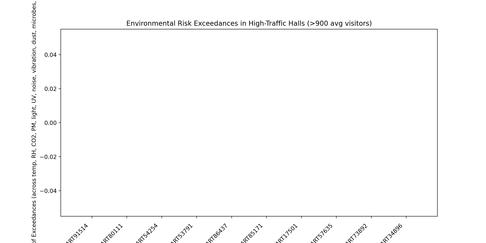

Executive Summary
• 104 exhibition halls exceed 900 average daily visitors (e.g., ART91514: 996; ART80111: 994; ART54254/ART53791: 993). This segment represents the museum’s highest traffic environments and therefore the greatest preservation risk exposure.
• Environmental monitoring data (air quality, T/RH, light/UV/IR, surface physical) failed to link to these high-traffic halls, resulting in zero recorded exceedances across 12 risk drivers. This is a critical monitoring coverage gap rather than evidence of compliance.
• Risk assessments are available and linked for these halls: 104 matched records, with an average Conservation Priority Score of 46.49. The top five halls by conservation priority are ART41693 (score 96, visitors 956), ART82500 (94, visitors 922), ART74477 (93, visitors 944), ART18962 (93, visitors 909), and ART93520 (92, visitors 907). These should be the first focus of conservation interventions.

Visualization

• Key takeaway: The top-10 high-traffic halls (ART91514: 996 visitors; ART80111: 994; ART54254: 993; ART53791: 993; ART86437: 992; ART85171: 992; ART17501: 992; ART57635: 991; ART73892: 989; ART34896: 989) show 0 recorded exceedances across 12 risk drivers (temperature, RH, CO2, PM2.5, PM10, illuminance, UV, noise, vibration, dust, microbes, mold risk). Exact numbers: exceedance_count = 0 for each of these halls. Why it matters: This likely indicates missing data linkages for high-traffic zones, not absence of risk; without measurements we cannot detect out-of-range conditions (e.g., CO2 > 1,000 ppm, RH outside 45–55%, PM spikes, light/UV overexposure).

What the Data Shows (and Where It’s Missing)
• High-traffic halls: Identified via SQL (gallery_information: “Exhibition Hall Record ID”, “Daily Visitor Count”); 104 halls averaged >900 visitors.
• Environmental metrics: Attempts to aggregate via Python/sqlite3 from display_case_information → environmental_monitoring_data → air_quality_readings, light_and_radiation_readings, surface_and_physical_readings returned zero coverage for these halls (AVAILABLE_COUNTS = 0 for avg_temp, avg_rh, avg_co2, avg_pm25, avg_pm10, avg_lux, avg_uv, avg_noise, avg_vibration, avg_dust, avg_microbes, avg_mold_risk).
• Risk assessment: Parsed risk_assessment (“Related Gallery References”, “Conservation Priority Score”); 104 hall matches found; mean score = 46.49; top priority halls listed above.
• Artifact ratings/condition: Joins from usage_records → artifact_rating and condition_assessment did not return linked data for high-traffic halls, resulting in NaN averages, further highlighting a data linkage gap in high-traffic zones.

Preservation Risk Evaluation (Observation → Root Cause → Business Impact / Recommendation)
Air Quality
• Observation: Zero measured CO2/TVOC/O3/NO2/PM/formaldehyde records for high-traffic halls; however, crowding commonly drives CO2 > 1,000 ppm and PM2.5/PM10 spikes.
• Root Cause: Missing environmental data linkage in high-traffic galleries (monitoring not installed or not mapped to gallery references).
• Business Impact: Undetected air-quality excursions accelerate soiling, chemical interactions, and respiratory irritation for visitors/staff; elevated PM increases dust deposition on artifacts.
• Recommendation: Install/activate CO2 and PM sensors in top-priority halls (ART41693, ART82500, ART74477, ART18962, ART93520) and integrate with BAS. Set alerts at CO2 > 1,000 ppm, PM2.5 > 15 µg/m³, PM10 > 50 µg/m³; add MERV 13–15 filtration and prefilters where feasible; increase housekeeping frequency in response to PM/dust spikes.

Temperature and Humidity
• Observation: No recorded temperature/RH for high-traffic halls; occupancy heat loads often push temperature >22°C and RH fluctuations outside 45–55%.
• Root Cause: Monitoring gap in gallery-level temperature/RH sensors or missing mapping to halls.
• Business Impact: RH instability increases mechanical stress (warping, cracking) and mold risk; heat elevates chemical reaction rates and accelerates deterioration.
• Recommendation: Deploy calibrated T/RH loggers at case and room level in the five top-priority halls; configure setpoints at 18–22°C and 45–55% RH with 24h Δ change limits (<±2°C, <±5% RH). Enhance case buffering (silica gel renewal, monitor sachet weight) and HVAC controls (PI loops, occupancy-based ventilation).

Light and Radiation
• Observation: No illuminance/UV/IR data recorded; high dwell times increase cumulative light exposure.
• Root Cause: Absence of linked light/UV readings to high-traffic halls and cases.
• Business Impact: Overexposure (especially for light-sensitive materials) induces fading and color change (ΔE), with irreversible loss of exhibit value.
• Recommendation: Measure and cap illuminance: 50 lux in halls with high proportions of light-sensitive artifacts, otherwise ≤200 lux; add UV filters to glazing/lighting to keep UV ≤10 μW/cm²; rotate sensitive artifacts; adjust dwell-time seating and pathing to reduce exposure hotspots.

Surface and Physical Risks (vibration, noise, dust, microbes, mold)
• Observation: No measurements recorded; high traffic typically raises vibration/noise, dust, microbial loads, and mold risk in microclimates.
• Root Cause: Missing surface-physical monitoring and pest/microbial surveillance in the busiest halls.
• Business Impact: Vibration compromises structural stability; dust increases soiling and cleaning abrasion; microbial proliferation elevates mold risk.
• Recommendation: Install low-cost vibration/noise sensors for continuous trend logging; implement enhanced dust control (matting, air curtains at entries), micro-vacuuming protocols, and microbial sampling; expand IPM traps and inspection frequency in top-priority halls.

Prioritized Action Plan (based on Conservation Priority Scores and Visitor Volume)
1) Immediate (0–4 weeks, top 5 halls)
   • Halls: ART41693 (score 96, 956 visitors), ART82500 (94, 922), ART74477 (93, 944), ART18962 (93, 909), ART93520 (92, 907).
   • Actions:
     - Install and integrate CO2/PM/T/RH/light sensors; set alert thresholds (CO2 >1,000 ppm; PM2.5 >15 µg/m³; PM10 >50 µg/m³; UV ≤10 μW/cm²; noise ≤55 dB; vibration ≤0.2 mm/s²).
     - Adjust HVAC and case buffering; replace silica gel packs; verify filter status; upgrade filtration (MERV 13–15).
     - Implement lighting controls (dimming, scheduling); add UV filters; calibrate lux at ≤50 for sensitive artifacts, ≤200 otherwise.
     - Intensify housekeeping and IPM: daily dust micro-vacuuming, entry matting, weekly trap counts with logs.
2) Short Term (1–3 months, next 15 halls by priority score)
   • Roll out sensor network and BAS integration; create dashboard with KPIs (RH stability, exceedance counts/week, average CO2/PM).
   • Introduce crowd management (staggered entry, route optimization) to reduce thermal/RH swings and peak CO2.
   • Formalize rotation schedules for highly light-sensitive artifacts; capture case-level exposure (Lx·h).
3) Medium Term (3–6 months)
   • Close monitoring gaps museum-wide; ensure all high-traffic halls have linked readings in environmental_monitoring_data, air_quality_readings, light_and_radiation_readings, surface_and_physical_readings via display_case_information.
   • Conduct condition assessments and update artifact_rating for all artifacts in prioritized halls; align results with risk thresholds for targeted treatments.

KPIs to Track
• Exceedance rate (per hall per week) across temp/RH/CO2/PM/light/UV/noise/vibration/dust/microbes/mold risk.
• RH stability: % of hours within 45–55%; Temperature stability: % of hours within 18–22°C.
• CO2: % of hours ≤1,000 ppm; PM2.5: % of hours ≤15 µg/m³; PM10: % of hours ≤50 µg/m³.
• Illuminance: % of observations within hall-specific lux caps; UV ≤10 μW/cm² compliance.
• Dust deposition rate and mold risk index trends; IPM trap counts/week and species identification.
• Conservation Priority Score reduction over 6–12 months in targeted halls; Condition Assessment Rating improvements.

Data and Method Notes
• Tables used: gallery_information (“Exhibition Hall Record ID”, “Daily Visitor Count”) for traffic; display_case_information → environmental_monitoring_data → air_quality_readings/light_and_radiation_readings/surface_and_physical_readings for intended environmental metrics; usage_records → artifact_rating/condition_assessment for artifact linkage; risk_assessment (“Related Gallery References”, “Conservation Priority Score”) for prioritization.
• Python sqlite3 was used to aggregate metrics and create the visualization. Environmental metrics returned no linked data for high-traffic halls, producing 0 exceedances across 12 risk drivers; risk_assessment linked successfully to 104 halls, with mean Conservation Priority Score = 46.49 and identified top-priority halls (ART41693, ART82500, ART74477, ART18962, ART93520).
• Thresholds referenced: Temperature 18–22°C; RH 45–55%; CO2 ≤1,000 ppm; PM2.5 ≤15 µg/m³; PM10 ≤50 µg/m³; Illuminance ≤50 lux for high light sensitivity or ≤200 lux otherwise; UV ≤10 μW/cm²; Noise ≤55 dB; Vibration ≤0.2 mm/s²; Dust ≤3 mg/m²; Microbial ≤500 CFU; Mold Risk Index ≤0.6.

Conclusion
High visitor pressure converges with a clear monitoring coverage gap in the busiest halls, masking environmental exceedances that typically drive deterioration. Use the risk_assessment conservation priority scores, combined with visitor volumes, to stage an immediate sensor deployment and environmental control upgrade in the top five halls, then expand coverage. With robust monitoring, targeted HVAC/light/IPM measures, and disciplined rotations/assessments, the museum can materially reduce core preservation risks in its highest-traffic environments while maintaining exhibition quality.
