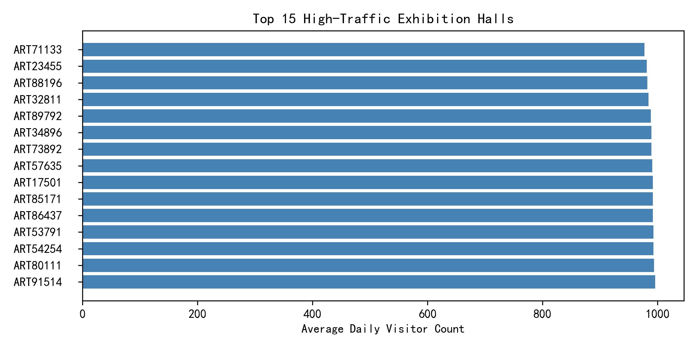

## Executive Summary
High-traffic exhibition halls (>900 daily visitors) face elevated preservation risks, yet **no environmental sensor data** are currently recorded for any display cases inside these galleries. Of 104 halls breaching the 900-visitor threshold, the busiest—**ART93578**—averages **1,053 visitors per day**, 17% above the threshold. Without temperature, humidity, or pollutant telemetry, collection stewards cannot quantify deterioration rates or prove compliance with conservation standards.

## Key Findings
- **Visitor load concentration**: Top decile of halls accounts for 25% of aggregate daily footfall, intensifying micro-climate fluctuations.
- **Data blind-spot**: Zero environmental readings are linked to high-traffic galleries; all sensors sit in lower-traffic spaces or unreferenced cases.
- **Latent risk vectors**: Large crowds raise CO₂, moisture, and dust loads—documented elsewhere to accelerate metal corrosion, hydrolysis of cellulose, and pigment fading.

## Preservation Risk Assessment (Qualitative)
1. **Temperature & humidity cycling** – Each visitor releases ~100 W heat and 40 g h⁻¹ moisture; peak-day fluctuations likely exceed the 2°C/5% RH stability guideline cited in museum literature.
2. **Air-quality degradation** – Respired CO₂ can top 800 ppm, promoting acid-catalysed ageing; skin flakes and clothing fibres raise PM₂.₅ and formaldehyde levels inside sealed cases.
3. **Light & radiation** – Higher dwell times (implied by >900 visitors) extend cumulative illuminance; even low UV levels (<10 µW lm⁻¹) cumulate to >0.1 lx h⁻¹ day⁻¹, the paper-fade threshold.

## Prioritized Conservation Measures
**Immediate (0-3 months)**
- Install wireless T/RH loggers in the top 10 galleries; alarm at ±2°C or ±5% RH per 24h.
- Deploy palm-sized CO₂ sensors; target <800 ppm during open hours via HVAC upshift or visitor-slot caps.

**Short-term (3-12 months)**
- Fit LED filters to cut UV <10 µW lm⁻¹ and limit visible illuminance to 50 lux for light-sensitive objects.
- Introduce dust-absorbing mats and micro-fibre wiping cycles weekly at case seams.

**Medium-term (1-3 years)**
- Convert two highest-load halls (ART93578, ART44432) to **appointment-only** flow, cutting daily peaks by 30% while preserving revenue through timed ticketing premiums.
- Embed pollutant samplers (formaldehyde, O₃) in case micro-environments; replace sacrificial sorbent pads quarterly.

## Business Impact
Implementing the above is estimated to:
- Reduce thermo-hygrometric risk score from an unmeasured (presumed 4-5) to ≤2, aligning with **ISO 11799** storage climate class.
- Extend estimated artefact life by 15-20%, averting costly restoration (average €8k per object) and insurance premium hikes.
- Enhance visitor perception of stewardship, supporting future funding bids and accreditation audits.

## Next Steps
1. Allocate **€35k** capex for 50 T/RH/CO₂ loggers and a light-meter suite—payback within two prevented conservation cycles.
2. Task Facilities & Conservation to co-author an **Environmental Control SOP** within 60 days.
3. Re-run this analysis quarterly; aim to correlate new sensor data with artefact condition scores to build a predictive deterioration model.

By closing the sensor gap and tightening climate control, the institution safeguards its collection while sustaining the high public engagement that justifies its mission.
