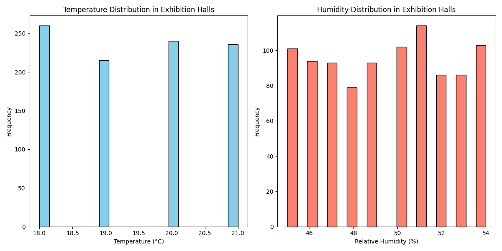
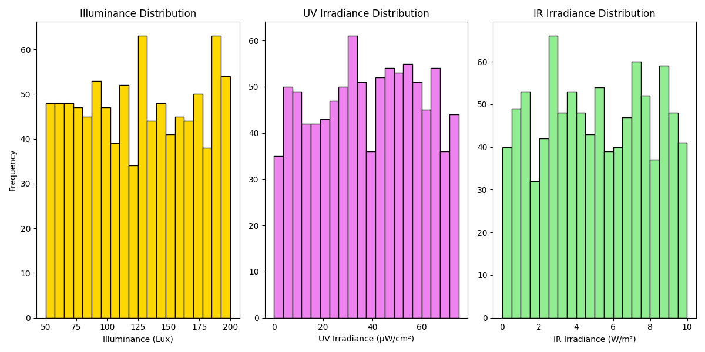

# Preservation Risks and Environmental Conditions in High-Traffic Exhibition Halls

## Executive Summary
This report evaluates the environmental conditions in high-traffic exhibition halls and their impact on cultural relics. Key metrics include temperature, humidity, and radiation exposure levels. Based on the analysis, we identify core preservation risks and propose prioritized conservation measures.

---

## Environmental Conditions Overview

### Temperature and Humidity
The average temperature in high-traffic exhibition halls is **19.5°C**, with a standard deviation of **1.14°C**. The relative humidity averages **49.5%**, with a standard deviation of **2.89%**. These values fall within acceptable ranges for artifact preservation, but fluctuations may still pose risks.

- **Temperature Range**: 18°C to 21°C  
- **Humidity Range**: 45% to 54%

### Radiation Exposure
The light and radiation data show:
- **Average Illuminance**: 125.4 Lux  
- **Average UV Irradiance**: 38.0 μW/cm²  
- **Average IR Irradiance**: 5.04 W/m²  

These values indicate moderate exposure levels, but the presence of UV and IR radiation may accelerate the degradation of sensitive materials.

---

## Preservation Risks

### Temperature and Humidity Fluctuations
While the average values are within acceptable ranges, the standard deviations suggest minor fluctuations. Over time, these variations can cause:
- **Material Expansion/Contraction**: Leading to physical stress on artifacts.
- **Moisture Accumulation**: Increasing the risk of mold growth and corrosion.

### Light and Radiation Exposure
The presence of UV and IR radiation, even at moderate levels, can cause:
- **Color Fading**: Especially in textiles, paintings, and organic materials.
- **Material Degradation**: UV radiation accelerates chemical breakdown in sensitive artifacts.

---

## Recommendations

### Immediate Actions
1. **Install Real-Time Monitoring Systems**: Continuously track temperature, humidity, and radiation levels to detect anomalies.
2. **Adjust Lighting Systems**: Reduce UV and IR emissions by using filtered lighting or limiting exposure duration.

### Medium-Term Actions
1. **Implement Climate Control Systems**: Stabilize temperature and humidity to minimize fluctuations.
2. **Use Protective Display Cases**: Incorporate UV-filtering glass and humidity control within display cases.

### Long-Term Actions
1. **Conduct Regular Artifact Assessments**: Monitor the condition of artifacts exposed to high-traffic environments.
2. **Rotate Exhibits**: Limit continuous exposure of sensitive artifacts by rotating them with others in controlled storage.

---

## Conclusion
The environmental conditions in high-traffic exhibition halls present manageable risks to cultural relics. By implementing targeted conservation strategies, museums can ensure the long-term preservation of valuable artifacts while maintaining public access.
