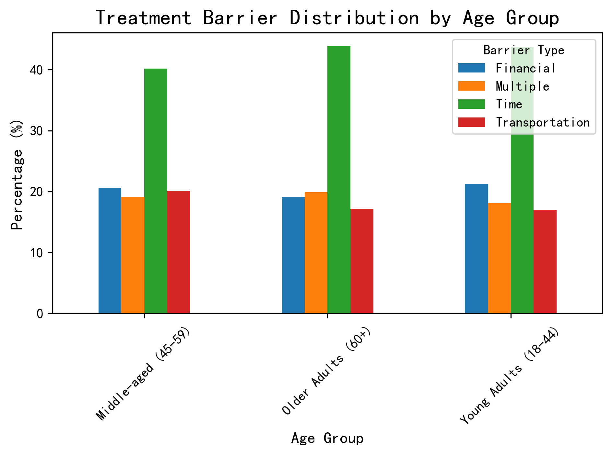
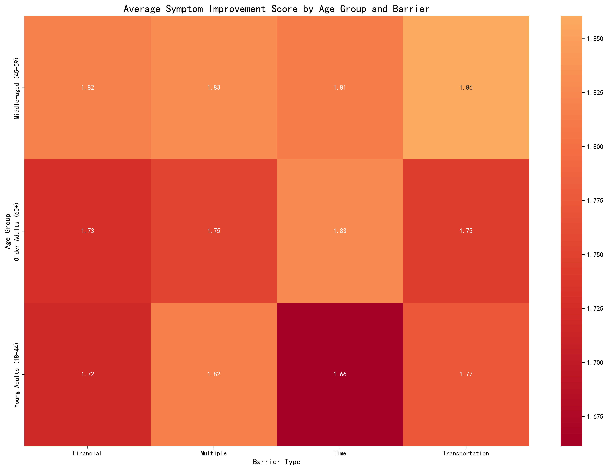
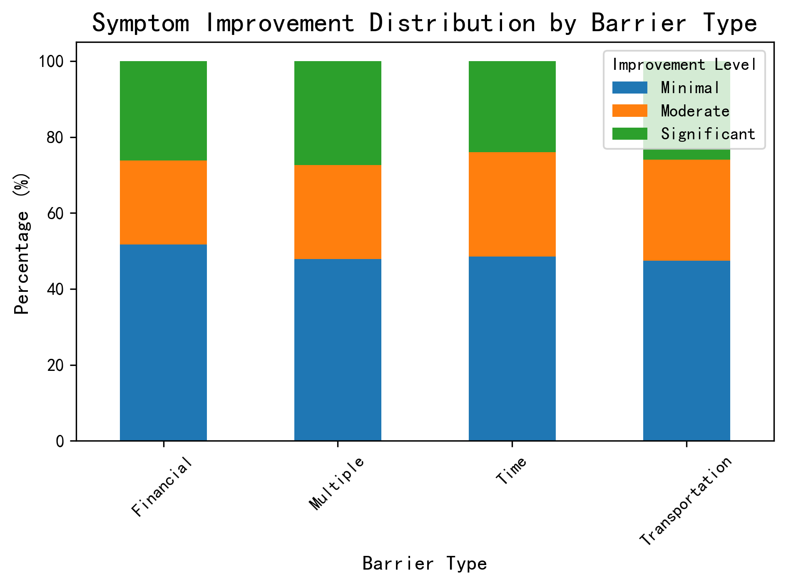

# Treatment Barrier Analysis Across Age Groups

## Executive Summary

This analysis examines how primary barrier factors to treatment adherence differ across patient age groups (young adults 18-44, middle-aged 45-59, older adults 60+) and how these barriers impact symptom improvement. The study reveals distinct patterns across age cohorts, enabling targeted intervention strategies.

## Data Overview

The analysis includes 1,000 patient records with complete treatment barrier and symptom improvement data:
- **Young Adults (18-44)**: 419 patients (41.9%)
- **Middle-aged (45-59)**: 214 patients (21.4%) 
- **Older Adults (60+)**: 367 patients (36.7%)

## Key Findings

### 1. Barrier Distribution by Age Group

**Time constraints** emerge as the dominant barrier across all age groups, but with varying prevalence:
- **Young Adults**: 43.7% face time constraints (highest prevalence)
- **Middle-aged**: 40.2% face time constraints  
- **Older Adults**: 43.9% face time constraints

**Financial barriers** show consistent impact across groups (19-21%), while **transportation issues** are most problematic for middle-aged patients (20.1%).

### 2. Symptom Improvement Impact

Middle-aged patients demonstrate the **highest overall improvement scores** (1.83/3.0), followed by older adults (1.76) and young adults (1.74). 

**Critical insights**:
- Transportation barriers have the **least negative impact** on middle-aged patients (1.86 improvement score)
- Financial barriers show the **poorest outcomes** across all age groups
- Multiple barriers consistently correlate with **reduced improvement**

### 3. Improvement Patterns by Barrier Type

**Transportation barriers** show the **best improvement outcomes** overall, while **financial barriers** show the **worst outcomes**.

## Age-Specific Analysis & Recommendations

### Young Adults (18-44)
**Primary Challenge**: Time constraints (43.7%) significantly impact this group, likely due to work/education commitments and family responsibilities.

**Targeted Interventions**:
- Flexible scheduling and telehealth options
- Time management counseling integrated into treatment
- Employer education programs about mental health accommodations

**Monitoring Indicators**:
- Appointment adherence rate improvement (target: +25%)
- Reduction in time-related barrier reporting (target: -30%)
- Improvement score increase (target: 1.85+)

### Middle-aged (45-59)  
**Primary Challenge**: Balanced barrier distribution with transportation issues showing the least negative impact.

**Targeted Interventions**:
- Transportation assistance programs and ride-sharing partnerships
- Financial counseling and assistance programs
- Workplace mental health initiatives

**Monitoring Indicators**:
- Transportation barrier reduction (target: -40%)
- Financial stress improvement (target: +20% satisfaction)
- Maintain current improvement scores (1.83+)

### Older Adults (60+)
**Primary Challenge**: Time constraints remain significant, potentially due to caregiving responsibilities or medical appointments.

**Targeted Interventions**:
- Home-based treatment options and mobile services
- Caregiver support programs
- Simplified medication regimens to reduce time burden

**Monitoring Indicators**:
- Home-based service utilization rate (target: 60%)
- Caregiver support program participation (target: 75%)
- Improvement score maintenance (1.75+)

## Cross-Cutting Recommendations

1. **Financial Assistance Programs**: Implement sliding-scale fees and insurance navigation support
2. **Technology Integration**: Expand telehealth and digital treatment platforms
3. **Barrier Screening**: Routine assessment of treatment barriers during intake
4. **Peer Support**: Age-matched support groups to address shared challenges

## Conclusion

This analysis reveals that while time constraints are universal, each age group faces unique challenges requiring tailored interventions. Middle-aged patients show the most resilience to barriers, while young adults require the most support with time management. Financial barriers consistently produce the poorest outcomes across all groups, indicating a critical need for systemic financial support solutions.

**Overall target**: Achieve 20% improvement in symptom outcomes across all age groups within 12 months through targeted barrier reduction strategies.
