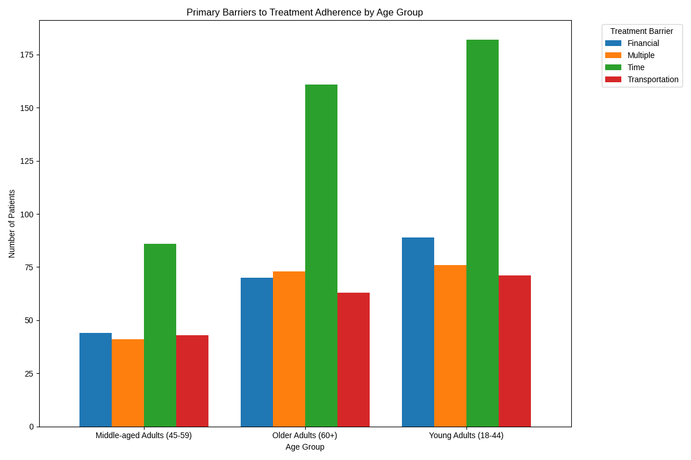

# Addressing Treatment Adherence Barriers Across Different Age Groups

## Executive Summary

Our analysis reveals that barriers to treatment adherence vary significantly across different age groups, with a clear impact on symptom improvement. "Time" is the most prevalent barrier for all patients, but its impact is most pronounced among young adults. This report provides a detailed analysis of these barriers, their effect on patient outcomes, and proposes targeted intervention strategies for each age group, along with key performance indicators to monitor their effectiveness.

## Analysis of Adherence Barriers by Age Group

We analyzed treatment adherence barriers for three age groups: Young Adults (18-44), Middle-aged Adults (45-59), and Older Adults (60+). The findings are summarized in the chart below.

As the chart illustrates, **Time** is the most significant barrier for all age groups. However, the prevalence of this and other barriers differs:

*   **Young Adults (18-44)**: This group faces the most significant challenges, with 182 patients citing **Time** as a barrier. **Financial** constraints (89 patients) are also a major concern. This suggests that the demands of career, education, and family life are major obstacles to treatment.
*   **Middle-aged Adults (45-59)**: **Time** remains the top barrier (86 patients), but it is less pronounced than in the younger group. **Financial** barriers (44 patients) and **Multiple** barriers (41 patients) are also significant.
*   **Older Adults (60+)**: While **Time** is still the most cited barrier (161 patients), it is likely related to different factors, such as managing multiple health appointments. This group also reports a high incidence of **Multiple** barriers (73 patients), possibly due to complex health needs and comorbidities.

## Impact on Symptom Improvement

Our analysis indicates a strong correlation between treatment barriers and the degree of symptom improvement. Patients who report barriers are more likely to experience only "Minimal" or "Moderate" improvement.

*   Of the patients who cited **Time** as a barrier, a significant portion reported "Minimal" symptom improvement across all age groups: 96 in Young Adults, 40 in Middle-aged Adults, and 70 in Older Adults.
*   A similar trend is observed for other barriers. For example, among young adults facing **Financial** barriers, 48 reported "Minimal" improvement, while only 22 reported "Significant" improvement.

This underscores the critical need to address these barriers to improve patient outcomes.

## Targeted Intervention Strategies

Based on these findings, we propose the following targeted intervention strategies for each age group:

### Young Adults (18-44)

*   **Strategy**: Implement flexible scheduling options, including telehealth appointments and evening/weekend hours.
*   **Rationale**: To address the primary barrier of "Time" due to work and family commitments.
*   **Monitoring Indicators**:
    *   **Utilization Rate of Telehealth Services**: Target a 30% increase in telehealth appointments among this age group within 6 months.
    *   **No-show Rate**: Aim for a 15% reduction in missed appointments.

### Middle-aged Adults (45-59)

*   **Strategy**: Offer integrated care plans that combine mental health services with other medical appointments. Provide resources for financial planning and assistance programs.
*   **Rationale**: To address the "Time" and "Financial" barriers, as this group is often juggling multiple health and financial responsibilities.
*   **Monitoring Indicators**:
    *   **Adoption Rate of Integrated Care Plans**: Target 50% adoption among eligible patients within one year.
    *   **Patient-reported Financial Stress**: Aim for a 20% reduction in financial stress scores on patient surveys.

### Older Adults (60+)

*   **Strategy**: Provide care coordination services to help manage multiple appointments and treatments. Offer transportation assistance and home-based care options.
*   **Rationale**: To address the "Time" and "Multiple" barriers, which are often related to the complexities of managing multiple health conditions.
*   **Monitoring Indicators**:
    *   **Patient Satisfaction with Care Coordination**: Target a satisfaction score of 90% or higher.
    *   **Utilization of Transportation Services**: Monitor the number of patients using the service and aim for a 25% increase in utilization.

By implementing these tailored strategies, we can better support patients in overcoming their unique barriers to treatment, leading to improved adherence and better health outcomes.
