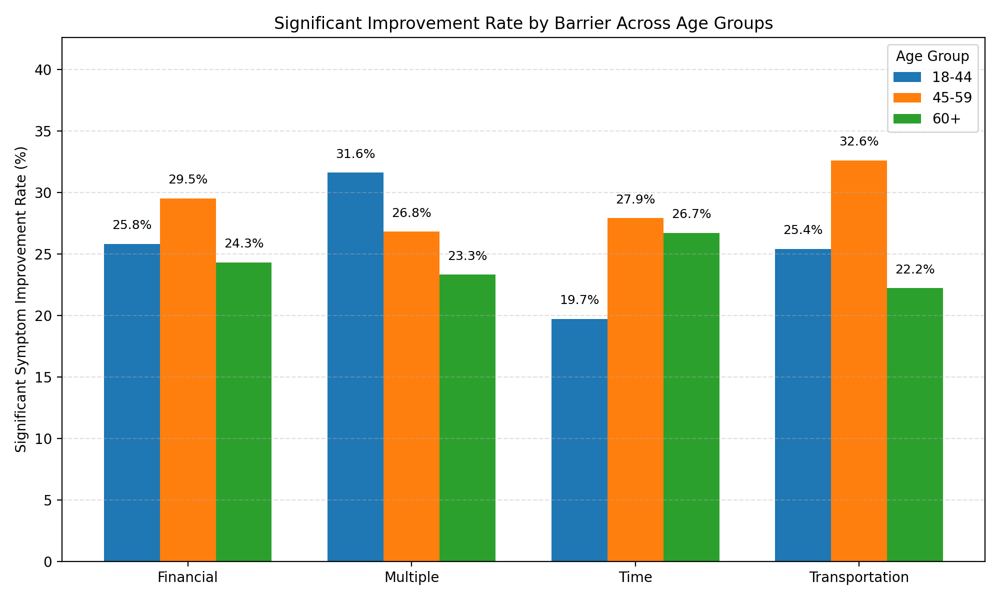

Report: Barriers to Treatment Adherence by Age Group and Their Impact on Symptom Improvement

Executive summary
- Time is the dominant barrier across all age groups: 18–44 (43.7%), 45–59 (40.2%), 60+ (43.9), from encounters.Treatment Barriers distribution. This suggests scheduling/access is the primary obstacle.
- The impact of barriers on symptom improvement differs by age:
  • 18–44: Significant improvement is lowest for Time barrier (19.7%) and higher for Multiple (31.6%).
  • 45–59: Transportation barrier shows the highest Significant improvement rate (32.6%), but Transportation also has the worst low/non-adherence rate (55.8%).
  • 60+: Time barrier has the highest Significant improvement rate (26.7%), while Transportation sees the highest missed appointment rate (22.2%).
- Action: Targeted strategies should address time/scheduling for all, transportation support especially for 45–59 and 60+, and comprehensive care coordination for 18–44 with Multiple barriers. KPIs should track Significant improvement rates, missed appointment rates, and adherence risk by barrier and age group.

Data and method
- Tables and fields used:
  • patients: Age, Patient number.
  • encounters: Visit Record Number, Patient Reference Number, Treatment Barriers, Missed Appointment.
  • treatmentbasics: Treatment ID, Visit Reference.
  • treatmentoutcomes: Symptom improvement, Treatment adherence.
- Join path (validated with SQL counts of 1,000 joined records): treatmentoutcomes.Treatment reference = treatmentbasics.Treatment ID → treatmentbasics.Visit Reference = encounters.Visit Record Number → encounters.Patient Reference Number = patients.Patient number.
- Age groups: 18–44, 45–59, 60+. Barrier categories: Financial, Multiple, Time, Transportation. Improvement categories: Minimal, Moderate, Significant.

Visualization

- Key takeaway: Barrier impact on improvement is age-specific. In 18–44, Time barrier patients achieve 19.7% Significant improvement, much lower than Multiple at 31.6%. In 45–59, Transportation yields the best Significant improvement at 32.6%, ahead of Time (27.9%) and Financial (29.5). In 60+, Time is highest at 26.7%, vs Financial 24.3, Multiple 23.3, Transportation 22.2. This matters because it pinpoints which barrier segments and age groups benefit most from targeted interventions, guiding resource allocation.

Key insights with metrics, causes, and actions

1) Barrier mix differs by age; Time is the primary barrier for all.
- Observation (SQL: barrier_share_by_age.csv): Within each age group, Time accounts for the largest share of barriers: 18–44 43.7%; 45–59 40.2%; 60+ 43.9. Financial and Multiple are ~19–21% each, and Transportation ~17–20%.
- Root cause: Scheduling constraints for working-age adults and clinic availability (Time) are pervasive. Transportation access compounds challenges, especially for older adults (mobility, location).
- Business impact / Recommendation: Prioritize access interventions (extended hours, telehealth, asynchronous touchpoints). Allocate transportation support services to older adults and mid-life patients where needed.

2) Barrier type changes the likelihood of Significant symptom improvement, and this pattern varies by age.
- Observation (SQL: sig_rate_by_age_barrier.csv):
  • 18–44: Significant improvement rates—Time 19.7%, Financial 25.8%, Transportation 25.4%, Multiple 31.6 (best).
  • 45–59: Transportation 32.6 (best), Financial 29.5, Time 27.9, Multiple 26.8.
  • 60+: Time 26.7 (best), Financial 24.3, Multiple 23.3, Transportation 22.2.
- Root cause: For younger adults, multi-factor support (addressing Multiple barriers) likely raises engagement and outcomes; mid-life patients who overcome transport hurdles may benefit from consistent attendance; older adults benefit most from scheduling/time solutions that reduce cognitive/physical strain.
- Business impact / Recommendation: Segment programs by barrier-age intersection: care coordination for young adults with Multiple barriers, transport concierge for mid-life/older adults, and flexible scheduling for all.

3) Missed appointment risk is highest for Transportation (especially older adults), followed by Time.
- Observation (SQL: missed rates by barrier and age):
  • 18–44: Transportation 18.3%, Time 14.2%, Multiple 15.8%, Financial 12.4.
  • 45–59: Time 19.8% (highest), Financial 18.2%, Transportation 16.3%, Multiple 14.6.
  • 60+: Transportation 22.2% (highest), Time 19.3%, Financial 17.1%, Multiple 12.3.
- Root cause: Physical access and logistics drive no-shows in older adults; scheduling conflicts drive mid-life no-shows; transport and time jointly affect young adults with work/school.
- Business impact / Recommendation: Implement transport vouchers/ride coordination for 60+, work-friendly scheduling for 45–59, and mix of flexible scheduling plus transport support for 18–44.

4) Adherence risk (Low/Non-compliant) is elevated across barriers, with Transportation particularly risky in 45–59.
- Observation (SQL: adherence by barrier and age):
  • 18–44 low/non-adherence: Financial 52.8%, Multiple 52.6%, Time 51.9%, Transportation 46.5. High adherence is lowest for Financial 18.0%.
  • 45–59 low/non-adherence: Transportation 55.8% (worst), Time 44.2%, Financial 47.7%, Multiple 46.3. High adherence highest for Financial 34.1%, Time 31.4%.
  • 60+ low/non-adherence: Financial 51.4%, Time 50.3%, Transportation 49.2, Multiple 46.6. High adherence is low across the board (17–25%).
- Root cause: Cost burden depresses adherence in 18–44 and 60+; transport barriers in mid-life patients degrade adherence despite good potential for improvement; complexity of regimen/time burden hurts consistency in older adults.
- Business impact / Recommendation: Financial counseling/sliding-scale for 18–44 and 60+, transport and adherence coaching for 45–59, regimen simplification and caregiver support for 60+.

Targeted intervention strategies and quantifiable monitoring indicators

Young adults (18–44)
- Strategy A: Time-flex scheduling and digital engagement (evening/weekend slots, SMS reminders, telehealth micro-sessions).
  • KPI: Increase Significant improvement for Time barrier from 19.7% to ≥25% within 3 months; reduce missed appointments for Time barrier from 14.2% to ≤10%.
- Strategy B: Comprehensive barrier case management for “Multiple”.
  • KPI: Raise Significant improvement in Multiple from 31.6% to ≥36%; decrease low/non-adherence for Multiple from 52.6% to ≤40%.
- Strategy C: Transportation and cost supports (transit vouchers, fare subsidies, transparent billing/sliding-scale).
  • KPI: Lower missed appointments for Transportation from 18.3% to ≤12%; reduce low/non-adherence for Financial from 52.8% to ≤40%.

Middle-aged (45–59)
- Strategy A: Work-friendly scheduling and employer coordination (letters for time-off, lunch-hour telehealth).
  • KPI: Reduce missed appointments for Time barrier from 19.8% to ≤14%; increase High adherence for Time from 31.4% to ≥38%.
- Strategy B: Transportation concierge (ride-hailing credits, clinic shuttle windows).
  • KPI: Cut low/non-adherence for Transportation from 55.8% to ≤40%; maintain/increase Significant improvement from 32.6% to ≥35%.
- Strategy C: Financial planning and adherence coaching.
  • KPI: Increase High adherence for Financial from 34.1% to ≥40%; reduce missed appointments for Financial from 18.2% to ≤13%.

Older adults (60+)
- Strategy A: Coordinated transport and home-based options (ride scheduling, home visits when possible).
  • KPI: Reduce missed appointments for Transportation from 22.2% to ≤15%; raise Significant improvement from 22.2% to ≥26%.
- Strategy B: Caregiver engagement and regimen simplification (medication synchronization, longer appointment windows).
  • KPI: Increase High adherence for Time from 21.7% to ≥28%; reduce low/non-adherence for Financial from 51.4% to ≤40%.
- Strategy C: Tech support for telehealth (assisted setup, phone-first options).
  • KPI: Reduce missed appointments for Time from 19.3% to ≤14%; increase Significant improvement for Time from 26.7% to ≥30%.

Monitoring framework (how to measure)
- Metrics and calculation (by age group and barrier):
  • Significant improvement rate = count(treatmentoutcomes.Symptom improvement='Significant') / total.
  • Missed appointment rate = encounters.Missed Appointment=1 / total.
  • Adherence risk (Low/Non-compliant) rate = count(treatmentoutcomes.Treatment adherence IN ['Low','Non-compliant']) / total; High adherence rate similarly.
- Frequency: Weekly dashboards; monthly reviews by age-barrier segment.
- Targets: As specified under each strategy; adjust targets per quarter based on baseline and capacity.

Why it matters
- The data shows Time and Transportation barriers are the most prevalent and the most disruptive to adherence and symptom improvement, with age-specific nuances. Addressing these strategically should lift Significant improvement rates by 3–6 percentage points within targeted segments, reduce missed appointments by 4–8 points, and lower low/non-adherence by 10–15 points—translating into better outcomes and more efficient care.

Supporting steps and reproducibility
- SQL joins and aggregations used tables: patients, encounters, treatmentbasics, treatmentoutcomes. Age groups and barrier categories derived from fields: Age, Treatment Barriers, Symptom improvement, Treatment adherence, Missed Appointment.
- Python plotting code executed to produce the visualization in the current directory:
  • Script: plot_sig_rates.py (reads sig_rate_by_age_barrier.csv and barrier_share_by_age.csv, creates sig_improvement_rates_by_age_barrier.png).

Next steps
- Pilot the interventions in three cohorts (18–44 Time, 45–59 Transportation, 60+ Transportation/Time) for 12 weeks.
- Stand up a dashboard with the three KPIs per age-barrier segment; iterate services where targets lag by >20% after 6 weeks.
- Scale successful programs across facilities and revisit resource allocation quarterly based on improved rates and reduced no-shows.
