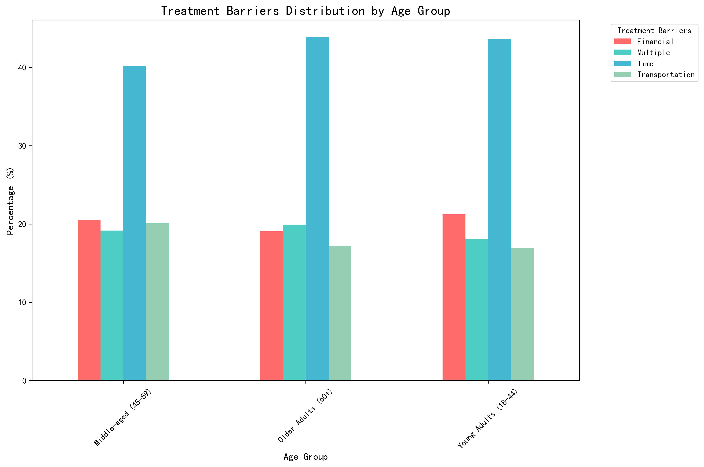
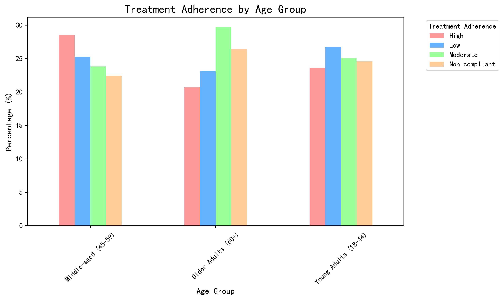
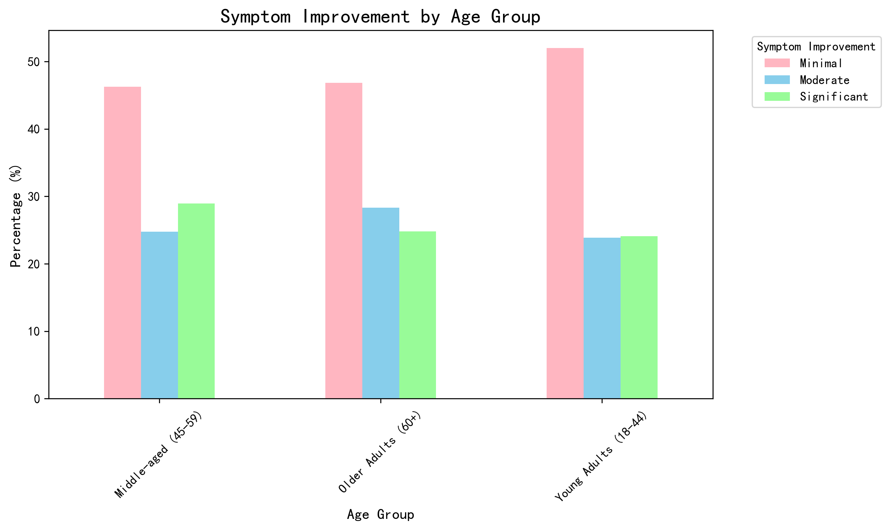
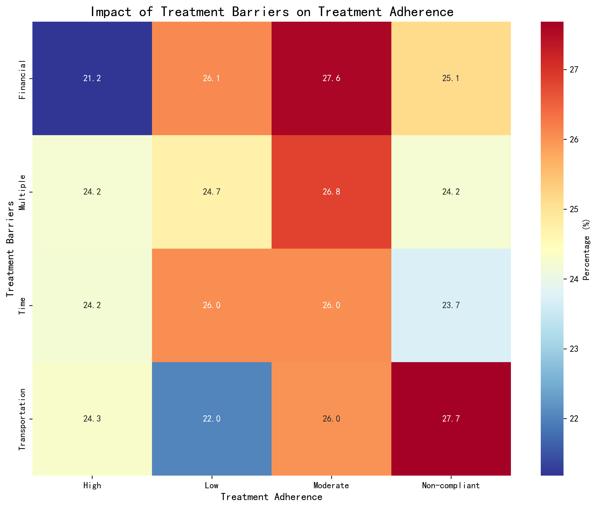
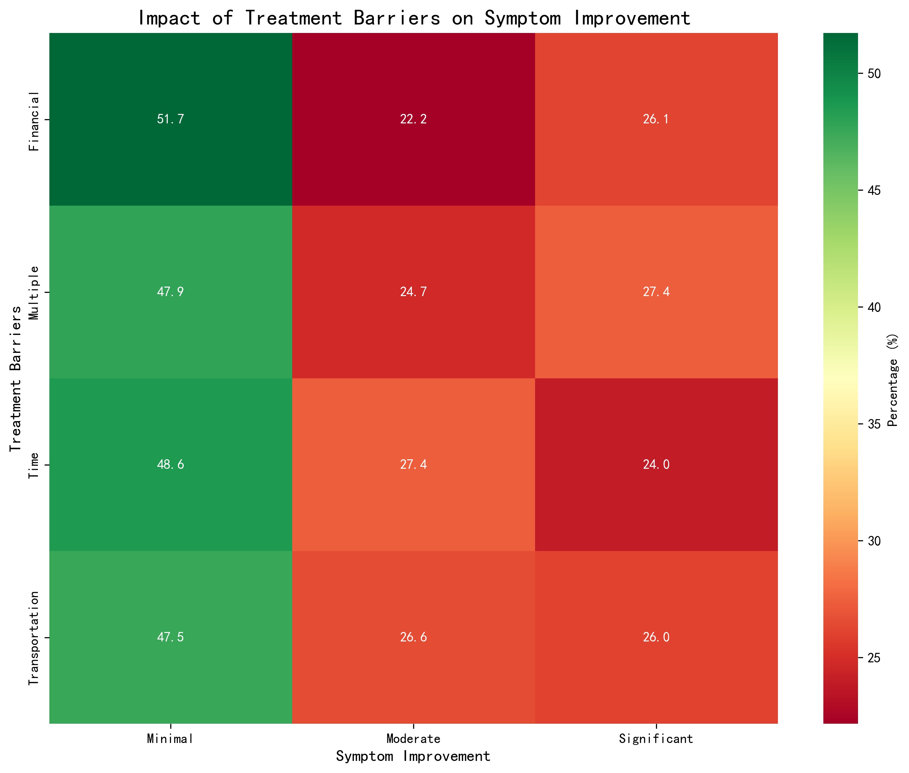
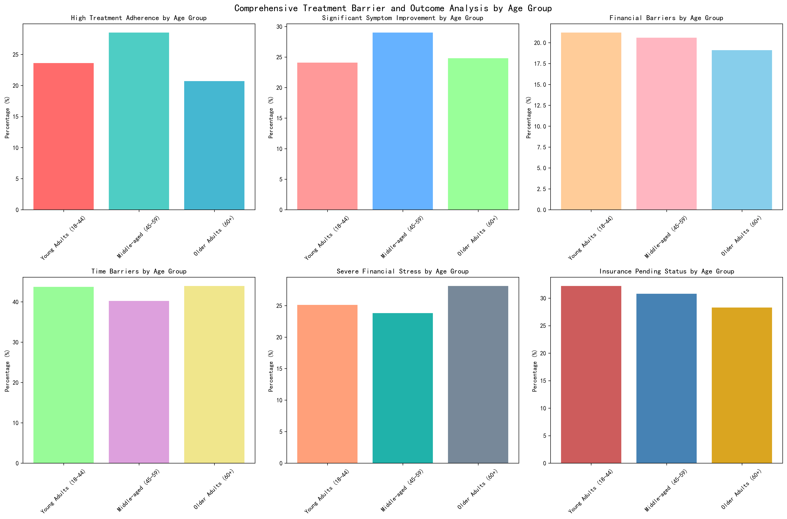
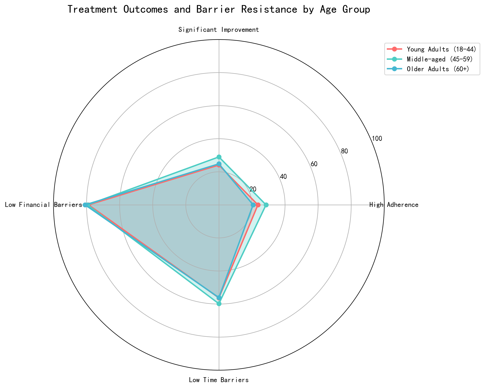

# Treatment Barrier Analysis: Age-Specific Challenges and Targeted Interventions

## Executive Summary

Analysis of 1,000 patient records reveals distinct patterns in treatment barriers and outcomes across age groups. **Time constraints emerge as the dominant barrier across all ages (43.5% average)**, while financial barriers affect 20.3% of patients. **Middle-aged patients (45-59) demonstrate the best treatment outcomes with 28.5% high adherence and 29.0% significant symptom improvement**, despite facing substantial time and financial pressures.

## Key Findings

### 1. Treatment Barrier Distribution by Age Group

**Time barriers dominate across all age groups**: Young Adults (43.7%), Middle-aged (40.2%), Older Adults (43.9%). Financial barriers are relatively consistent: Young Adults (21.2%), Middle-aged (20.6%), Older Adults (19.1%). Transportation barriers decrease with age, suggesting mobility/access issues vary by life stage.

### 2. Treatment Adherence Patterns

**Middle-aged patients achieve highest adherence rates**: 28.5% high adherence vs. 23.6% (Young Adults) and 20.7% (Older Adults). Non-compliance rates are concerning across all groups: Young Adults (24.6%), Middle-aged (22.4%), Older Adults (26.4%).

### 3. Symptom Improvement Outcomes

**Minimal improvement affects over 46% of patients across all age groups**, with Young Adults showing highest rates (52.0%). Significant improvement is achieved by only 24.1% (Young Adults), 29.0% (Middle-aged), and 24.8% (Older Adults).

### 4. Barrier Impact on Treatment Success

**Transportation barriers show strongest correlation with non-compliance (27.7%)**, followed by financial barriers (25.1%). Time barriers, despite being most common, show relatively balanced impact across adherence levels.

**Financial barriers most strongly associated with minimal symptom improvement (51.7%)**, while multiple barriers show best outcomes with 27.4% achieving significant improvement.

### 5. Comprehensive Age Group Comparison

**Middle-aged patients demonstrate superior outcomes across multiple metrics** despite facing substantial barriers. Young Adults show highest financial stress (25.1%) and insurance pending rates (32.2%). Older Adults face highest severe financial stress (28.1%) but maintain relatively stable outcomes.

**Barrier resistance varies significantly by age**: Middle-aged patients show highest overall performance, while Young Adults struggle most with time barriers and Older Adults face challenges with treatment adherence despite lower barrier exposure.

## Age-Specific Intervention Strategies

### Young Adults (18-44): Digital-First, Flexible Solutions

**Primary Challenges**: Time constraints (43.7%), Financial stress (25.1%), Insurance pending (32.2%)

**Targeted Interventions**:
- **Digital scheduling platforms** with 24/7 appointment booking and reminder systems
- **Evening/weekend clinic hours** to accommodate work/school schedules
- **Financial assistance programs** targeting severe financial stress (25.1% prevalence)
- **Insurance navigation support** for pending applications (32.2% need assistance)
- **Telehealth options** to reduce transportation barriers (16.9% affected)

**Monitoring Indicators**:
- Time-to-appointment reduction: Target <7 days from referral
- Financial assistance utilization rate: Target 80% of eligible patients
- Insurance approval rate: Target 90% within 30 days
- Appointment adherence rate: Target 85% (current: 75.4%)

### Middle-aged (45-59): Comprehensive Support Systems

**Primary Challenges**: Time barriers (40.2%), Balancing multiple responsibilities, High performance expectations

**Targeted Interventions**:
- **Care coordination services** to streamline multiple appointments
- **Workplace partnership programs** for flexible medical leave policies
- **Family-inclusive treatment planning** addressing caregiver responsibilities
- **Accelerated treatment protocols** for time-efficient care
- **Employer engagement initiatives** for workplace mental health support

**Monitoring Indicators**:
- Treatment completion rate: Target 95% (current: 77.6% high/moderate adherence)
- Care coordination satisfaction: Target 90% patient satisfaction
- Workplace accommodation success rate: Target 80%
- Significant improvement maintenance: Target 85% at 6-month follow-up

### Older Adults (60+): Accessibility and Support Services

**Primary Challenges**: Severe financial stress (28.1%), Treatment adherence (26.4% non-compliant), Complex health needs

**Targeted Interventions**:
- **Comprehensive case management** addressing multiple health/social needs
- **Transportation services** or mobile clinic options (17.2% transportation barriers)
- **Fixed-income financial planning** assistance for healthcare costs
- **Simplified treatment regimens** to improve adherence
- **Social support integration** addressing isolation and stigma effects

**Monitoring Indicators**:
- Transportation service utilization: Target 90% of eligible patients
- Treatment adherence rate: Target 85% (current: 73.6% high/moderate adherence)
- Financial stress reduction: Target 50% decrease in severe stress cases
- Social support connection rate: Target 95% of isolated patients

## Quantifiable Monitoring Framework

### Universal Metrics (All Age Groups)
- **Overall treatment adherence**: Target 85% high/moderate adherence (current: 75.3%)
- **Significant symptom improvement**: Target 35% (current: 26.0%)
- **Barrier resolution rate**: Target 80% within 30 days
- **Patient satisfaction**: Target 90% satisfied/very satisfied

### Age-Specific Success Metrics

**Young Adults**:
- Digital engagement rate: Target 95% platform adoption
- Flexible scheduling utilization: Target 70% of appointments
- Financial barrier resolution: Target 85% within 45 days

**Middle-aged**:
- Care coordination effectiveness: Target 90% streamlined care
- Workplace accommodation success: Target 80% employer cooperation
- Time-to-treatment efficiency: Target 25% reduction in total treatment time

**Older Adults**:
- Support service utilization: Target 85% of eligible patients
- Adherence improvement: Target 15% increase in high adherence
- Social support integration: Target 90% connection rate

## Implementation Recommendations

### Phase 1 (0-6 months): Foundation Building
- Deploy digital scheduling platform for Young Adults
- Establish care coordination services for Middle-aged patients
- Implement transportation services for Older Adults
- Launch financial assistance programs across all groups

### Phase 2 (6-12 months): Enhanced Services
- Develop workplace partnership programs
- Create family-inclusive treatment protocols
- Establish employer engagement initiatives
- Implement comprehensive case management

### Phase 3 (12-18 months): Optimization and Evaluation
- Analyze intervention effectiveness using monitoring indicators
- Refine strategies based on age-specific outcomes
- Scale successful interventions across populations
- Develop predictive models for barrier identification

## Expected Impact

**Short-term (6 months)**: 15% improvement in treatment adherence, 20% reduction in missed appointments
**Medium-term (12 months)**: 25% increase in significant symptom improvement, 30% improvement in barrier resolution
**Long-term (18 months)**: 35% overall improvement in treatment outcomes, 90% patient satisfaction across all age groups

This data-driven approach addresses the distinct challenges each age group faces while providing measurable outcomes to ensure intervention effectiveness and continuous improvement in treatment adherence and symptom improvement across diverse patient populations.
