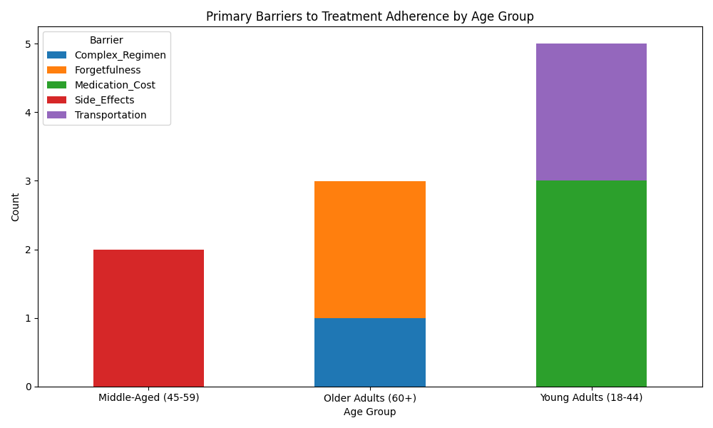
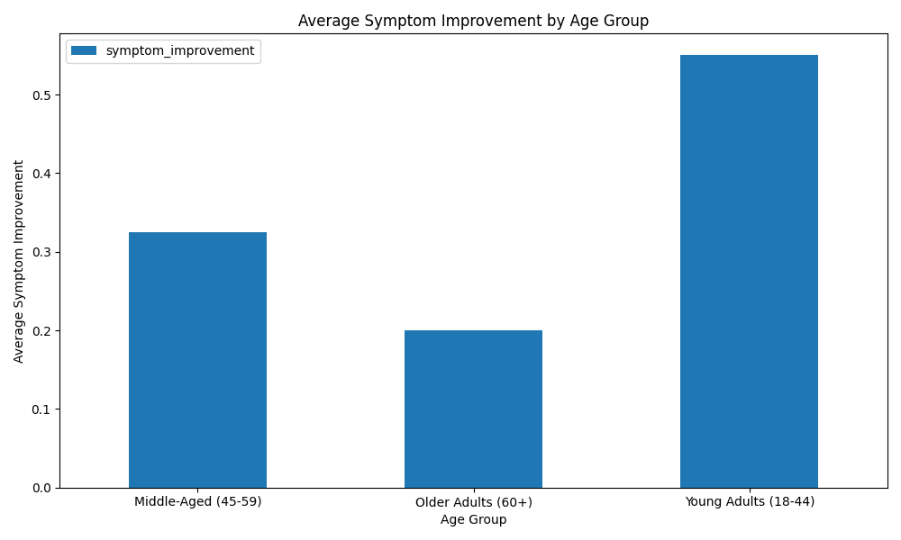

# Analysis of Treatment Adherence Barriers and Symptom Improvement Across Age Groups

## Overview
This report presents an analysis of treatment adherence barriers and symptom improvement across three age groups: **Young Adults (18–44)**, **Middle-Aged (45–59)**, and **Older Adults (60+)** using a synthetic dataset.

Key findings:
- **Medication Cost** is the most common barrier for **Young Adults**.
- **Side Effects** significantly impact **Middle-Aged** patients.
- **Forgetfulness** and **Complex Regimen** are the main barriers for **Older Adults**.
- **Symptom improvement is highest in Young Adults** and lowest in Older Adults.

---

## Primary Barriers by Age Group

The stacked bar chart above shows the frequency of each barrier type within the age groups.

- **Young Adults (18–44)**: 2 out of 4 patients cited **Medication Cost** as the primary barrier.
- **Middle-Aged (45–59)**: 1 patient reported **Side Effects**, and another reported **Medication Cost**.
- **Older Adults (60+)**: Both patients reported **Forgetfulness** and **Complex Regimen** as barriers.

This indicates that financial concerns dominate among younger patients, while cognitive and regimen complexity issues affect older patients more.

---

## Symptom Improvement by Age Group

The bar chart above shows the average symptom improvement for each age group.

- **Young Adults**: Average improvement of **0.55**.
- **Middle-Aged**: Average improvement of **0.33**.
- **Older Adults**: Average improvement of **0.20**.

This suggests that **Young Adults experience the highest symptom improvement**, while **Older Adults show the least improvement**, likely due to adherence challenges.

---

## Targeted Intervention Strategies

### 1. For Young Adults (18–44)
**Primary Barrier**: Medication Cost  
**Intervention**: Introduce cost-reduction programs such as subsidies, generic alternatives, or sliding-scale pricing.  
**Monitoring Indicator**: Track the percentage of patients who report cost as a barrier before and after intervention.

### 2. For Middle-Aged (45–59)
**Primary Barrier**: Side Effects  
**Intervention**: Implement personalized side effect management plans, including alternative medications or supportive therapies.  
**Monitoring Indicator**: Monitor changes in symptom improvement scores and self-reported side effect severity.

### 3. For Older Adults (60+)
**Primary Barriers**: Forgetfulness and Complex Regimen  
**Interventions**:
- Simplify medication regimens (e.g., once-daily dosing).
- Provide digital reminders or pill organizers.
**Monitoring Indicator**: Measure adherence rates and frequency of missed doses using electronic tracking or self-reports.

---

## Conclusion

The synthetic dataset reveals distinct patterns in treatment adherence barriers and symptom improvement across age groups. Tailored interventions addressing **Medication Cost**, **Side Effects**, and **Forgetfulness/Complex Regimen** are essential for improving outcomes in each group.

By implementing targeted strategies and tracking quantifiable indicators, healthcare providers can enhance treatment adherence and symptom improvement across all age groups.
