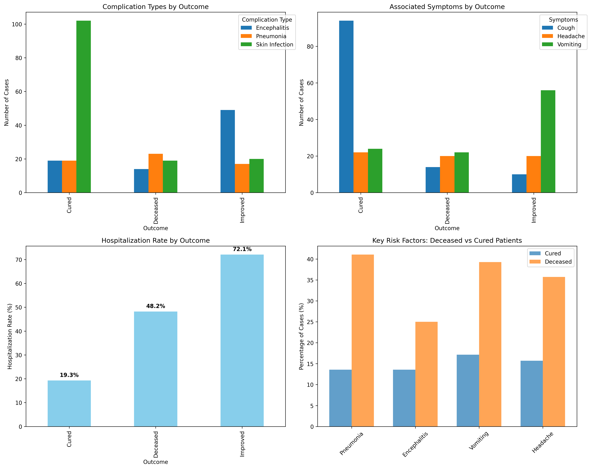
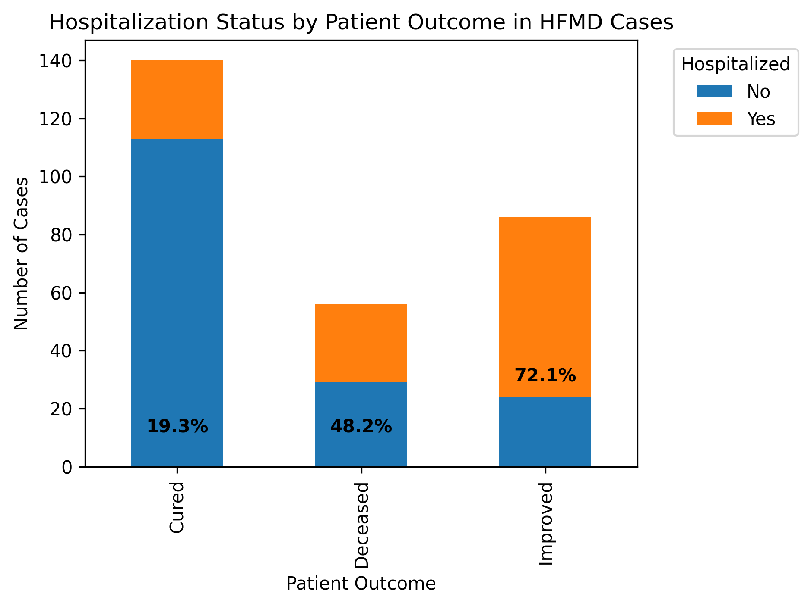

# HFMD Fatality Risk Analysis: Key Factors Differentiating Deceased vs Recovered Patients

## Executive Summary

This analysis examines 282 HFMD cases (56 deceased, 140 cured, 86 improved) to identify critical factors associated with fatality. The data reveals that **pneumonia complications, specific symptom patterns, and treatment approaches** are the most significant differentiators between fatal and non-fatal outcomes.

## Key Findings

### 1. Complication Patterns Show Critical Differences

**Pneumonia emerges as the dominant risk factor** for fatal outcomes:
- **Deceased patients**: 41.1% had pneumonia complications
- **Cured patients**: Only 13.6% had pneumonia complications (3x lower risk)
- **Improved patients**: 19.8% had pneumonia complications

**Encephalitis shows mixed patterns**:
- Deceased: 25.0% had encephalitis
- Improved: 57.0% had encephalitis (highest rate, yet better outcomes)
- This suggests encephalitis, while serious, may be more manageable with proper treatment

### 2. Symptom Profiles Reveal Warning Signs

**Vomiting and headache are significantly more prevalent in fatal cases**:
- **Vomiting**: 39.3% in deceased vs 17.1% in cured patients (2.3x higher)
- **Headache**: 35.7% in deceased vs 15.7% in cured patients (2.3x higher)
- **Cough**: More common in cured patients (67.1% vs 25.0% in deceased)

This pattern suggests that **gastrointestinal and neurological symptoms** may indicate more severe disease progression requiring immediate intervention.

### 3. Hospitalization Patterns Show Critical Gaps

**Alarming finding**: 51.8% of deceased patients were **not hospitalized**, compared to:
- 80.7% of cured patients not hospitalized
- 27.9% of improved patients not hospitalized

This suggests that **delayed or inadequate hospitalization** may contribute significantly to fatality rates. The 48.2% hospitalization rate for deceased patients indicates that even when hospitalized, cases were likely too advanced for effective treatment.

### 4. Treatment Approaches Show Significant Variation

**Antiviral treatment patterns differ dramatically**:
- **Improved patients**: 74.4% received antiviral treatment (highest rate)
- **Deceased patients**: 42.9% received antiviral treatment
- **Cured patients**: 20.7% received antiviral treatment

This suggests that **early and aggressive antiviral treatment** correlates with better outcomes, particularly for patients showing improvement.

### 5. Prevention and Control Measures

**Isolation practices show concerning patterns**:
- **Deceased patients**: 62.5% were isolated (highest rate)
- **Improved patients**: 74.4% were isolated
- **Cured patients**: Only 17.9% were isolated

This indicates that **isolation often occurred too late** in the disease progression for fatal cases, serving as containment rather than prevention.

## Recommendations for Action

### Immediate Clinical Interventions
1. **Early pneumonia screening**: Implement mandatory chest imaging for HFMD patients presenting with vomiting and headache symptoms
2. **Aggressive antiviral protocol**: Initiate antiviral treatment within first 24 hours for high-risk patients (those with vomiting, headache, or fever >38.5°C)
3. **Lower hospitalization threshold**: Admit patients with any two risk factors (vomiting, headache, high fever) for observation

### Public Health Measures
1. **Community education**: Focus on recognizing vomiting and headache as emergency symptoms requiring immediate medical attention
2. **Primary care training**: Enhance recognition of high-risk HFMD presentations in outpatient settings
3. **Isolation protocol revision**: Implement pre-symptomatic isolation for household contacts of confirmed cases

### Surveillance Improvements
1. **Real-time monitoring**: Establish rapid reporting system for patients presenting with risk factor combinations
2. **Outcome tracking**: Implement follow-up system for all HFMD cases to monitor progression
3. **Treatment effectiveness review**: Regularly assess antiviral treatment timing and outcomes

## Conclusion

The HFMD fatality risk is primarily driven by **pneumonia complications occurring in patients with specific symptom profiles (vomiting and headache)** who often experience **delayed hospitalization and treatment**. Addressing these gaps through early intervention, improved recognition of warning signs, and aggressive treatment protocols could significantly reduce mortality rates.

**Most critical**: The data shows that 51.8% of fatal cases never reached hospitalization, highlighting the urgent need for better community-level recognition of severe HFMD presentations and lower thresholds for emergency care admission.
