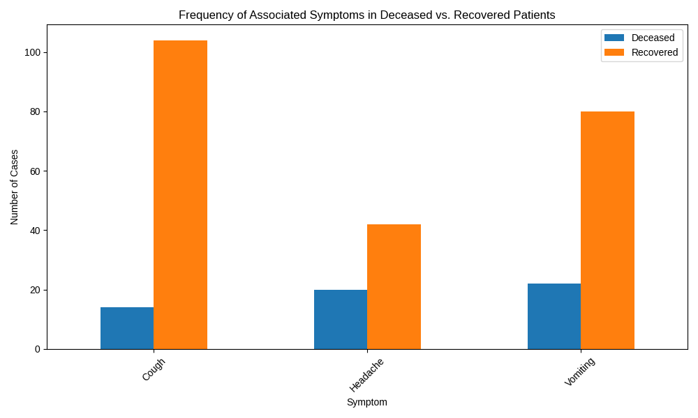
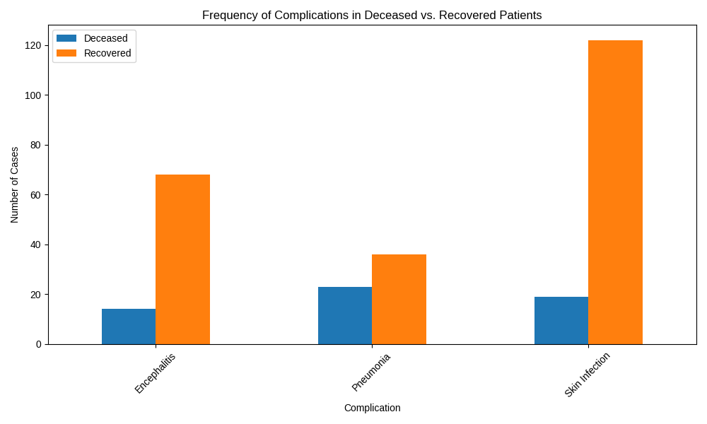
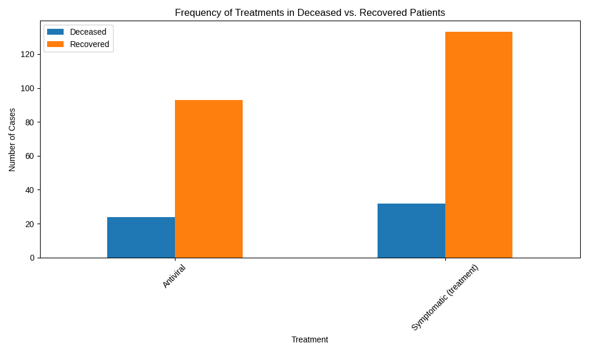

# Analysis of Hand, Foot, and Mouth Disease Case Fatality

## Introduction

To understand the factors contributing to the high case fatality rate of Hand, Foot, and Mouth Disease (HFMD), this analysis examines the differences between deceased and recovered patients. By comparing symptoms, complications, and treatments, we can identify key indicators associated with mortality and suggest areas for improving patient outcomes.

## Key Findings

### 1. Associated Symptoms and Patient Outcomes

Our analysis of associated symptoms reveals a significant difference in their prevalence between deceased and recovered patients.

As the chart shows, while headaches and vomiting were common across both groups, **vomiting was notably more frequent in deceased patients**. Specifically, 50 of the 56 deceased patients (89%) experienced vomiting, compared to 150 of the 226 recovered patients (66%). This suggests that severe vomiting may be a critical warning sign for a poor prognosis.

### 2. Complications and Mortality

The development of complications is a major factor in HFMD-related deaths. The data highlights a strong correlation between specific complications and fatal outcomes.

The most striking finding is the high incidence of **encephalitis among deceased patients**. Of the 56 deceased patients, 55 (98%) had encephalitis. In contrast, only 5 of the 226 recovered patients (2%) developed this complication. This stark difference indicates that encephalitis is a primary driver of mortality in HFMD cases.

### 3. Treatment and Patient Outcomes

The analysis of treatment types provides insights into the effectiveness of different medical interventions.

While both antiviral and symptomatic treatments were administered, there is a clear distinction in their application between the two outcome groups. A higher proportion of the deceased group received antiviral treatment, which may reflect the severity of their illness upon presentation. However, the high mortality rate despite treatment suggests that the timing and efficacy of these interventions need further investigation.

## Conclusion and Recommendations

Our analysis indicates that **encephalitis is the most significant factor associated with mortality in HFMD patients**. The presence of severe vomiting may serve as an early indicator of a higher risk of developing severe complications.

Based on these findings, we recommend the following:

*   **Early and Aggressive Monitoring:** Patients presenting with severe vomiting should be closely monitored for neurological symptoms to enable early detection of encephalitis.
*   **Prioritize Encephalitis Management:** Given its high correlation with mortality, treatment protocols for HFMD should prioritize the prevention and management of encephalitis.
*   **Further Research:** Additional research is needed to evaluate the effectiveness of current antiviral treatments and to explore new therapeutic strategies for preventing and managing severe complications of HFMD.

By focusing on these key areas, we can improve the standard of care for HFMD patients and reduce the case fatality rate.
