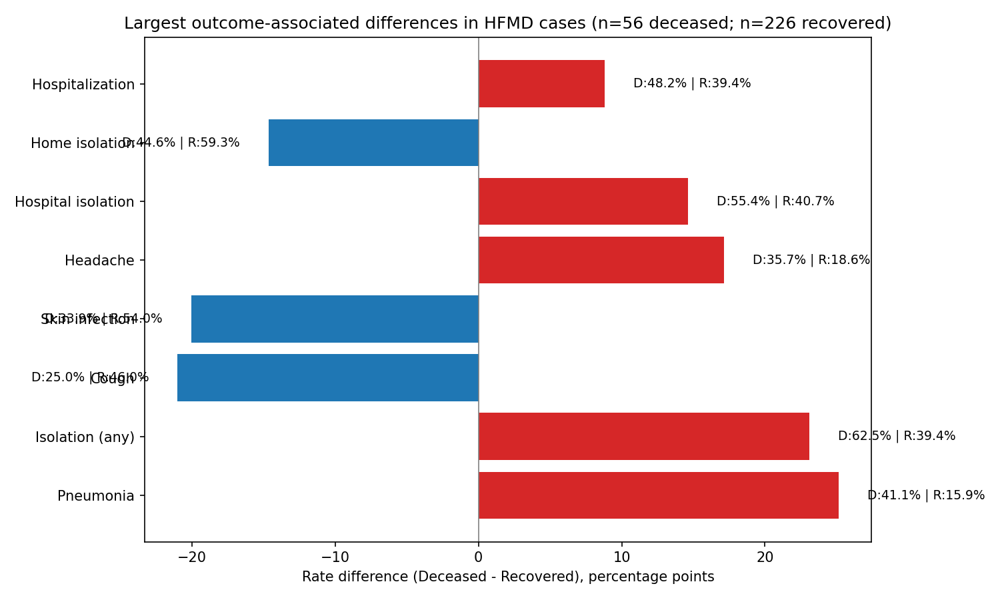

HFMD case fatality drivers: differences between deceased vs recovered cohorts

Executive summary
- Pneumonia and hospital isolation stand out as the strongest correlates of death in HFMD. Among 56 deceased and 226 recovered cases (CFR 19.9%), pneumonia was present in 41.1% of deceased vs 15.9% of recovered (Δ 25.1 pp), and any isolation was recorded in 62.5% vs 39.4% (Δ 23.1 pp).
- Neurologic-related symptom headache is more frequent in deceased (35.7% vs 18.6%, Δ 17.1 pp), while cough and skin infection are less frequent in deceased (25.0% vs 46.0%, Δ -21.0 pp; 33.9% vs 54.0%, Δ -20.1 pp).
- Treatment types (antiviral vs symptomatic) show minimal differences between groups (antiviral 42.9% vs 41.2%, Δ 1.7 pp; symptomatic 57.1% vs 58.8%, Δ -1.7 pp), indicating outcomes may hinge more on complication management and care setting than on the choice of basic therapy.

Cohorts and method
- Data source: clinical_manifestations table (fields used: Outcome (Cured/Improved/Deceased), Highest Body Temperature (°C), Hospitalization (Yes/No), Treatment (Antiviral/Symptomatic), Associated Symptoms (Cough/Headache/Vomiting), Complication Type (Pneumonia/Encephalitis/Skin Infection), Isolation Status (Yes/No), Isolation Type (Home/Hospital)).
- Outcome cohorts: 56 Deceased vs 226 Recovered (Recovered includes Cured/Improved), derived via SQL.
- Analysis steps:
  - SQL aggregation: Computed per-outcome counts and averages for symptoms, complications, hospitalization, isolation, and treatment (see Python SQL in plot_hfmd.py).
  - Python visualization: Ranked factors by absolute difference in prevalence between deceased and recovered groups, and charted top 8.

Visualization and key takeaway

- The chart shows the top differentials (Deceased – Recovered, percentage points), with red bars indicating higher prevalence in deceased.
- Exact numbers:
  - Pneumonia: 41.1% (23/56) deceased vs 15.9% (36/226) recovered, Δ +25.1 pp. This aligns with severe lower-respiratory involvement as a major risk driver.
  - Isolation (any): 62.5% (35/56) deceased vs 39.4% (89/226) recovered, Δ +23.1 pp; within type, hospital isolation 55.4% vs 40.7% (Δ +14.6 pp) and home isolation 44.6% vs 59.3% (Δ -14.6 pp). This indicates severe cases are more often escalated to hospital isolation, consistent with higher clinical acuity.
  - Cough: 25.0% (14/56) deceased vs 46.0% (104/226) recovered, Δ -21.0 pp. Less cough in deceased may reflect atypical respiratory presentation or predominance of complications other than airway irritation.
  - Skin infection: 33.9% (19/56) deceased vs 54.0% (122/226) recovered, Δ -20.1 pp. Skin involvement alone appears more characteristic of non-fatal courses.
  - Headache: 35.7% (20/56) deceased vs 18.6% (42/226), Δ +17.1 pp, suggesting possible neurologic involvement risk (consistent with encephalitis, which is 25.0% vs 30.1%, Δ -5.1 pp overall but headache is more discriminating than recorded encephalitis).
  - Hospitalization: 48.2% (27/56) deceased vs 39.4% (89/226), Δ +8.8 pp. Higher inpatient care aligns with elevated severity; however, escalation alone doesn’t appear sufficient without targeted complication management.
  - Vomiting: 39.3% (22/56) deceased vs 35.4% (80/226), Δ +3.9 pp; a weaker differentiator.

Symptoms and complications
- Observation: Pneumonia is the strongest clinical differentiator linked to mortality (41.1% vs 15.9%). Headache is also more prevalent in deaths (35.7% vs 18.6%).
- Root cause hypothesis: Severe lower-respiratory disease (pneumonia) likely leads to hypoxia and systemic stress, elevating risk. Headache could indicate CNS involvement or systemic inflammation, aligning with severe trajectories.
- Business impact: Triage protocols that under-weight pneumonia signs or CNS indicators may miss high-risk patients, increasing CFR.

Prevention/control (isolation)
- Observation: Deceased cases had higher rates of any isolation and hospital isolation. Home isolation is more common among recovered (59.3% vs 44.6%).
- Root cause hypothesis: Clinicians escalate isolation type for severe cases; however, late escalation or insufficient respiratory support may not reduce risk if pneumonia is established.
- Business impact: Resource planning for hospital isolation must integrate early identification of pneumonia/CNS risk rather than reactive isolation alone.

Treatment
- Observation: Antiviral vs symptomatic treatment distributions are similar across outcomes (Δ ≤ 1.7 pp). Average temperature is slightly lower in deceased (37.99 °C) than recovered (38.70 °C), implying fever intensity isn’t a reliable severity signal here.
- Root cause hypothesis: Outcomes hinge more on complication-focused support (e.g., respiratory management) than on baseline antiviral/symptomatic choice. Fever magnitude may not capture respiratory or neurologic deterioration risk.
- Business impact: Optimizing protocols for early detection and management of complications can move CFR more than adjusting antiviral/symptomatic mix.

Recommendations
1) Pneumonia-first triage and escalation
   - Action: Add mandatory chest exam/oximetry for HFMD intake; fast-track chest imaging for suspected pneumonia.
   - Thresholds: Any pneumonia signs → immediate hospital observation; initiate oxygen/respiratory support pathway.
   - Why: Pneumonia prevalence is +25.1 pp higher in deaths; early intervention can reduce progression.

2) Neurologic symptom flagging
   - Action: Introduce headache + vomiting screening as a CNS risk bundle; early neuro checks and hydration.
   - Thresholds: Headache present → frequent neuro vitals; consider rapid referral if persistent or worsening.
   - Why: Headache is +17.1 pp higher in deaths; CNS involvement may be under-recognized versus recorded encephalitis.

3) Isolation policy refinement
   - Action: Use hospital isolation proactively for pneumonia-risk patients; reinforce home isolation compliance for low-risk.
   - KPI: Shift appropriate patients to hospital isolation within 24 hours of risk flag; monitor home isolation adherence.
   - Why: Severe cases already cluster in hospital isolation; timeliness and care quality matter more than isolation per se.

4) Complication-focused care bundles
   - Action: Standardize respiratory care bundle (oximetry, oxygen, fluids, monitoring) for pneumonia-risk HFMD; add neurologic observation bundle.
   - KPI: Time-to-support initiation; reduction in respiratory-related deterioration.

5) Quality assurance and training
   - Action: Train front-line staff on high-risk markers (pneumonia, headache) derived from clinical_manifestations data; audit triage decisions monthly.
   - Why: Treatment type alone is not differentiating; focus on earlier detection and support.

Evidence references
- SQL/Python: Aggregations executed within plot_hfmd.py (see CTE outcome querying clinical_manifestations, and bar chart of prevalence differences).
- Fields used: Outcome (Cured/Improved/Deceased), Complication Type (Pneumonia/Encephalitis/Skin Infection), Associated Symptoms (Cough/Headache/Vomiting), Hospitalization (Yes/No), Isolation Status (Yes/No), Isolation Type (Home/Hospital), Treatment (Antiviral/Symptomatic), Highest Body Temperature (°C).

Limitations and next steps
- Outcome-linked analysis is drawn from clinical_manifestations; deeper prevention/control metrics (e.g., disinfection frequency, PPE) from isolation_and_disinfection could be integrated in a follow-up once identifier parsing issues are resolved.
- Future analyses: Time-to-escalation and temporal sequences (onset → isolation → hospitalization) to test whether early actions reduce pneumonia incidence and CFR; add resource adequacy signals from healthcare_resources.

Bottom line
- CFR is 19.9% (56/282). Mortality correlates strongly with pneumonia (+25.1 pp vs recovered) and hospital isolation (reflecting severity), while antiviral vs symptomatic treatment shows minimal outcome discrimination.
- Prioritize early detection and management of respiratory and neurologic complications, and ensure isolation decisions are timely and matched to risk. These actions are the most likely levers to reduce HFMD fatality in this dataset.
